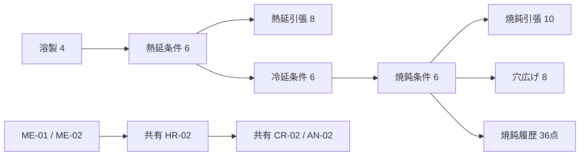

# 最小教材データで追う Data → Profile → Feature → Model

この文書は、Evidence Decision Workbench がExcelを読み、予測に使える形へ変換するまでを、同梱の最小教材データだけで追う開発者向けガイドです。

教材の目的は精度競争ではありません。1件ずつ覚えられる規模で、共有工程、分割relation、反復試験、部分欠損、LSなしの実測ヒートパターン、Model Packageの固定契約を確認することです。

## 1. 教材の全体像

正本は [`data/source/material_workbench_tutorial_v1.xlsx`](../../data/source/material_workbench_tutorial_v1.xlsx) です。

| 種類 | 件数 | 覚えるポイント |
|---|---:|---|
| 成分ロット | 4 | CとMnだけを2水準で変える |
| 熱延条件 | 6 | `HR-02`を異なる2成分が共有する |
| 焼鈍条件 | 6 | `AN-02`を異なる2成分が共有し、`AN-06`はLSなし |
| 熱延引張 | 8 | 6条件＋2反復 |
| 焼鈍引張 | 10 | 共有工程、反復、部分欠損を含む |
| 穴広げ | 8 | 6条件＋2反復 |

成分は次の4ロットだけです。

| key | C | Mn | 意味 |
|---|---:|---:|---|
| ME-01 | 0.05 | 1.00 | 低C・低Mn |
| ME-02 | 0.08 | 1.00 | 高C・低Mn |
| ME-03 | 0.05 | 1.50 | 低C・高Mn |
| ME-04 | 0.08 | 1.50 | 高C・高Mn |

TaskDefinitionとの契約上、ほかの成分列も存在しますが、教材では固定値です。「列が多い」ことと「学ぶ変数が多い」ことを分けています。



## 2. Excelで表しているもの

各実体シートは1行1実体です。

- `溶製`：成分ロット
- `熱延`、`冷延`、`焼鈍`：工程条件
- `熱延引張`、`焼鈍引張`、`焼鈍穴広げ`：観測
- `焼鈍履歴`：1焼鈍条件に複数の時刻・温度点
- `relation`：実体同士を結ぶリンク

重要なのは、`relation` の1行を学習1行として扱わないことです。学習の観測単位は試験シートの行で、`relation` はその試験がどの工程条件と成分に由来するかを解決するために使います。

`HR-02`と`AN-02`は、`ME-01`と`ME-02`の両方から使われます。工程キーだけを見ると成分は一意になりませんが、`HT-02`は`ME-01`、`HT-03`は`ME-02`とrelation経路上で決まります。学習時の集約単位も工程キー単独ではなく、`成分キー::工程キー`です。

`HT-01`は、`HT-01 → HR-01`と`HR-01 → ME-01`を別々のrelation行にしています。一意な経路なら分割されていても解決します。反対に、同じ試験から複数成分へ分岐する場合は勝手に複製せず、曖昧な観測として学習から外します。

### 部分欠損

`TT-03` はYS、`TT-07` はELを空欄にしています。

- TSモデルには両方の行を使える
- YSモデルは`TT-03`を使わない
- ELモデルは`TT-07`を使わない
- 行全体を一律に捨てない

この違いを確認するための欠損であり、偶然の欠損を統計的に説明する教材ではありません。

## 3. ProfileはExcelの方言を正規形へ写す

教材専用Profileは [`dataset-input-profile-tutorial.json`](../../backend/src/decision_workbench/data/dataset-input-profile-tutorial.json) です。

このProfileは既存の薄板Task用Profileを継承し、`概要.項目` に `教材データID` があることだけを固有マーカーにします。これにより、同じシート名を持つ別Workbookと自動判定が衝突しません。

Profileが決めるのは次の内容です。

1. どのシートがどのroleか
2. 各実体のkey列
3. `relation` の親子順序とcardinality
4. Excel列名からcanonical pathへの対応
5. 単位変換
6. 学習利用・有効判定のポリシー
7. 観測の目的変数と補助値

Profileはモデルではありません。Excelの列名をアプリ内部の意味へ翻訳する入力契約です。

```text
Excel「C[mass%]」
  → Profile: composition.C / mass% → %
  → canonical input: composition.C
```

## 4. Importerが作る正規化データ

入口は `decision_workbench.data.importer.load_workbook_data()` です。教材Workbookでは次の結果になります。

```text
composition          4
hot_rolling_features 6
anneal_features      6
observations         26
relation_routes      27
detected_quality     0
```

処理の順序は次のとおりです。

1. Profileを自動判定する
2. keyの一意性と参照先を検査する
3. `relation` 行を経路として保持し、観測・工程・成分を解決する
4. 工程条件、成分、観測をcanonical pathへ写す
5. 判定列から学習可能性を付ける
6. 焼鈍履歴を時刻順のheat patternへする
7. 目的変数ごとに欠損を保持する

確認コマンド:

```powershell
$env:PYTHONPATH = "backend/src"
uv run python -c "from decision_workbench.data.importer import load_workbook_data; d=load_workbook_data('data/source/material_workbench_tutorial_v1.xlsx'); print(d.profile_id, len(d.observations))"
```

## 5. Feature Pipelineはcanonical inputから決定的に計算する

Feature PipelineはModel Packageに含まれるPythonコードではありません。実装コードはアプリ本体にあり、PackageにはID、version、入力path、出力特徴量の順序と参照artifactを保存します。

### 焼鈍

実装は [`feature_pipeline.py`](../../backend/src/decision_workbench/modeling/feature_pipeline.py) です。

- 成分値
- ヒートパターンの最高温度、保持、加熱・冷却挙動
- 成分と熱履歴を組み合わせた材料観点の派生特徴

`AN-01`から`AN-05`は、炉内位置とLSから作った経過時間を明示履歴として保存しています。`AN-06`はLSを空欄にし、測定済みの経過時間と温度だけを保存しています。Task DefinitionでもLSは任意入力です。どちらも最終的な正本はheat patternで、Feature Pipeline v4はLSそのものを重複特徴として使いません。LSは履歴を組み立てる入力として利用できます。

### 熱延

実装は [`hot_rolling_feature_pipeline.py`](../../backend/src/decision_workbench/modeling/hot_rolling_feature_pipeline.py) です。

- 成分値
- 熱延工程値
- 炭素当量などの材料観点の派生値
- 成分と工程の交互作用

固定列も特徴量には存在しますが、教材内で変化しない列は学習上の識別情報を持ちません。

## 6. Model Packageは再現用の固定成果物

教材のactive Packageは次の2つです。

- `models/packages/annealed-gp-stable-ard-tutorial-v2`
- `models/packages/hot-rolled-tutorial-v2`

Packageには次を保存します。

- `manifest.json`
- Feature PipelineのID・version・特徴量順序
- 学習データとProfileのdigest
- モデルartifact
- 品質レポート
- smoke入力と期待値

焼鈍は目的変数ごとのExact GPです。反復は`成分キー::工程キー`単位へ集約し、同一コンテキスト内のばらつきは観測ノイズの手掛かりとして使います。

熱延教材は独立工程条件が6件しかありません。通常データ用のHorseshoe/NUTSをこの規模へ無理に適用せず、ridge近似posteriorを使います。これは教材専用の安定した予測分布で、係数の因果解釈や精度評価を目的にしません。12条件以上では既存のRegularized Horseshoe経路を使います。

再生成:

```powershell
$env:PYTHONPATH = "backend/src"
uv run python backend/scripts/generators/build_default_model_package.py `
  --source data/source/material_workbench_tutorial_v1.xlsx `
  --output artifacts/model-package-candidates/annealed-gp-stable-ard-tutorial-v2 `
  --package-id annealed-gp-stable-ard-tutorial-v2 --replace

uv run python backend/scripts/generators/build_hot_rolling_model_package.py `
  --source data/source/material_workbench_tutorial_v1.xlsx `
  --output artifacts/model-package-candidates/hot-rolled-tutorial-v2 `
  --package-id hot-rolled-tutorial-v2 --replace
```

## 7. なぜWorkbook、Profile、Packageを別々に版管理するか

3つは変更理由が違います。

| 成果物 | 変わる理由 |
|---|---|
| Workbook | 行・列・値・関係が変わった |
| Profile | Excel列の意味や単位対応が変わった |
| Feature Pipeline | canonical inputから作る特徴が変わった |
| Model Package | 学習データ・特徴量・モデルのどれかが変わった |

PackageのmanifestはWorkbook SHA、Profile digest、canonical training dataset digest、input contract digestを持ちます。どれかが変わったPackageを同じdirectoryへ黙って差し替えません。新しいIDで作り、activeを切り替えます。

旧Workbookと旧Packageを配布資源に残しているのは、保存済みProjectが固定したmanifest SHAを解決できるようにするためです。初回起動の既定は教材だけですが、過去の判断記録は壊しません。

## 8. 変更するときの最短チェック

1. 実データの正本は上書きせず、新しいExcelを別名で作る。配布用チュートリアルを意図的に置換する場合は、Workbook・Profile・Packageを一つの契約変更として同時に更新する
2. Profileの固有markerで自動判定を一意にする
3. Importerで件数、lineage、部分欠損を確認する
4. Feature Pipelineのgolden testを更新する
5. Packageを新IDで生成しverifyする
6. `models/active-packages.json`を切り替える
7. fresh DBと既存DBの両方で起動する

精度指標が良いかより、どの行がどの意味で使われたか、再現契約が閉じているかを先に確認します。
