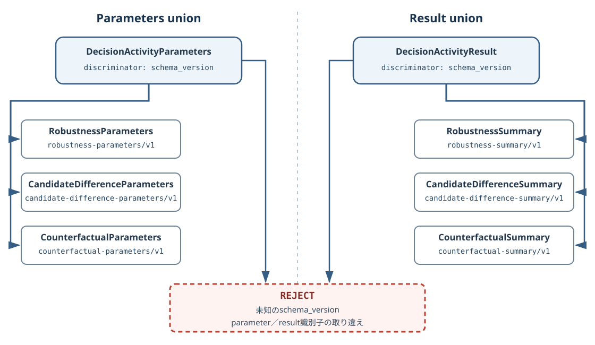
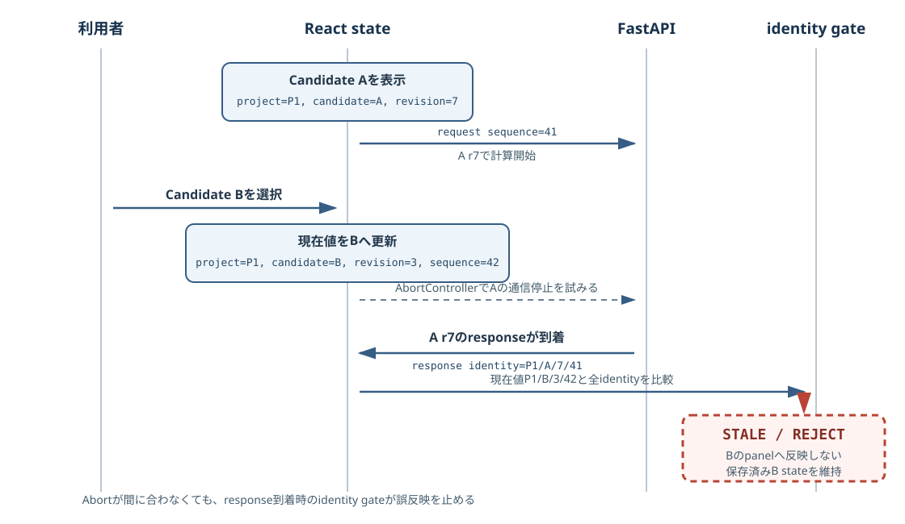
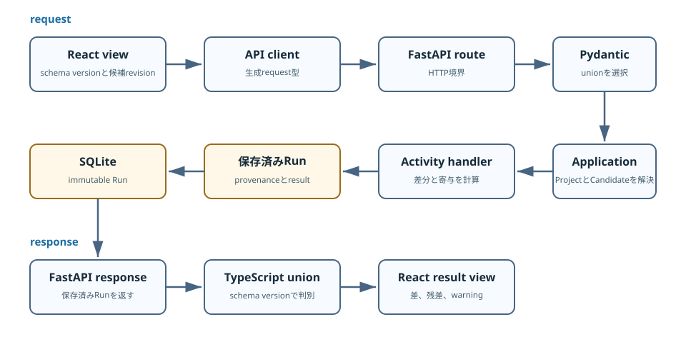

# 型付き契約をPythonからReactまで通す {#sec-contract-stack}

## 対象読者と到達点

この章は、PythonまたはTypeScriptで開発した経験があり、Material Decision Workbenchの変更経路を初めて追う開発者を対象にします。

読了後は、候補差分の要因分解を題材として、次の問いへ答えられる状態を目指します。

- request bodyの型はどこが正本か
- Activityごとに異なるparameterとresultを、共通APIがどう扱うか
- OpenAPIとTypeScript型は何から生成されるか
- Reactは異なるresult shapeをどう判別するか
- 保存済みRunは、どの版の候補とモデルから作った結果かをどう保持するか
- contract、service、API、frontend、E2Eのtestは、それぞれ何を防ぐか

この章は、新しいActivityをproductionへ追加しません。
既存実装を読み、小さな変更案を演習用に設計するところまでを扱います。

## 変更が一層で終わらない理由

候補差分の要因分解に「比較理由」という文字列を追加するとします。
request bodyだけを考えれば、Python modelへfieldを一つ足せば済みそうです。

しかし、このアプリではrequestが次の境界を通ります。

```text
React form
  -> generated TypeScript request type
  -> openapi-fetch
  -> FastAPI route
  -> Pydantic request contract
  -> application service
  -> Activity handler
  -> immutable Run in SQLite
  -> Pydantic response contract
  -> generated TypeScript response type
  -> React result view
```

一層だけを変更すると、別の層が古い意味を保持します。
たとえばPython modelだけを変えて生成型を更新しなければ、frontendは古いrequest型を使い続けます。
画面だけにfieldを足せば、backendは余分なfieldを拒否するか、意図せず捨てます。
保存済みRunのschemaを考えなければ、再起動後の読み出しで現行contractに復元できません。

この問題は「同じfieldを何度も書く」ことだけではありません。
各層が別の責務を持つため、変更の意味をどの境界まで通すかを決める問題です。
境界の数ではなく、interfaceが隠す複雑さでmoduleを評価する見方は、Ousterhoutの*Modules Should Be Deep*と比較できます [@ousterhout-philosophy]。

## 判別可能なunion

異なるshapeを一つの入口で受けるとき、値そのものから種類を推測すると判定が曖昧になります。
`sample_count`があるからロバストネス解析だと推測すると、別のActivityが同名fieldを使った時点で破綻します。

そこで、payload自身へ種類を示す固定値を置きます。
この固定値を**discriminator**と呼び、discriminatorで種類を一意に選べるunionを**discriminated union**と呼びます。

検討アクティビティのparameterは、`schema_version`をdiscriminatorにします。^[Pydanticのdiscriminatorは、検証エラーを該当するvariantへ絞る利点もあります。この章では変更経路を主題にするため、エラー表現の比較までは扱いません。]

| Activity | parameterの`schema_version` |
|---|---|
| ロバストネス／公差解析 | `robustness-parameters/v1` |
| 候補差分の要因分解 | `candidate-difference-parameters/v1` |
| 目標へ届く最小変更 | `counterfactual-parameters/v1` |

resultも同じ考え方で分けます。
parameterとresultが別の識別子を持つため、requestとresponseを同じ型だと誤認しません。

{fig-alt="DecisionActivityParametersは三つのparameter契約を、DecisionActivityResultは対応する三つのsummary契約を、それぞれschema_versionで判別する。parameter用とresult用の識別子を取り違えたpayloadと未知の識別子はREJECTとなる。" width="100%"}

::: {.callout-important title="DESIGN DECISION"}
`schema_version`は画面表示用のlabelではありません。
保存済みpayloadの復元と、Python、OpenAPI、TypeScriptの型選択に使う契約上の識別子です。
表示名を変える事情で更新せず、shapeまたは意味の互換性が変わるときにversionを分けます。
:::

## Python契約が種類を固定する

### parameter model

正本は  です。
候補差分のparameter modelは、比較対象の候補IDとrevisionを要求します。

```python
class CandidateDifferenceParameters(ContractModel):
    schema_version: Literal["candidate-difference-parameters/v1"] = (
        "candidate-difference-parameters/v1"
    )
    comparison_candidate_id: Annotated[str, Field(min_length=1)]
    comparison_revision: Annotated[int, Field(ge=1)]
```

`Literal`は許される文字列を一つへ固定します。
`comparison_candidate_id`は空文字を拒否し、`comparison_revision`は1以上に制限します。
これらはpayload単体で判定できる構造条件です。

三つのparameter modelは、次のunionへまとめられます。

```python
DecisionActivityParameters = Annotated[
    RobustnessParameters
    | CandidateDifferenceParameters
    | CounterfactualParameters,
    Field(discriminator="schema_version"),
]

class DecisionActivityRunRequest(ContractModel):
    expected_revision: Annotated[int, Field(ge=1)]
    parameters: DecisionActivityParameters
```

ここで、`expected_revision`と`comparison_revision`は別の値です。
前者は操作対象の候補が、画面で見たrevisionから変わっていないことを確認します。
後者は比較候補のどのrevisionを使うかを固定します。

二つを一つの「revision」にまとめると、操作対象の競合検出と比較証拠の再現性を区別できません。

### discriminatorを省略できない理由

各parameter modelの`schema_version`にはdefaultがあります。
それでも、union全体の入力ではdiscriminatorを明示する必要があります。

Pydanticは、個別modelを選んでdefaultを補う前に、どのmodelで検証するかを決めなければなりません。
discriminatorがなければ、その選択ができません。

`backend/tests/test_decision_activities.py` は、requestから`schema_version`を削除したときにHTTP 422となることを確認します。

```python
payload = _run_payload(candidate["revision"])
del payload["parameters"]["schema_version"]

response = client.post(activity_url, json=payload)

assert response.status_code == 422
```

このtestはdefault値の存在を否定していません。
Pythonコードがを直接生成する場合にはdefaultを使えます。
外部payloadをunionとして受ける場合は、種類を明示させるという境界を固定しています。

### result model

候補差分のresultは、入力差、予測差、入力ごとの寄与、支持範囲、warningを分けます。

```python
class CandidateDifferenceSummary(ContractModel):
    schema_version: Literal["candidate-difference-summary/v1"] = (
        "candidate-difference-summary/v1"
    )
    comparison_candidate_id: str
    comparison_candidate_revision: int
    changed_input_count: Annotated[int, Field(ge=1)]
    target_summaries: tuple[DifferenceTargetSummary, ...]
    input_changes: tuple[DifferenceInputChange, ...]
    contributions: tuple[DifferenceContribution, ...]
    base_support: Support
    comparison_support: Support
    warnings: tuple[str, ...]
```

予測差とモデル不確実性は、同じ数値へ畳み込みません。
`DifferenceTargetSummary`は、この候補と比較候補のprediction、差、置換で説明できた分、残差を別fieldにします。

寄与も因果効果とは呼びません。
実装は「比較候補の入力を一つだけ置換した局所差」を返すため、画面とE2Eはwarningとして「因果効果ではありません」と示します。

<span class="evidence-label">CONFIRMED</span>
現行result contractと画面は、入力置換で説明できた差と残差を別のfieldとして表示します。

<span class="evidence-label">INTERPRETATION</span>
この分離は、説明できた値だけを過大評価しないための「会計表」として読むと追いやすくなります。
会計表は教材上の読み方であり、統計的な因果分解を保証する名前ではありません。

## registryが固有処理を閉じ込める

型だけをunionにしても、共通serviceへ次の分岐が増え続ければ拡張点は中央へ集中します。

```python
if activity_id == "robustness-analysis-v1":
    ...
elif activity_id == "candidate-difference-v1":
    ...
```

現行実装は、この形を採りません。
`backend/src/material_workbench/application/decision_activity_registry.py` は、Activityごとのhandlerをallow-listします。

```python
@dataclass(frozen=True)
class DecisionActivityHandler:
    definition: DecisionActivityDefinition
    parameters_kind: str
    prepare: Callable[[ActivityContext], Any]
    compute: Callable[[ActivityContext, Any], ActivityComputation]
```

handlerは、Activity definition、受け付けるparameter kind、事前準備、計算を一組にします。
`build_registry()`は固有handlerを集め、`activity_id`の重複とparameter/result kindの衝突を拒否します。

このregistryは任意plugin loaderではありません。
アプリ本体がimportする実装だけを登録する内部allow-listです。
Model PackageからPythonコードを読み込まないというリポジトリの安全原則と同じ方向を向いています。

### 共通serviceの責務

`backend/src/material_workbench/application/decision_activities.py` の`DecisionActivityService`は、Activityの種類に依存しない処理を持ちます。

1. Project、Candidate、Task runtimeを解決する
2. handlerをregistryから取得する
3. requestの`schema_version`がhandlerの`parameters_kind`と一致するか確認する
4. required resourceが利用できるか確認する
5. handlerへ準備と計算を委譲する
6. provenanceとresultを`DecisionActivityRun`へまとめる
7. immutable Runとして保存する

Activity固有の計算は、`decision_activity_difference.py`のような別moduleへ置きます。
共通serviceは「候補差分ならこの計算」と名指ししません。

`test_shared_activity_shells_do_not_name_a_specific_activity`は、共通service、API、共通React panelに既知の`activity_id`文字列が混入していないことを検査します。
通常の動作testだけでは見逃す構造上の退行を、source inspectionで固定しています。

::: {.callout-note title="REPOSITORY"}
このtestが守るのは「固有IDを共通shellへ書かない」という構造です。
Activityを追加する際に変更箇所が一切増えないことまでは保証しません。
Python contract union、backend registry、frontend view registryには、新しい種類を明示的に追加します。
:::

## 業務条件はapplicationで検証する

Pydantic contractは、IDが空でないことやrevisionが1以上であることを検証できます。
一方、比較候補が実際に存在するか、同じProjectに属するか、操作対象と同じ候補ではないかは、storeとProject文脈を読まなければ判定できません。

この条件は、Activity handlerとapplication serviceが検証します。

たとえば次は、どれもJSON shapeとしては正しいrequestです。

- 存在しない`comparison_candidate_id`
- 別Projectの候補ID
- 操作対象と同じ候補ID
- 入力が完全に同じ別候補
- 保存後にrevisionが進んだ比較候補

これらをPydantic validatorへ詰め込むと、contract modelがdatabaseとruntimeに依存します。
model単体の検証と、実行文脈を必要とするpreconditionが混ざります。

`backend/tests/test_decision_activities.py` は、自己比較、同一入力、別Activityのparameterを送る場合を個別に検証します。
失敗理由を分けることで、単なる422だけでなく、どの境界が拒否したかを確認できます。

## provenanceが結果の出所を閉じる {#sec-contract-provenance}

候補差分の数値だけを保存しても、後から同じ判断を説明できません。
候補、モデル、特徴量、Activityのいずれかが変われば、同じ入力に見えても結果の意味が変わるためです。

`DecisionActivityProvenance`は次を保存します。

| 分類 | 主なfield |
|---|---|
| Task | `task_id`, `task_contract_digest` |
| 操作対象 | `candidate_id`, `candidate_revision`, `canonical_input_digest` |
| Model | `model_package_digest`, `model` |
| Feature | `feature_pipeline_digest` |
| Activity | `activity_id`, `activity_version`, `parameters_digest` |
| Project設定 | `project_design_space_digest`, `objective_definition_digest` |

`DecisionActivityRun`はdefinition、parameters、provenance、resultを同じimmutable recordにします。
model validatorは、definitionの`result_kind`とresultの`schema_version`が一致することを確認します。
provenance内のActivity IDとversionもdefinitionへ一致させます。
^[ここでいうimmutableは「作成済みRunを更新するAPIを設けない」というアプリケーション上の契約です。SQLite file自体が暗号学的に改変不能になる、という意味ではありません。]

このvalidatorがなければ、候補差分というlabelのRunへロバストネスresultを格納できてしまいます。
個々の型が正しくても、組合せが誤っている状態です。

::: {.callout-warning title="PITFALL"}
保存済みRunを現行modelで読み出せることと、最新モデルで再計算することは別です。
Runは作成時のPackage digestとresultを保持します。
最新Packageへ自動追従させると、過去の判断証拠が別の計算へ置き換わります。
:::

## FastAPIがcontractを公開する

`backend/src/material_workbench/api/decision_activities.py` は、requestとresponseへPydantic modelを指定します。

```python
@router.post(
    "/api/projects/{project_id}/candidates/{candidate_id}"
    "/decision-activities/{activity_id}/runs",
    status_code=201,
    response_model=DecisionActivityRun,
)
def run_decision_activity(
    project_id: str,
    candidate_id: str,
    activity_id: str,
    payload: DecisionActivityRunRequest,
    service: ServiceDependency,
) -> DecisionActivityRun:
    return service.run(project_id, candidate_id, activity_id, payload)
```

routerはHTTP path、status、dependency、error変換を担当します。
候補差分の計算やSQLiteへの保存は担当しません。
この分担はService Layerの語彙で比較できますが [@fowler-poeaa]、現行実装がpatternの完成例だとはみなしません。

FastAPIはfunction signatureとPydantic modelからOpenAPI schemaを生成します。
request bodyからvalidationとAPI documentへ情報が渡る基本経路は、FastAPI公式tutorialでも確認できます [@fastapi-request-body]。
の`parameters`は、三つのparameter schemaを持つ`oneOf`と、`schema_version`のdiscriminator mappingになります。

このOpenAPIはruntimeから毎回frontendへ直接配信して終わりではありません。
`backend/scripts/export_openapi.py`がJSONを安定した順序で書き出し、`apps/web/src/generated/openapi.json`としてversion controlします。

追跡する理由は、backend変更とfrontend生成型の差をPRで確認し、staleなschemaをtestで拒否するためです。
^[生成物を追跡する運用にはdiffが大きくなる欠点もあります。それでも本リポジトリでは、Python環境を起動せずにfrontend側が契約を検査できることと、契約差分をreviewできることを優先しています。]
`backend/tests/test_openapi_contract.py` は、追跡済みJSONと`app.openapi()`が等しいことを確認します。

## OpenAPIからTypeScript型を生成する

ルートのcommandは次です。

```powershell
npm run api:generate
```

このcommandは二段階で動きます。

```text
Pydantic/FastAPI
  -> backend/scripts/export_openapi.py
  -> apps/web/src/generated/openapi.json
  -> openapi-typescript
  -> apps/web/src/generated/api-types.ts
```

生成された`CandidateDifferenceParameters`では、`schema_version`が文字列一般ではなくliteralになります。

```typescript
CandidateDifferenceParameters: {
  comparison_candidate_id: string;
  comparison_revision: number;
  schema_version: "candidate-difference-parameters/v1";
};
```

`DecisionActivityRunRequest.parameters`は三つのmodelのunionです。

```typescript
parameters:
  | components["schemas"]["RobustnessParameters"]
  | components["schemas"]["CandidateDifferenceParameters"]
  | components["schemas"]["CounterfactualParameters"];
```

frontendが同じunionを手書きしないため、backendへ種類を追加して生成を忘れると`npm run api:check`が失敗します。
逆に、生成fileを手で直しても、次回生成で消えます。

### checkとgenerateの使い分け

`npm run api:generate`は生成物を更新します。
契約を意図的に変えたときに使います。

`npm run api:check`は生成物が最新かを確認し、差分を書き換えません。
文書作業や、契約を変えていない変更の完了判定に使います。

この章の演習はproduction contractを変更しないため、`api:check`だけを実行します。

## API wrapperが画面の言葉へ寄せる

`apps/web/src/shared/api/client.ts`は、生成された`paths`を`openapi-fetch`へ渡します。
endpoint path、query、request body、response bodyが同じOpenAPIから型付けされます。

`apps/web/src/shared/api/workbench-api.ts`は、画面が使う型aliasと操作名を置きます。

```typescript
export type ApiDecisionActivityRun =
  components["schemas"]["DecisionActivityRun"];
export type ApiDecisionActivityRunRequest =
  components["schemas"]["DecisionActivityRunRequest"];
```

実行methodは、生成`paths`に存在するendpointへ、型付きbodyを渡します。

```typescript
async runDecisionActivity(
  projectId: string,
  candidateId: string,
  activityId: string,
  body: ApiDecisionActivityRunRequest,
  signal?: AbortSignal,
) {
  return requireData(await apiClient.POST(
    "/api/projects/{project_id}/candidates/{candidate_id}"
      + "/decision-activities/{activity_id}/runs",
    {
      params: {
        path: {
          project_id: projectId,
          candidate_id: candidateId,
          activity_id: activityId,
        },
      },
      body,
      signal,
    },
  ), "検討アクティビティを実行できませんでした。");
}
```

wrapperはPydantic contractを再定義しません。
画面向けの名前、共通error message、AbortSignalの接続を担当します。

## React共通shellと固有view

### 共通shell

のは、Activityに共通する状態を所有します。

- 利用可能なActivityの取得
- 保存済みRunの取得
- 選択中Activity
- 選択中の保存済みRunとURL state
- loading、running、error
- requestの中断
- 選択候補が変わった後のstale response破棄
- Activity固有viewへのprops受渡し

共通shellは、候補差分の入力fieldやresult tableを知りません。
`decisionActivities/registry.ts`から、選択した`activity_id`に対応するviewを取得します。

frontend側にもallow-listが必要な理由は、backendが計算できることと、rendererが結果を意味のある画面で表示できることが別だからです。
未知Activityへ汎用JSON viewerをfallbackとして出さず、未対応を明示します。

### 固有view

`CandidateDifferenceActivityView.tsx`は、比較候補の選択と候補差分resultの表示を担当します。
実行時に次のparameterを組み立てます。

```typescript
void onRun({
  schema_version: "candidate-difference-parameters/v1",
  comparison_candidate_id: comparison.candidateId,
  comparison_revision: comparison.revision,
});
```

`onRun`が受ける型は、手書きのinterfaceではありません。
`decisionActivities/types.ts`が生成request typeから取り出します。

```typescript
export type DecisionActivityParameters =
  ApiDecisionActivityRunRequest["parameters"];
```

responseの`result`もunionです。
viewは`schema_version`を確認して候補差分resultへnarrowingします。

```typescript
function differenceResult(run: ApiDecisionActivityRun) {
  return run.result.schema_version === "candidate-difference-summary/v1"
    ? run.result
    : null;
}
```

この条件の後では、TypeScriptが`input_changes`、`contributions`、`target_summaries`の存在を認識します。
`as CandidateDifferenceSummary`で強制castする必要はありません。

### 数値と適用範囲をTaskの言葉へ変える

候補差分の出力値は、view固有の固定桁数で表示しません。
`DecisionActivityPanel`はTask DefinitionとProjectの`display_decimals` overrideを固有viewへ渡します。
`CandidateDifferenceActivityView`は`formatTaskNumber()`を使い、目的変数ごとの桁数で予測値、差、寄与、区間を表示します。

入力値の差分は、出力値とは別に最大4桁の汎用formatを使います。
入力fieldと出力targetは、同じ数値でも表示契約の正本が異なるためです。

support statusも`"supported"`を直接表示しません。
`supportStatusLabel()`を通し、「範囲内」「要確認」「外挿」という判断に使える表示へ変えます。
型付きcontractが状態の集合を固定し、presentation helperが利用者向けの語と桁数を固定します。

### 点予測の達成と予測区間を分ける

条件変更案では、`achieved`だけを見ると「この変更で目標達成が保証された」と誤読できます。
現行contractの`CounterfactualTargetEvaluation`は、判定に使った`predicted_value`に加えて、canonical `prediction`を保存します。
閾値または範囲を指定する`at_least`、`at_most`、`between`、`target`では実単位の`shortfall`も保存します。
値を報告するだけの`reporting_only`と、他候補との比較で決まる`maximize`、`minimize`では、単独候補の不足量を定義しません。
`achieved`は点予測による判定であり、予測区間全体が目標条件を満たすという判定ではありません。

は、点予測、達成または未達、利用可能な予測区間を別の表示要素へ分けます。
Predictionに区間情報がない場合は、「区間情報なし」と明示します。
binary targetの不足量はパーセントポイント、ordinal targetはカテゴリ差、連続量は特性の実単位で表します。
は案全体にも「点予測で目標条件を満たす」と明記し、支持範囲のbadgeと達成判定を同じ意味に見せません。

旧versionの保存済みRunにはcanonical `prediction`と`shortfall`がありません。
画面は要約値を点予測へ格上げせず、「旧記録の要約値」「区間情報なし」と表示します。[^counterfactual-v11]

[^counterfactual-v11]:
    Activity versionは`1.1.0`へ進み、semantic cache identityも旧`1.0.0`と分かれます。
    旧Runを読めることと、新しい証拠を持つRunを同一視することは別です。

### 判断質問の責務境界

共通の`DecisionActivityPanel`は、Activity一覧、保存済みRun、request identity、実行lifecycleを扱います。
一方、質問文と前提確認は各Activity viewが扱います。
目標なしRobustnessのように、Project設定によって「目標達成率」と「入力ばらつき」の問いを切り替える処理を共通shellへ置くと、shellが固有Activity IDを知ることになります。

現行実装は、各viewが`availability.definition.question`を表示します。
Robustness viewだけは、目標がない間は前提説明を出し、利用者が感度だけを見ると確認した後に感度の問いへ切り替えます。

### 保存済みRunをURLへ接続する

保存済みRunの選択は、固有viewではなく共通shellが所有します。
`DecisionActivityPanel`は`activeRunId`と`onSelectRun`を各viewへ渡し、Activityを切り替えた場合は別ActivityのRunを引き継がないよう選択を消します。

選択中ActivityとRun IDは、`apps/web/src/app/navigation.ts`を通してlocationへ含めます。
共有URLから開いた場合、shellはRun IDを保存済みRunへ照合し、そのRun自身が持つ`activity_id`を優先します。^[URLのActivity IDは入口を早く決めるhintです。Runと矛盾する場合は、保存済みRunが持つdefinitionを正とするため、別Activityの表示へ誤って復元しません。]

この状態を共通shellへ持ち上げることで、ロバストネス、候補差分、最小変更が同じ共有linkの契約を使います。
`apps/web/tests/activityRunNavigation.test.mjs`は、locationへのRun ID保持、候補の作成元Runへの帰還、各viewが選択stateを重複所有しないことを確認します。

### stale response

候補AのActivityを実行中に、利用者が候補Bへ切り替える場合があります。
遅れて候補Aのresponseが届き、候補Bのpanelへ表示されると、型が正しくても内容は誤りです。

`DecisionActivityPanel`は、Project ID、Candidate ID、Candidate revisionからrequest identityを作ります。
request開始時のidentityと現在のidentityが一致する場合だけ、responseをstateへ反映します。
候補切替時には実行中requestもabortします。

{fig-alt="Candidate A revision 7のrequest開始後にCandidate B revision 3へ切り替える。Aのresponseが届いてもProject、Candidate、revision、request sequenceが現在値と一致しないためSTALEとしてREJECTし、Bのpanelへ反映しない。AbortControllerは通信停止を試みるが、response到着時のidentity checkを置き換えない。" width="100%"}

型はpayloadのshapeを守ります。
request identityはpayloadが現在の画面文脈に属することを守ります。
二つは別の安全策です。

## 一requestを端から追う

候補差分を一度実行するときの流れを、値と責務で追います。

{fig-alt="React requestからAPI client、FastAPI、Pydantic、application service、Activity handler、保存済みRunを経て、TypeScript unionとReact result viewへ戻る。" width="100%"}

1. 利用者が「差分を分解」を押す。
2. React viewは比較候補IDとrevisionをparameterへ入れる。
3. 共通panelは操作対象候補の`expected_revision`を追加する。
4. `openapi-fetch`は生成されたendpoint型に従ってPOSTする。
5. FastAPIはbodyを`DecisionActivityRunRequest`として検証する。
6. serviceは`activity_id`でhandlerを引き、parameter kindを照合する。
7. handlerは比較候補をrevision付きで解決し、入力差と予測差を計算する。
8. serviceはTask、Candidate、Package、Feature、Activityのprovenanceを固定する。
9. storeはRunを保存し、APIは201で同じRunを返す。
10. React viewはresultの`schema_version`を確認して候補差分の表を描く。

途中のどこかが失敗した場合、すべてを「実行できませんでした」へ潰しません。
構造validation、業務precondition、not found、revision conflictは、API境界で意味のあるstatusとmessageへ変換します。

## testが守る境界

一つのE2Eだけですべてを保証しようとすると、失敗原因が広く、実行も遅くなります。
現行実装は、壊れ方に近い層へtestを置きます。

### contractとservice

`backend/tests/test_decision_activities.py`は、少なくとも次を確認します。

- availabilityが必要resourceの不足理由を返す
- parameterとresultのschema kindが混ざらない
- Candidate revisionが古い場合に拒否する
- 同じ入力から同じRun identityを得る
- 保存後に同じRunを復元できる
- 自己比較と同一入力比較を拒否する
- 共通shellが固有Activity IDで分岐しない
- backend registryとfrontend view registryが同じActivity集合を持つ

これらは、画面の見た目より前に成立すべき契約です。

### OpenAPI drift

`backend/tests/test_openapi_contract.py`は、FastAPIが現在生成するschemaと、追跡済み`openapi.json`を比較します。
`npm run api:check`は、そのJSONと`api-types.ts`の同期を確認します。

二段階に分けることで、次のどちらが古いかを判別できます。

- Python contractに対してOpenAPI JSONが古い
- OpenAPI JSONに対してTypeScript生成型が古い

### E2E

`e2e/decision-activity.spec.ts`は、利用者の操作として次を確認します。

1. 候補比較画面を開く
2. 検討アクティビティを開く
3. 候補差分tabを選ぶ
4. 比較候補を選ぶ
5. 「差分を分解」を押す
6. POSTが201を返す
7. 置換で説明できた分と残差が見える
8. 因果効果ではないというwarningが見える

E2Eは、すべての数値を固定しません。
契約、API、画面が接続され、判断に必要な区別が表示されることを確認します。

::: {.callout-tip title="CHECKPOINT"}
Python testが成功しても生成型が古い可能性があります。
TypeScript typecheckが成功しても、利用者が正しいtabから実行できない可能性があります。
focused test、`api:check`、E2Eは代替関係ではなく、異なる破損を検出します。
:::

## 現mainで再確認する

リポジトリ直下で次を実行します。

```powershell
uv run python -m pytest `
  backend/tests/test_decision_activities.py `
  backend/tests/test_openapi_contract.py

npm run api:check
```

成功した場合、次を確認できたと解釈します。

- 現行Activity contractとserviceのfocused testが通る
- 追跡済みOpenAPIがFastAPI contractと一致する
- 生成TypeScript型が追跡済みOpenAPIと一致する

このcommandだけではReactの実操作を確認していません。
UIまで変更した場合は、隔離DBを使う既定設定で次も実行します。

::: {.callout-warning title="現mainの既知E2E failure"}
2026年7月27日にmerge済みHEAD `f93af87` で再実行し、3件中2件が成功しました。
失敗はrevision付きoption labelへのtest追従漏れ [Issue #279](https://github.com/mryk814/re-process-dashboard/issues/279) だけで、open中の [Issue #280](https://github.com/mryk814/re-process-dashboard/issues/280) に記録された失敗は再現しませんでした。
Issue #279が閉じるまでは、2 passed、1 known failureを現行の期待結果とし、失敗を教材変更の退行と誤認しません。
:::

```powershell
npx playwright test e2e/decision-activity.spec.ts
```

## 変更影響を逆向きに読む

ここまではPython contractから画面へ進みました。
実際の保守では、画面の違和感やtest failureから正本へ戻る場合もあります。

たとえば、候補差分画面に新しいfieldが表示されないとします。
最初から全fileを検索するのではなく、次の順に境界を戻ります。

1. React viewがresultをnarrowingした後、そのfieldを読んでいるか
2. `ApiDecisionActivityRun`の候補差分resultにfieldがあるか
3. `api-types.ts`の生成元であるOpenAPI schemaにfieldがあるか
4. FastAPI response modelのPydantic contractにfieldがあるか
5. handlerがresult modelへ値を渡しているか
6. 保存後にRunを復元したときもfieldが残るか

この順序なら、表示だけの欠落か、生成driftか、backend計算の欠落かを早く分けられます。

### 画面にはfieldがあるが値が空の場合

TypeScript型にoptional fieldがあり、画面もそのfieldを読んでいる場合、生成driftではありません。
Network panelのresponseを確認し、次にhandlerがresultを組み立てる箇所を読みます。

空値が許されるcontractなら、「値がないこと」が正常かもしれません。
たとえばgoalを設定していないProjectでは、目標達成率を計算できません。
この場合は0を補うと意味が変わります。
画面は未計算と0を分けて表示する必要があります。

現行のRobustness Activityは、ここで処理全体を失敗させません。
画面はまず、目標達成率にはProjectの目標値が必要だと説明し、目標設定へ移る経路と、目標なしで入力ばらつきだけを見る経路を分けます。
後者では入力ばらつき、モデル支持範囲、worst valueを確認できますが、`goal_achievement_rate`は未計算のままです。

この分岐は、同じ計算を説明文だけ変えて見せるものではありません。
「目標にどの程度届くか」と「入力が揺れたとき予測がどの程度動くか」は、必要な前提が異なる二つの判断質問です。[^goal-less-robustness]

[^goal-less-robustness]:
    保存済みRunを後から開いたときも、画面は現在のProject設定から達成率を補いません。
    結果が`null`なら「この解析の実行時に目標が未設定だったため未計算」と表示し、証拠を実行時点の意味のまま読みます。

### APIが422を返す場合

422をすべてPydantic errorだと決めません。
このrouterは、形として正しいrequestでも、自己比較や同一入力のような業務precondition違反を422へ変換します。

responseのfield errorがbody pathを示す場合は、Pydantic validationを先に調べます。
日本語messageが比較条件を示す場合は、application serviceまたはhandlerのvalidationを調べます。
同じstatusでも、調査する層が異なります。

### 保存後だけ読み出せない場合

実行直後のresponseは表示できるのに、再起動後の履歴だけ失敗する場合、通信経路より保存payloadの復元を疑います。
新しいrequired fieldを同じschema versionへ追加すると、旧Runにfieldがないため現行modelへ復元できない可能性があります。

この場合、frontendへfallbackを足して隠しません。
旧payloadをどう読むか、schema versionを分けるか、migrationを行うかを保存契約として決めます。

## 典型的な失敗を切り分ける

次の表は、症状から最初に確認する境界を示します。
一つの症状に複数の原因がありうるため、診断を断定する表ではありません。

| 症状 | 最初に確認するもの | 次の確認 |
|---|---|---|
| `api:check`だけ失敗する | OpenAPIまたは生成型の未更新 | 意図したcontract差分か |
| pytestでschema validationが失敗する | Pydantic field、literal、validator | 保存fixtureのversion |
| APIは201だが画面が空 | result narrowingとview registry | response payload |
| 候補切替後だけ誤表示 | request identityとabort | query keyとrevision |
| 再起動後だけRunが読めない | 保存payloadと現行model | migration方針 |
| Activity追加で共通testが失敗 | 共通shellへの固有ID混入 | registry配置 |
| E2Eでwarningだけ見えない | view copyと条件render | result warnings |
| 数値は出るが意味が不明 | contract fieldの意味と単位 | docsとUI label |

### 生成fileへ直接修正した場合

`api-types.ts`を直接直すと、その場のtype errorは消えるかもしれません。
しかし次の`npm run api:generate`で修正は消えます。
さらにPython contractと通信payloadは変わっていないため、画面が存在しないfieldを期待する状態になります。

正本へ戻り、Pydantic model、OpenAPI、生成型の順で変更します。
生成差分が予想より大きい場合は、無関係なcontract変更が混ざっていないか確認します。

### 共通serviceへ固有分岐を追加した場合

新Activityの実装中に、共通serviceへ小さな`if`を足すと短く見えます。
二件目、三件目でも同じ判断をすると、availability、precondition、compute、result処理が中央へ集まります。

現行registryが提供する`definition`、`parameters_kind`、`prepare`、`compute`で表現できるかを先に確認します。
共通lifecycleそのものが変わる場合だけ、共通serviceのcontract変更としてreviewします。

### frontendへ汎用JSON fallbackを追加した場合

backendへ新Activityがあるがfrontend viewがない場合、任意JSONを表示すれば一時的に内容は見えます。
しかし、単位、warning、操作、結果の意味を利用者へ翻訳できません。

現行panelは未知viewを「未対応」と表示します。
この停止は機能不足を隠さず、backend capabilityと利用可能なUIを分けます。
新Activityをproductionへ出す場合は、view registryとActivity固有componentを同じ変更で追加します。

## 教材を監査として使う

処理経路を説明できない箇所は、文書の不足だけとは限りません。
責務が複数moduleへ散らばっている、同じ概念を別名で呼んでいる、testが結果だけを確認して境界を固定していない可能性があります。

この章を書く過程では、次の問いで実装を監査しました。

1. parameterの種類を一意に選べるか
2. resultとdefinitionの組合せを検証するか
3. 共通serviceが固有Activityを知りすぎていないか
4. 保存済みRunが再現に必要なdigestを持つか
5. OpenAPIと生成型のdriftを別々に検出できるか
6. 画面がunionを安全にnarrowingするか
7. 型では防げないstale responseへ対策があるか
8. E2Eが統計値と表示上の意味を混同していないか

説明を書くために新しい抽象化を作る必要はありませんでした。
一方、backendとfrontendに別々のallow-listがあること、source inspection testが文字列へ依存すること、保存schemaの長期migrationを変更ごとに判断することは、現在の限界として明示できました。

この監査結果は、「すぐに共通registryを自動生成する」という将来案を正当化しません。
二箇所の明示登録は、利用可能なbackend処理と意味のあるfrontend表示を別々に承認する境界でもあります。
重複による事故が実測されたときに、自動化の利点と失うreview pointを比較します。

## 契約変更PRをreviewする

契約変更のreviewでは、差分のfile数だけを見ません。
一つの意味が必要な境界まで届き、不要な境界へ漏れていないかを確認します。

### 変更前の問い

reviewerは、最初に変更の種類を確定します。

- 既存schema versionの互換な拡張か
- 保存済みpayloadを読めなくする非互換変更か
- field名だけでなく意味や単位を変える変更か
- Activity固有処理か、共通lifecycleの変更か
- requestだけか、保存済みRunとresponseにも残す情報か

この分類が曖昧なまま生成fileまで更新すると、機械的には整合していても、旧Runをどう読むかという判断が抜けます。

### 差分の読む順番

次の順でdiffを読むと、正本から派生物へ進めます。

1. Pydantic contractとvalidator
2. Activity handlerとapplication service
3. persistenceまたはmigration
4. FastAPI routeとerror変換
5. OpenAPI JSON
6. TypeScript生成型
7. API wrapperとReact view
8. focused testとE2E
9. 契約文書と教材

OpenAPI JSONとTypeScript生成型の大きなdiffを最初に読むと、意図した変更と自動展開された差分を区別しにくくなります。
先にPython contractで意図を確認し、生成差分がその意図だけを反映しているか照合します。

### reviewで拒否する状態

次の状態は、buildが成功しても契約変更の完了とはしません。

- 生成型だけを直接修正している
- 旧Runが読めないのにschema versionとmigrationの判断がない
- 共通serviceへActivity固有IDの分岐を追加している
- resultの数値を追加したが、単位または意味が画面で分からない
- provenanceへ必要なversionまたはdigestが残らない
- stale response対策を外し、最後に返ったresponseを無条件で表示する
- focused testがshapeだけを確認し、保存後の復元を確認しない
- E2Eが値の存在だけを見て、予測差と残差の区別を確認しない

これらの拒否理由は、抽象的な「設計がよくない」ではありません。
過去の判断を再現できない、別Activityの処理が中央へ集まる、利用者が数値の意味を誤るという具体的な破損へ結び付きます。

### PR本文へ残す証拠

契約変更PRには、変更したschema version、保存互換性の判断、生成command、focused test、E2Eの要否を記録します。
検証件数は実行時点の証拠として書き、恒久的な仕様にはしません。

教材を更新した場合は、`verified_commit`、参照path、HTML/PDF build、PDF visual reviewも記録します。
この証拠があれば、後続の開発者は「文書だけ更新した」のか「現mainの実装と組版まで確認した」のかを区別できます。

## 採用理由と代替案

### unionとregistryを採る理由

Activityごとにparameterとresultのshapeが異なる一方、Runの保存、Project解決、Candidate revision、provenanceは共通です。
discriminated unionは異なるshapeを保ち、registryは固有計算を共通serviceから分離します。

代替案として、すべてのActivity fieldをoptionalにした巨大modelがあります。
このmodelでは、候補差分に`sample_count`が付いた状態や、ロバストネスに比較候補IDが付いた状態を表現できてしまいます。
不正な組合せをvalidatorで列挙するほど、種類を分けた意味が失われます。

別の代替案は、Activityごとに完全に別endpointと別Run tableを持つ方法です。
Activity間でlifecycleが大きく異なるなら適します。
現行Activityは、明示実行、Candidate revision、provenance、immutable Runという共通lifecycleを持つため、共通shellを使う利点があります。

### 生成型を採る理由

TypeScript interfaceを手書きすれば、frontendだけを見たときは単純です。
しかし、Python contract変更のたびに別の正本を同期する必要があります。

生成型は、すべての意味を自動的に正しくする仕組みではありません。
field名、required、literal、union、endpoint bodyの機械的な同期を担います。
「この寄与を因果効果と呼ばない」といった表示上の意味は、ReactとE2Eで別に守ります。

### 現在の限界

現行実装には、次の限界があります。

- Pythonとfrontendにそれぞれallow-listがあり、新Activity追加では二箇所を更新する
- OpenAPIはshapeを伝えるが、統計的な意味の正しさまでは伝えない
- E2Eは代表的な操作を確認し、全Activityの全error状態を網羅しない
- source inspection testは構造退行を検出するが、識別子の書き方に依存する
- 保存済みschemaの長期migration方針は、Activity versionを増やす変更ごとに判断が必要
- Task Definitionは表示桁数を固定するが、統計値の意味を画面へ自動生成しない

これらは「型があるから完全に安全」という説明を退けます。
型はshapeと一部の組合せを守り、業務precondition、科学的妥当性、画面文脈、長期migrationは別の境界で扱います。

## 章末チェック

次の問いに、pathとtestを挙げて答えてください。

1. 候補差分parameterの正本はどこか。
2. `schema_version`を省略した外部requestが失敗するのはなぜか。
3. 比較候補が同じProjectに属するかをPydanticだけで検証しないのはなぜか。
4. 共通serviceがActivity固有IDで分岐しないことを、どのtestが守るか。
5. FastAPI contractと追跡済みOpenAPIのdriftを、何が検出するか。
6. OpenAPIとTypeScript生成型のdriftを、何が検出するか。
7. Reactが候補差分resultへnarrowingするとき、どのfieldを使うか。
8. 型が正しくてもstale responseが誤表示されるのは、どのような場合か。
9. RunへPackage digestとFeature Pipeline digestを残す理由は何か。
10. E2Eが数値をすべて固定せず、表示上の区別を確認する理由は何か。

[章末チェックの解答](../labs/extend-contract.qmd#answer-contract-chapter-check)を確認してから、同じページの変更演習へ進みます。

## Further Reading

- OpenAPI Specificationの*Schema Object*と*Discriminator Object* [@openapi-311]：PythonからTypeScriptへ運べるshapeを確認します。科学的な表示文脈まで運べるとは解釈しません。
- Pydanticの*Discriminated Unions* [@pydantic-unions]：variant選択を明示fieldへ固定する方法を読みます。Project ownershipのようなDB依存条件は対象外です。
- TypeScript Handbookの*Discriminated unions* [@typescript-narrowing]：生成unionをfrontendでnarrowingする経路を確認します。時間的にstaleなresponseの検出は別問題です。
- PercivalとGregoryの*Repository Pattern*と*Service Layer* [@cosmic-python]：境界の比較語彙を得ます。現行`Store`をpatternどおりに分割する処方箋にはしません。
