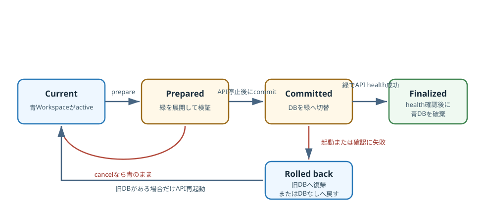

# Workspaceを切り替える前に復元を確かめる {#sec-workspace-restore}

## 対象読者と到達点

ローカルアプリの保存先、バックアップ、起動処理を変更する開発者が対象です。
PythonとTypeScriptの制御構造を読めればよく、SQLiteの内部実装やElectronのpackaging経験は前提にしません。

読了後は、次の問いへ実装pathを挙げて答えられる状態を目指します。

- 動作中の`workbench.db`をOSのfile copyで退避しない理由は何か
- `.mdwb` bundleがDBだけでなくData AssetとModel Packageを含む理由は何か
- `prepare`、`commit`、API health確認、`finalize`を分けると、どの失敗から戻れるか
- databaseを切り替える前後で、table digestが同じだと判定できる理由は何か
- archiveのSHA-256が保証するものと、保証しないものは何か
- backend test、desktop contract test、packaged smokeは、それぞれどの境界を守るか

## 扱わない範囲

この章は、定期backup scheduler、cloud storageへの同期、bundleの暗号化、電子署名を扱いません。
現行実装は利用者がDesktop版のnative dialogから明示的に作成し、選択したローカルbundleを復元します。

個々のProject Snapshotを候補へ戻す操作も別の機能です。
ここでいうWorkspace restoreは、user data directoryにある判断履歴と管理資源を一組で切り替えます。

## DBを戻してもWorkspaceは戻らない

PCを移行するため、動作中の`workbench.db`をコピーしたとします。
新しいPCでDBを開ければ、復元は終わったように見えます。

しかし、DBの`data_assets.locator`が指すworkbookと、`model_package_refs.locator`が指すPackageは別fileです。
DBだけを移すと、ProjectやPrediction Snapshotの行は残っていても、その判断を再現する入力とモデルを解決できません。

逆に、Data Libraryだけをコピーしても、どのProjectがどのrevisionとdigestを固定したかは戻りません。
このアプリのWorkspaceは、一つのSQLite fileではなく、**整合したDB snapshotと、そのDBが参照する管理資源の組**です。

Issue [#252](https://github.com/mryk814/re-process-dashboard/issues/252) は、次の六つを同じ復旧対象に置きました。

- Project
- Candidate Revision
- Prediction Snapshot
- Decision Activity Run
- Chainの判断証拠
- Source lifecycleの取得、品質判定、承認、Training Snapshot

PR [#282](https://github.com/mryk814/re-process-dashboard/pull/282) は、これらをversion付き`.mdwb` bundleへまとめ、別の空user data directoryへ復元する経路を実装しました。

::: {.callout-note title="DECISION"}
Package本体は参照だけでなくbundleへ含めます。
容量より可搬性を優先し、復元先に元PCと同じPackage配置がなくても固定参照を解決できるようにした判断です。
:::

## 復元に現れる六つの具体物

`backup`や`rollback`という語だけでは、どのfileがいつ正本なのか判断できません。
六つの具体物を先に固定します。

| 具体物 | 置き場所 | 役割 | 破棄できる時点 |
|---|---|---|---|
| active DB | active `workbench.db` | 現在利用中の判断履歴 | 新WorkspaceのAPI health確認後 |
| 既存Data Library | user data directory配下のcontent-addressed store | 現在利用中または再利用可能な管理資源 | restoreの`finalize`では一括破棄しない |
| Workspace bundle | 利用者が選んだ`.mdwb` | 移送するDB snapshot、資源、manifest | 利用者の保管方針による |
| prepared restore | `.workspace-restore/<token>/next/` | 展開、migration、照合を終えた候補 | cancelまたは失敗時 |
| rollback DB | `<token>/rollback-workbench.db` | commit直前の現DB | `finalize`後 |
| recovery journal | `<token>/state.json` | prepareとcommitの途中状態 | cancel、finalize、rollback後 |

`restore_token`は、検証済み候補と後続操作を結びます。
利用者が選んだpathをそのまま`commit`へ渡さないため、prepare後にbundleが差し替わっても、検証していない内容へ切り替わりません。

## 一回の復元を固定例で追う

現Workspaceを青、bundle内のWorkspaceを緑と呼ぶことにします。
青にはProject `P-blue`とData Asset `A-blue`があり、緑にはProject `P-green`とData Asset `A-green`があります。

prepareを終えた時点では、画面が読んでいる正本はまだ青です。
緑のDBとassetは`.workspace-restore/<token>/next/`にあり、検証結果だけが確認画面へ返ります。

利用者が「この内容へ復元」を選ぶと、Desktop main processがAPIを停止します。
backendは緑の管理資源をresource inventoryの`bundle_digest`で決まるcontent-addressed pathへ置き、青のDBをrollback用へ移し、最後に緑のDBをactive pathへ移します。

その直後にDesktop main processがAPIを起動します。
緑のDBを使ったhealth確認が成功して初めてrollback DBを破棄し、画面をreloadします。

もし緑のDBでAPIを起動できなければ、青のDBをactive pathへ戻します。
利用者が見ていた正本を捨ててから復元を試す順序にはなっていません。

{fig-alt="現Workspaceからprepare、commit、API health確認、finalizeへ進む。失敗時はrollbackし、旧DBがあれば元Workspaceへ戻し、旧DBがなければDBなしの状態へ戻す。" width="100%"}

この流れで問いになるのは、「fileを置き換えたか」ではありません。
新しいWorkspaceをアプリが実際に開けるところまで確認したかです。

## 動作中DBはSQLiteへ複製させる

`_logical_database_backup()`は、sourceとdestinationのSQLite connectionを開き、Pythonの`Connection.backup()`を呼びます。
処理後のdestinationへ`PRAGMA integrity_check`を実行し、`ok`以外があればbundle作成を止めます。

SQLite Online Backup APIは、動作中のdatabaseから整合したsnapshotを別databaseへ作るための公式interfaceです。
単純なfile copyとは異なり、source databaseをSQLiteのtransactionとlockの外から読まないため、アプリを動かしたままbackupできます。[^sqlite-online-backup]

`test_backup_uses_a_consistent_sqlite_snapshot_during_an_uncommitted_write`は、この差を一行で示します。
別connectionが`BEGIN IMMEDIATE`中に追加した未commitの`project_series`は、作成されたbundleのtable evidenceへ入りません。

もしOSのfile copyだけで十分なら、このtestはSQLiteの接続を使わずに通せたはずです。
実装がOnline Backup APIを選ぶ理由は、拡張子が`.db`だからではなく、動作中のtransaction境界を守る必要があるからです。

[^sqlite-online-backup]: SQLite公式は、Online Backup APIをlive databaseの内容から別database fileへsnapshotを作るinterfaceとして説明しています [@sqlite-backup]。

## manifestは移送物と検証証拠を結ぶ

`WorkspaceBundleManifest`は`workspace-bundle/v1`というschema versionを持ちます。
主な内容は次のとおりです。

| field | 固定するもの |
|---|---|
| `database` | bundle内DBのpath、SHA-256、byte数 |
| `data_library_files` | 同梱fileごとのpath、SHA-256、byte数 |
| `schema_migrations` | 適用済みmigration ID、checksum、適用時刻 |
| `model_package_references` | Package参照、Task、manifest digest、archive状態 |
| `bundled_resources` | Data Asset／Model Packageとbundle内rootの対応 |
| `table_evidence` | table名、対象column、row count、canonical digest |
| `diagnostics` | SQLite整合性、固定参照、同梱資源に関する診断 |

一つのbundle entryを検査するだけでは、全体の整合を確認できません。
manifestが「何が入っているはずか」を列挙し、展開処理が実際のentry集合と完全一致するかを確認します。

`WorkspaceBundleFile`のSHA-256はfileの破損や取り違えを検出します。
一方、manifestとfileを同時に作り直せる相手まで識別する署名ではありません。

::: {.callout-warning title="CONFIRMED"}
現行bundleは暗号化も署名も行いません。
SHA-256を「信頼できる配布者が作った証明」と説明すると、実装より強い保証を教材が作ってしまいます。
:::

## table digestはpathの違いを吸収する

別のPCへ復元すると、Data Libraryの絶対pathは変わります。
`C:\Users\A\...\asset.xlsx`と`D:\Portable\...\asset.xlsx`が異なるという理由だけで、判断履歴まで異なると判定するわけにはいきません。

`_normalized_row()`は、Data Assetのlocatorを`data-asset:<id>`、そのlocator kindを`workspace-managed`、Model Packageのlocatorを`model-package:<id>`へ正規化してからcanonical digestを計算します。
`_table_evidence()`は、安定したcolumn順とrow順で値をJSON化し、tableごとのSHA-256を作ります。

これにより、移設で変わる運用pathと、保存された判断内容の違いを分けられます。
`test_live_workspace_evidence_matches_after_restore_to_another_user_data`は、Project、Candidate、Snapshot、Activity、Chain、Source lifecycleを含むtable evidenceが別user data directoryでも一致することを確認します。

この正規化は、すべての差を無視する処理ではありません。
判断内容、revision、digest、参照IDが変わればtable digestも変わり、locatorの設置場所だけを比較から外します。

## backupは完成品だけを公開する

`create_workspace_backup()`は、利用者が指定したpathへ直接ZIPを書き始めません。
同じdirectoryに一時fileを作り、DB snapshot、資源、manifestを書き終えた後でbundleを再検査します。

最後の`os.replace()`だけが完成品をdestinationへ公開します。
途中で失敗した一時fileは`finally`で削除されます。

destinationをactive database、Data Library、`.workspace-restore`の内側には置けません。
backup出力が復元対象へ混ざり、次回bundleへ自己包含されることも防ぎます。

この処理は、backup作成時のatomic publishです。
復元時のDB切替とは別のatomicityなので、同じ「atomic」という語でまとめません。

## archiveを展開する前に入口を狭める

`.mdwb`はZIP containerです。
拡張子を確認しただけで展開すると、`../outside`のようなentryがstaging外へfileを作る可能性があります。

`_inspect_bundle()`は展開前に次を拒否します。

- entry数が上限を超える
- 展開後の合計byte数または一entryが上限を超える
- 同じentry名が重複する
- 絶対path、`..`、drive letter、colon、backslashを含むpath
- Windowsの予約名
- symlink
- 極端な圧縮率
- manifestがない、または大きすぎる

Python標準libraryも、信頼できないarchiveを事前確認せずに展開しないよう警告しています。[^python-zip]
この実装は`extractall()`へ任せず、manifestのsizeを上限としてchunk単位で書き、同時にSHA-256を計算します。

空き容量も展開前に確認します。
compressed fileのsizeだけで見積もらず、manifestにあるexpanded bytesと予備容量を使うため、展開途中で現Workspaceのdiskまで埋めにくくなります。

[^python-zip]: Python公式の`zipfile`文書は、信頼できないarchiveの展開前検査とpath traversalへの注意を示しています [@python-zipfile]。

## prepareは現Workspaceへ触れずに候補を作る

`prepare_workspace_restore()`は、randomなtokenを作り、`.workspace-restore/<token>/next/`へ候補を作ります。
active databaseとactive Data Libraryのlocatorは、この段階では変えません。
完了時には、同じtoken配下の`state.json`へ途中状態を記録します。

prepareの順序は次のとおりです。

1. bundle entryを検査し、stagingへstream展開する。
2. manifest、size、SHA-256、resource対応を照合する。
3. DB内のmigration一覧がmanifestと一致するか確認する。
4. unknown migrationとchecksum違いを拒否する。
5. allow-list済みmigrationだけをstaging DBへ適用する。
6. staging用locatorへ参照を書き換える。
7. Projectが固定するDataset、Package、Chain、Transformを診断する。
8. SQLite integrity、foreign key、table evidenceを再計算する。
9. `state.json`へ`prepared`状態とstaged DB digestを保存する。

既知の旧schemaは、現Workspaceではなくstaging DBでmigrationします。
migration後も、正規化対象を除くtable evidenceがbundle作成時と同じかを確認します。

`WorkspaceRestorePrepared`は、token、manifest、migration後DBのSHA-256、diagnosticsを返します。
Desktop UIはこのsummaryとwarningを表示し、まだ切替を行いません。

::: {.callout-note title="INTERPRETATION"}
prepareは「復元できる」という最終保証ではありません。
active Workspaceへ切り替える前のstaging検証を終えた状態であり、新しいWorkspaceを実際のAPI processが開けるかはcommit後に確認します。
:::

## commitはDBを最後に切り替える

`commit_workspace_restore()`は、tokenの形式、state、expiry、staged DB digestを再確認します。
prepare後にstagingが変更されていれば、active Workspaceへ触れる前に止まります。

次にData AssetとModel PackageをData Libraryへ配置します。
最終pathは`by-digest/data-assets/<bundle_digest>`または`by-digest/model-packages/<bundle_digest>`です。

同じdigestのresourceがすでにあれば再利用します。
新規resourceは一時directoryへcopyしてから`os.replace()`で公開し、staging DBのlocatorを新しい絶対pathへ更新します。

locator更新後もtable evidenceを再計算します。
pathだけを正規化する設計なので、判断証拠のdigestが変わればcommitを止めます。

DB切替の直前に、journalを`committing`へ更新します。
その後の順序は二回の`os.replace()`です。

1. active DBを`rollback-workbench.db`へ移す。
2. staged DBをactive pathへ移す。

二回目が失敗した場合は、rollback DBをactive pathへ戻し、このcommitで新規配置したresourceを削除します。
`test_commit_switch_failure_preserves_database_and_data_library`は二回目の`os.replace()`へ故障を注入し、DB digestとData Libraryのfile一覧が実行前と同じことを確認します。

ここで「Workspace全体を一つのfilesystem transactionで切り替える」と説明してはいけません。
DBはrenameで切り替えますが、複数resourceの配置にはcleanupという補償処理を使います。

## APIが開けてからfinalizeする

backendが`committed`を返しても、Desktop main processは復元成功をまだ表示しません。
`commitPreparedRestore()`はsidecarを停止した状態でcommitし、同じportでsidecarを起動してhealth確認を待ちます。

起動に成功すると`finalize`を呼びます。
`finalize_workspace_restore()`はrollback DBとjournalを含むrestore directoryを削除し、復元を確定します。

起動に失敗するとsidecarを止め、`rollback`を呼びます。
`rollback_workspace_restore()`は失敗した新DBを退避し、旧DBをactive pathへ戻し、新規配置resourceを片付けます。

復元前にactive DBが存在しなかった場合は、戻す旧DBもありません。

この場合は失敗した新DBと新規配置resourceを削除し、復元前の「DBなし」という状態へ戻します。

旧DBがあった場合だけ、そのWorkspaceでsidecarを起動します。

利用者には復元前の状態へ戻したことを通知し、利用可能なWorkspaceがある場合は画面をreloadします。

rollback自体または旧Workspaceの再起動に失敗した場合、Desktopは曖昧な状態で操作を続けません。
診断logのpathを示し、recovery modeとしてアプリを再起動します。

## journalはprocess終了をまたぐ

commit中にprocessが終了すれば、通常の`catch`は動きません。
`state.json`が必要になるのは、この場面です。

`recover_incomplete_workspace_restores()`は起動時に`.workspace-restore`を調べます。
stateが`committing`または`committed`でrollback DBが残っていれば、旧DBをactive pathへ戻し、install済みresourceをcleanupします。

`prepared`のまま期限が切れた候補も回収対象です。
process memoryの`preparedRestore`だけを状態管理に使わないため、電源断や強制終了の後でも途中状態を識別できます。

recovery journalは業務データの履歴ではありません。
復元操作の途中を回収するための短命な運用記録です。

## rendererへfile pathを渡さない

Reactの`WorkspaceManagerDialog`は、backup先やrestore元の文字列を入力しません。
rendererはpreloadが公開する`exportWorkspace()`と`prepareWorkspaceRestore()`を呼び、Electron main processがnative dialogを開きます。

`preload.ts`のIPCには`destination`、`sourcePath`、`filePath`というargumentがありません。
rendererが任意pathを組み立ててmaintenance commandへ渡す経路を作らないためです。

main processはIPC senderも検査します。
packaged版では読み込んだ`file:` documentの実path、開発版ではdev serverのoriginが期待値と一致する場合だけWorkspace操作を許可します。

同時に二つのWorkspace操作も実行しません。
`exclusiveWorkspaceOperation()`が進行中のPromiseを保持し、後から始まったbackup、prepare、commit、cancelをエラーで拒否します。

Workspace操作中に利用者がアプリを閉じようとした場合も、main processは終了を一度保留します。
進行中のPromiseが成功または失敗して安全な状態へ着地した後で、改めて終了します。

## UIは切替前の確認材料を出す

prepare後の画面は、作成日時、作成アプリ版、Project件数、Candidate件数、Snapshot件数、Activity件数、Chain件数、Source lifecycle件数、同梱resource件数を表示します。

固定参照を現行runtimeで解決できない場合は、attention warningとして確認画面に残します。
実行不能な参照があっても保存済み判断証拠を削除しないため、warningは自動修復の完了を意味しません。

利用者が確認するbuttonは「この内容へ復元」です。
画面は「失敗した場合は現在の内容へ戻します」と、commit後のrollbackまで含む操作であることを伝えます。

Web版ではbackupとrestoreを利用できません。
local file dialog、sidecar停止、DB切替、process再起動を担うElectron main processがないためです。

## testは失敗する場所ごとに分かれる

一つのhappy pathだけでは、復元前に現Workspaceを守れたか証明できません。
現mainのtestは、壊れる場所へ対応して分かれています。

- **`restores_to_an_empty_user_data_directory`**：別user dataへの移設で、asset bytesとlocatorが復元先を指すことを確認する。
- **`live_workspace_evidence_matches`**：全判断履歴の移設で、主要tableのrow countとdigestが一致することを確認する。
- **`consistent_sqlite_snapshot`**：backup中の未commit writeを、snapshotへ混ぜないことを確認する。
- **`tampered_bundle_is_rejected`**：DB entry改ざんをprepareで拒否し、現DB digestを維持することを確認する。
- **`commit_switch_failure_preserves`**：DB最終切替失敗時に、現DBとData Libraryを原状維持することを確認する。
- **`known_older_schema_is_migrated`**：既知の旧schemaが、stagingで現schemaへ到達することを確認する。
- **`expanded_bundle_cannot_fit`**：空き容量不足を、展開前に拒否することを確認する。
- **`extreme_compression_ratio`**：ZIP bomb候補を、展開前に拒否することを確認する。
- **`unsafe_archive_paths`**：path traversalを、staging外へ書く前に拒否することを確認する。
- **presentation test**：rendererとpreloadのglobal UI、説明、IPC引数を確認する。
- **packaged smoke**：実配布物のnative dialog、改ざん拒否、復元後起動を確認する。

現行`smoke-packaged.mjs`はWorkspace検証の前にData Lifecycleの容量probeも実行し、計測artifactを保存します。^[この追加はpackaged smokeの実行時間と出力を増やしますが、native dialog、改ざん拒否、復元後再起動というWorkspace acceptanceを置き換えません。]

backend unit testは、Electron processが本当に停止して再起動することを確認しません。
packaged smokeは、table digestの全分岐や故障注入を網羅しません。

二つを重ねることで、domainの不変条件と配布物の実配線を別々に確かめます。

## 現mainで再確認する

リポジトリ直下で、backendの復元契約とdesktop境界を確認します。

```powershell
uv run python -m pytest `
  backend/tests/test_workspace_bundle.py `
  backend/tests/test_windows_packaging_contract.py `
  -k "workspace or desktop_startup_recovery"

node --test `
  apps/web/tests/workspaceBackupPresentation.test.mjs `
  apps/web/tests/workspaceNotice.test.mjs
npm run typecheck
```

backend testの成功は、bundle、migration、digest、commit切替失敗時の補償処理を扱うfocused testが通ったことを示します。
Node testは、確認文言、preload IPC、reload後の一回限りのnoticeが意図した境界にあることを示します。

実配布物の完了判定には、さらにWindows packageとpackaged smokeが必要です。
毎回の原稿編集でinstallerを作るのではなく、desktop実装またはpackaging契約を変更したときに実行します。

```powershell
npm run package:windows
npm run smoke:packaged
```

## 症状から最初の境界へ戻る

| 症状 | 最初に確認するもの | 次の確認 |
|---|---|---|
| bundle作成中にDBが壊れた | `_logical_database_backup()`とintegrity check | SQLite connectionとdisk error |
| prepareでsize mismatch | manifestのfile record | archive entryの改ざんまたは欠落 |
| 旧bundleだけ拒否される | migration IDとchecksum | current migration inventory |
| prepareは通るがcommitで失敗 | staged DB digestとresource install | Data Libraryの権限と空き容量 |
| commit後にAPIが起動しない | sidecar logとstartup stage | rollback resultと旧DB再起動 |
| 別PCでtable digestが違う | locator normalization | 実際に変わったrowとcolumn |
| 画面から任意pathを渡せる | preloadのIPC signature | native dialogとsender検査 |

「restoreに失敗した」という一文だけでは、現Workspaceへ触れる前か後かが分かりません。
tokenのstateとDesktop main processの段階を先に特定すると、確認範囲を狭められます。

## 設計を振り返る

### file copyよりOnline Backup APIを選ぶ

動作中のSQLiteは、transactionとWALを含むdatabase engineの管理下にあります。
SQLite自身にsnapshotを作らせることで、アプリを停止せず、未commit変更を混ぜないbackupを作れます。

### 直接上書きよりstagingを選ぶ

未知schema、壊れたentry、digest不一致、解決不能な参照は、active Workspaceへ触れる前に判定できます。
旧schemaのmigrationもstagingで試すため、失敗したmigrationが現DBを途中まで変えません。

### 一回の関数より段階を分ける

prepare後に利用者が内容を確認できます。
commit後もrollback DBを残し、APIが実際に開けることを確認してからfinalizeできます。

この分割にはjournal cleanupと期限管理が必要です。
状態が増える代わりに、どの失敗で何を維持するかをtestへ固定できます。

### 現在の限界

`.mdwb`は真正性を証明する署名付きarchiveではありません。
機密性が必要なWorkspaceを第三者へ渡す用途も想定していません。

自動定期backup、世代管理、remote storage、容量予測、不要になったcontent-addressed resourceのgarbage collectionは、この実装の外側です。
固定参照を現行runtimeで解決できない場合、証拠は保持しますが、その場で再実行可能にするとは限りません。

`data/source/`は読取専用の正本であり、backup／restoreはこのdirectoryへ書き戻しません。
DBへData Assetとして登録されたfileのbytesはbundleへ含まれますが、復元先ではData Libraryのmanaged resourceとして配置します。
DBに登録されていない元Sourceまでdirectory単位で退避する機能ではありません。

起動時recoveryの自動testは、journalを`committing`へ書いた直後、新DBをactive pathへ移した直後、`committed`を書いた直後、health失敗を観測した後で、別processを強制終了します。
次のprocessはdisk上のjournalと旧DB・新DBのdigestだけを読み、元Workspaceをactiveへ戻し、staging DB、rollback DB、途中配置したmanaged resourceを片付けます。
これによりPython process境界のrollbackは再現できますが、OSの電源断やinstallerを使った強制終了そのものを再現した試験ではありません。

packaged smokeは正常restore、改ざん拒否、再起動を確認しますが、rollback分岐までは実動確認しません。

prepareしたtokenと確認内容はElectron main processのmemoryにも保持します。
rendererだけがreloadすると確認画面は失われますが、期限内のstagingはdisk上に残るため、操作性と回収可能性は同じ問題ではありません。

資源の配置完了から、その配置一覧をjournalへ書くまでにprocessが強制終了した場合、新DBへ切り替わらなくても未参照resourceが残る可能性があります。
content digestで分離されるため現Workspaceの意味内容は変えませんが、disk cleanupの完全性までは証明されていません。

## 章末チェック

次の問いに、具体的なfileと状態を挙げて答えてください。

1. なぜ`workbench.db`とData Libraryを別々に手動copyしないのか。
2. prepare中にactive Workspaceへ加える変更は何か。
3. commitが成功し、API health確認が失敗したとき、どのfileを戻すか。
4. table digestが絶対pathの違いを無視してよい条件は何か。
5. SHA-256検証済みbundleを、署名済みと呼べない理由は何か。
6. processがcommit直後に終了した場合、何がrollbackの手掛かりになるか。
7. rendererへrestore元pathを渡させない境界はどこか。
8. unit testとpackaged smokeが互いに代替できない理由は何か。

[章末チェックの解答](../labs/trace-workspace-restore.qmd#answer-workspace-chapter-check)を確認してから、同じページの故障予測演習へ進みます。

## Further Reading

- SQLiteの*Backup API* [@sqlite-backup]：稼働中databaseの整合したsnapshotを単純file copyと区別します。Workspace全体のbundle仕様にはなりません。
- Python `zipfile`の*Decompression pitfalls* [@python-zipfile]：member pathを展開前に検査する理由を確認します。digestとrollbackは別の境界です。
- *Building Secure and Reliable Systems*の*Design for Understandability*と*Recovery from Failure* [@google-bsrs]：trust boundaryと復旧経路をsystem invariantから読みます。Google規模の運用構成をそのまま採用しません。
