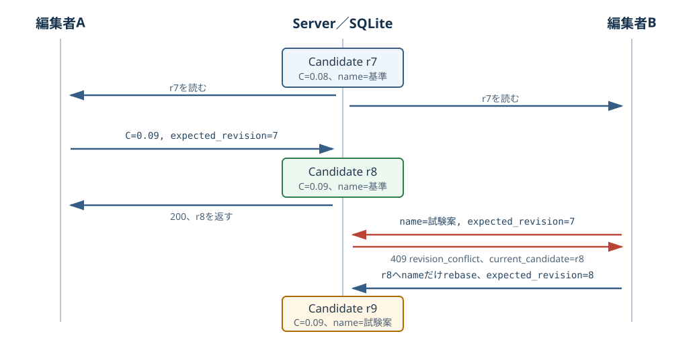

# 順番と内容を別々に識別する {#sec-revision-digest}

## 対象読者と到達点

Candidateの編集、保存済み判断証拠、推論cache、非同期画面を変更する開発者が対象です。
Python、SQL、TypeScriptの基本的な制御構造を読めることを前提にします。

読了後は、次の問いへ実装pathを挙げて答えられる状態を目指します。

- Candidate ID、revision、digest、request sequenceは、それぞれ何を識別するか
- 二つの編集が同じrevisionから始まったとき、後着の保存をどこで拒否するか
- `candidate_revisions`をcurrent rowと分けて残す理由は何か
- JSONのfield順を変えてもsemantic digestが変わらない理由は何か
- digest対象からfieldを除く判断をhash関数へ任せられない理由は何か
- backendがrevisionを確認しても、frontendで遅いresponseを捨てる必要があるのはなぜか

## 扱わない範囲

この章は、分散合意、vector clock、CRDT、SHA-256の暗号学的証明を扱いません。
現行アプリはsingle-user local SQLiteを正本としますが、同じ画面内のdebounce、複数window、遅いHTTP responseでも時間差は生じます。

hash collisionを数学的に無視できると証明する章でもありません。
Chain Definition、Profile、Dataset View、Model Packageなど、同じdigestの既存recordと新payloadを比較するcatalog境界では、不一致を競合として停止する設計を読みます。
Data lifecycleのすべてのrepositoryが同じ比較を行うとは一般化しません。

## 一つのIDでは四つの問いに答えられない

候補`candidate-a`を二人の編集者が開き、どちらもrevision 7を読んだとします。
編集者Aは炭素量を0.08から0.09へ変え、編集者Bは表示名を「試験案」へ変えます。

両方のrequestが`candidate-a`だけを送るなら、serverはどの状態を読んで編集したのか判定できません。
後着requestをそのまま受け入れると、編集者Aの炭素量変更を編集者Bの古いpayloadで戻すlost updateが起こります。

一方、revisionだけでも内容identityにはなりません。
別Candidateのrevision 7は同じ整数を持ち得ますし、同じ科学内容を別順序のJSONで表した場合に同じかどうかも示しません。

画面内のHTTP responseには、さらに別の順序があります。
revision 8のpreviewを要求した後でrevision 7のresponseが届いても、serverはすでに正しいresponseを返し終えています。
現在の画面へどちらを採用するかはrendererが判断します。

この固定例には、四つの具体物が現れます。

| 具体物 | 固定する問い | この例 |
|---|---|---|
| logical ID | どの継続対象か | `candidate-a` |
| revision | その対象の何番目の受理済み変更か | 7、8、9 |
| digest | 選んだ表現の内容が同じか | `sha256:...` |
| request sequenceとidentity | 現在の画面が待つresponseか | revision 8のpreview request |

これらをまとめて「version」と呼ぶと、競合、内容照合、非同期表示のどこで失敗したか分からなくなります。

## revisionは同じ対象の受理順を表す

`Candidate`は`id`と`revision`を別fieldとして持ちます。
`id`は編集をまたいで変わらず、`revision`は受理済みの変更ごとに1増えます。

更新requestの`CandidateUpdate`は`expected_revision`を必須にします。
これは「serverのcurrent revisionがこの値なら更新してよい」というpreconditionです。

固定例を状態として書くと、更新は次の関数に近い形になります。

```text
update(candidate-a, expected_revision=7, change)
```

current revisionが7なら、serverは変更を反映してrevision 8を作ります。
current revisionが8なら、requestが読んだ状態は古いため更新しません。

::: {.callout-note title="一般概念"}
この方式はoptimistic concurrencyの一種です。
編集開始時に長時間lockを保持せず、commit直前に読んだversionとcurrent versionを比較します [@fowler-optimistic-lock]。
:::

「revisionが大きいほど内容が良い」を意味しません。
revisionは受理順であり、科学的な優劣、データ量、モデル精度を表すscoreではありません。

## 一つのUPDATEがcompare-and-swapになる

`Store.update_candidate()`は、先にrevisionを読んでから無条件updateしません。
次の条件を一つのSQL statementへ入れます。

```sql
UPDATE candidates
SET name = ?,
    payload = ?,
    revision = revision + 1,
    updated_at = ?
WHERE id = ?
  AND project_id = ?
  AND revision = ?
  AND archived_at IS NULL
```

最後の`revision = ?`へ`expected_revision`が入ります。
条件を満たしたrowだけを変更するため、revision確認と更新のあいだへ別writerが割り込む窓を作りません。

SQLiteでは、`WHERE`へ一致するrowがなければ`UPDATE`はerrorではなく0 rowを変更します [@sqlite-update]。
実装は`rowcount`が0ならcurrent Candidateを読み、未存在、archive済み、revision conflictを分けます。

更新全体は`BEGIN IMMEDIATE`で始めます。
SQLiteが同時に持てるwriterは一つであり、`BEGIN IMMEDIATE`は最初からwrite transactionを開始します [@sqlite-transactions]。

::: {.callout-warning title="不変条件をUPDATEへ置く"}
別transactionやlockを保持しないconnectionで`SELECT revision`を行い、後から無条件の`UPDATE`を実行すると、二つのstatement間でcurrent rowが変わる可能性があります。
同じ`BEGIN IMMEDIATE` transaction内では別writerが割り込めませんが、revision条件を`UPDATE`自身へ置くと、更新を許す条件がSQL statementだけで完結します。
この実装のcompare-and-swapは、revision条件を`UPDATE`自身へ置くことで成立します。
:::

同じ考え方は整数revisionに限りません。
Project Series所属変更では、nullableな`expected_project_series_id`が変更前、nullableな`project_series_id`が変更後です。
`null`も「比較しない」ではなく未所属というcurrent identityとして比較し、他操作で所属が変わっていれば409で拒否します。

## 競合は現在値を返して終わらない

編集者Aの保存が先に届くと、Candidateはrevision 8になります。
編集者Bが`expected_revision=7`を送ると、`UPDATE`は0 rowを変更します。

APIはこの状態をHTTP 409、code `revision_conflict`へ変換し、`current_candidate`としてrevision 8を返します。
409は「入力値が不正」という422とも、「Candidateがない」という404とも異なります。

`current_candidate`があるため、rendererは利用者のdraftとserverのcurrent値を比較できます。
ただし、競合を検出したことと、安全に自動mergeできることは同じではありません。

{fig-alt="編集者Aと編集者Bがrevision 7を読み、Aの保存がrevision 8を作る。Bの古い保存は409となり、current revision 8へ変更fieldだけを重ねた保存がrevision 9を作る。" width="100%"}

`useCandidateEditor()`は、同じCandidateの保存を`LatestSaveQueue`で順番に流します。
競合responseに`current_candidate`があれば、queueの次の保存はそのcurrent値を起点にできます。

`rebaseChangedFields()`は、baseとdraftで変わったfieldだけをcurrent値へ重ねます。
固定例では、編集者Aが変えた炭素量0.09を残し、編集者Bが変えた表示名だけをrevision 8へ重ねます。

しかし、`rebaseChangedFields()`は同じfieldの三者競合を検出しません。
後続のqueued saveがある場合、draft側で変えた値をcurrentへ重ねるため、外部更新と同じfieldならdraftが後勝ちになります。

失敗した保存がqueueの最新なら、UIは競合状態を示し、入力値を保持したまま再読込またはcopyを利用者へ促します。
自動rebaseが常に利用者の意図を守るわけではない点は、成功経路と分けて確認します。

## current rowと過去revisionは役割が違う

`candidates` tableは、各Candidateのcurrent rowを持ちます。
更新後の一覧、次の編集、previewはこのrowを使います。

一方、`candidate_revisions` tableは`(candidate_id, revision)`をprimary keyにし、受理した各版のpayloadを追記します。
`Store.update_candidate()`はcurrent rowを更新したtransaction内で、新しいrowを`candidate_revisions`へ記録します。

ここでのimmutableは、更新用のapplication経路を持たず追記する契約を指します。
SQLite fileへ直接書き込めないという権限上または暗号学的な保証ではありません。

この分離によって、revision 8へ進んだ後でもrevision 7を読めます。
copy由来のCandidateは、作成元Candidateの特定revisionをprovenanceへ固定できます。

`candidate_revisions`には、意図的にactive `candidates`へのforeign keyがありません。
active一覧から元Candidateを外しても、派生Candidateが固定した過去revisionを読めるようにするためです。

::: {.callout-note title="DECISION"}
「一覧から消えたCandidateの履歴も一緒に消す」という削除modelは採りません。
判断証拠が過去revisionを参照するため、active stateの寿命とimmutable evidenceの寿命を分けています。
:::

`candidate_revision_migration.py`は既存current rowをrevision historyへseedします。
migration markerがあるのにtable列またはcurrent revisionが欠けていれば、起動時に不完全な履歴として拒否します。

## digestは選んだ表現の内容を固定する

revision 7と8には順序があります。
しかし、二つのpayloadが同じ内容かという問いにはrevisionを使えません。

`semantic_digest()`は、payloadを決定的なJSON byte列へ変え、そのbyte列へSHA-256を適用します。

$$
C(x) = \operatorname{UTF8}\left(\operatorname{JSON}_{sorted,compact,no\ NaN}(x)\right)
$$

$$
D(x) = \texttt{"sha256:"} \mathbin{\|} \operatorname{hex}\left(\operatorname{SHA256}(C(x))\right)
$$

ここで$C(x)$は、このrepositoryのPython実装が作るcanonical representationです。[^canonical-json]
object keyをsortし、余分な空白を除き、NaNを拒否します。
Unicodeの正規化は行いません。[^unicode-normalization]

次の二つはkey順が違いますが、同じdigestになります。

```json
{"composition":{"C":0.08},"process":{"speed":100}}
```

```json
{"process":{"speed":100},"composition":{"C":0.08}}
```

arrayの要素順は変えません。
工程段の順、時系列点の順、Chain stageの順は意味を持つためです。

[^canonical-json]: JSONをhash対象へ使う一般的な方法として、RFC 8785はprimitiveのserialization、property sorting、UTF-8生成を定めています [@rfc8785]。
    現行`semantic_digest()`はRFC 8785準拠実装を名乗らず、Python `json.dumps()`の明示optionをrepository内契約として使います。

[^unicode-normalization]: 見た目が同じ文字列でも、Unicode code pointの並びが異なれば別のbyte列になります。
    source間でUnicode正規化が必要なら、hash後ではなくcanonical representationを作る契約へ明示します。

## hash関数は意味を選ばない

`semantic_digest()`へ何を渡すかはcallerが決めます。
hash関数は、表示名、単位、Package digest、runtime typeのどれが科学identityへ必要か判断しません。

Candidate contractには、Candidate全体を表す`candidate_digest`がありません。
Candidateはrevisionで変更順と過去版を識別し、推論側は用途に合わせてcanonical inputのdigestを作ります。

表示名だけを変えたCandidateは新revisionになりますが、canonical input digestは同じになり得ます。
「同じ履歴record」と「同じ計算入力」を同義にしないためです。

推論cacheの`InferenceKey`は、canonical inputだけでなく次を別fieldとして固定します。

- Task ID
- runtime type
- Model Package digest
- Feature Pipeline digest
- support digest
- operation
- operation parameter digest

Candidate labelとUI selection stateはこの推論cache keyへ入れません。
表示名を変えても計算内容が同じなら、推論cacheまで別identityにしないためです。

一方、Decision Activityの保存済みRunが持つ`semantic_identity`にはCandidate revisionが入ります。
表示名だけの変更でも、計算入力のcache identityは同じまま、どの受理済みCandidateを見て判断したかという証拠identityは変わります。
「科学identity」という一語でも、計算入力と判断記録では固定する対象が違います。

反対に、単位変換やFeature Pipelineをdigest対象から外すと、同じkeyで異なる計算を再利用する危険があります。
「何をcanonical representationへ含めるか」がdomain設計であり、SHA-256はその設計を代行しません。

Chain Definition、Profile、Dataset View、Model Packageなど、登録時に既存payloadを比較するcatalog境界では、同じdigestへ異なるpayloadを見つけても後着payloadへ黙って置換しません。
これらの境界は`CatalogConflictError`などの競合として停止します。
digestが一致するという前提が崩れた状態で、どちらを正本とするか自動決定できないためです。

Data lifecycle repositoryのCuration、Canonical Dataset、Training Snapshotは、同じdigestのrecordがあれば既存recordを返し、payload全体の比較までは行いません。
前者の検証をrepository全体の保証として読まないことが、実装境界を見誤らないための確認点です。

### Chain Revisionは順番と内容を両方持つ

Candidateとは異なり、`ChainRevision`は整数の`revision`と`revision_digest`を同時に持ちます。
整数は同じChain内の版順を表し、digestは整数revision、stage lock、binding、unit conversionを含むrevision recordを固定します。

`build_chain_revision()`は`revision_digest`を除いたpayloadからdigestを計算します。
`validate_chain_revision()`は保存済みdigestを再計算値と比較し、fieldだけ書き換えたforged revisionを拒否します。

整数revision自体がdigest対象に入るため、stage構成が同じでもrevision 1とrevision 2のdigestは異なります。
このdigestは純粋な科学内容だけではなく、callerが選んだrevision record全体のidentityです。

この例では、revisionとdigestのどちらかが余分なのではありません。
同じChain内の順序と、固定したrevision recordのidentityへ別々に答えます。

## byte digestとsemantic digestを混ぜない

Workspace bundleのfile recordは、file bytesへSHA-256を適用します。
一byteでも変われば異なるdigestになるため、archive展開時の改ざんと欠落を検出できます。

`semantic_digest()`は、Python objectを選んだJSON表現へ写してからhashします。
JSONの空白とobject key順を同一視できますが、callerが除外したfieldは照合しません。

| 種類 | 入力 | 同一視する差 | 主な用途 |
|---|---|---|---|
| byte digest | fileのbyte列 | なし | archive file、artifact |
| semantic digest | 選択したobjectのcanonical JSON | object key順、余分な空白 | contract、input、operation parameter |
| normalized evidence digest | pathなど正規化対象を除いたtable evidence | 明示した環境依存field | Workspace移設前後の照合 |

どれもSHA-256を使うため、prefixだけでは意味を区別できません。
field名、manifest schema、照合するcontextまで読んで初めて、何を同じとしたか分かります。

## backendのrevision確認だけでは遅いresponseを防げない

revision 7のpreview requestを送った直後に、利用者がCandidateをrevision 8へ編集したとします。
serverはrequest受理時点でrevision 7を正しく読み、revision 7のpreviewを返し得ます。

そのresponseがrevision 8のresponseより遅く届けば、単純な`setState()`は画面を古い値へ戻します。
backendのcompare-and-swapは保存競合を防ぎますが、rendererがresponseを採用する順序までは決めません。

`InferenceSurfaceState`は、次を別々に持ちます。

- `currentIdentity`：表示中dataが属するidentity
- `requestedIdentity`：現在待っているidentity
- `requestSequence`：request開始順
- `data`：最後に受理した結果
- `pending`と`error`：現在requestの状態

`resolveInferenceSurface()`はsequenceとidentityの両方がcurrent requestと一致する場合だけdataを置き換えます。
遅れて届いたrevision 7のresponseは、revision 8を待つstateへ入りません。

同じidentityを再requestする場合もあるため、identity比較だけでは足りません。
一回目と二回目のidentityが同じでも、`requestSequence`が古ければ一回目のresponseを捨てます。

古いdataを即座に空へする必要もありません。
revision 8を待つ間はrevision 7のdataを保持し、statusを`stale`として表示できます。
利用者は「値がない」と「古い値を更新中」を区別できます。

## 三つの失敗を別の場所で止める

固定例へ戻すと、境界ごとの責務は次のようになります。

| 失敗 | 最初に止める場所 | 証拠 |
|---|---|---|
| 古いrevisionからの保存 | SQL `UPDATE ... revision=?` | 0 rowと409 `revision_conflict` |
| 過去版の消失 | current更新と同じtransactionのrevision追記 | `(candidate_id, revision)`で再読込 |
| 遅いresponseの誤表示 | rendererのrequest sequenceとidentity | 古いresolveがstateを変えない |
| 同じcatalog digestへの異なる内容 | payload比較を持つcatalog境界 | `CatalogConflictError`などの競合 |

一つの万能なversion checkがあるわけではありません。
順序、内容、保存、表示は異なる問いであり、それぞれが最初に観測できる境界へcheckを置きます。

## 現mainで再確認する

リポジトリ直下で、Candidate revision、semantic digest、frontend response identityを確認します。

```powershell
uv run python -m pytest `
  backend/tests/test_candidate_safety.py `
  backend/tests/test_inference_work_graph.py

node --test `
  apps/web/tests/latestSaveQueue.test.mjs `
  apps/web/tests/inferenceSurfaceState.test.mjs `
  apps/web/tests/workbenchIdentity.test.mjs

npm run api:check
```

backend testはcompare-and-swap、immutable revision、revision付き予測、推論identityを確認します。
Node testはqueued save、競合からのrebase、遅いresponse、stale表示を確認します。
`api:check`は`expected_revision`と409 error contractから生成TypeScript型までのdriftを検出します。

test成功は、複数processでの高負荷競合やhash collision耐性を実証しません。
この章で確認するのは、現行single-user構成の契約と明示された故障例です。

## 症状から識別子を選ぶ

| 症状 | 最初に確認する識別子 | 次に読む場所 |
|---|---|---|
| 保存が409になる | Candidate IDと`expected_revision` | responseの`current_candidate` |
| copy元が現在と違う | provenanceのCandidate IDとrevision | `candidate_revisions` |
| cacheが古い計算を返す | canonical inputとPackage、Pipeline digest | `InferenceKey` |
| 古いresponseが画面へ戻る | request identityとsequence | `InferenceSurfaceState` |
| 同じdigestで登録が衝突する | digest対象payloadとcanonicalization | immutable catalogの検証 |

「versionが違う」という一文だけでは調査を始められません。
整数の順序、内容hash、HTTP request順のどれが違うのかを先に固定します。

## 設計を振り返る

### revisionとdigestを併用する

revisionは同じCandidate内で7から8へ進んだことを表せます。
digestは二つの選択済み表現が同じ内容かを照合できます。

revisionだけなら、異なるresource間の内容一致を表せません。
digestだけなら、同じresourceでどちらが後の受理版かを表せません。

### conflictを通常の分岐として返す

optimistic concurrencyでは、409はdatabase破損ではありません。
別の更新が先に受理されたことを示す、想定内のbusiness conflictです。

そのためAPIはcurrent Candidateを返し、UIはdraftを保持します。
ただし、自動rebaseが外部更新を保つのは変更fieldが独立している場合です。
同じfieldの三者競合は検出せず、後続queued saveがdraft値をcurrentへ重ねます。

### immutable historyをactive stateから分ける

active Candidateをarchiveしても、過去revisionを参照するSnapshotと派生Candidateは残ります。
current一覧の都合で履歴を消さないため、`candidate_revisions`の寿命をactive rowから分けています。

### staleを隠さず古い値と示す

新responseを待つ間に旧dataを表示すること自体は、誤りではありません。
そのdataが旧identityに属することを示さず、current結果として見せると誤りになります。

rendererはrequest sequenceで誤採用を防ぎ、statusで利用者へ時間差を伝えます。

## 現行実装の限界

`rebaseChangedFields()`はobjectを再帰的に比較しますが、arrayはfield全体を一つの変更として扱います。
同じheat pattern arrayを双方が編集した場合、要素単位のmergeは行いません。

`semantic_digest()`はrepository内で再現可能な表現を作りますが、RFC 8785とのcross-language互換を保証しません。
別言語から同じdigestを計算する場合は、Pythonのserialization contractを複製するのか、標準canonicalizationへ移行するのかを先に決める必要があります。

Candidate revisionは整数であり、独立した二系統の履歴をmergeする仕組みではありません。
このアプリは一つのSQLite正本へ書き込みを直列化するため、offline replicaの統合には使えません。

request identityの正しさは、identityへ意味を変える入力を漏れなく含めることに依存します。
display-only fieldを入れれば不要な再計算が増え、計算入力を外せば古い結果をcurrentと誤認します。

## 章末チェック

1. Candidate IDとrevisionは、どの問いを分けるか。
2. `expected_revision`を`SELECT`と無条件`UPDATE`へ分けると、どの窓が開くか。
3. 競合responseが`current_candidate`を返す理由は何か。
4. `candidate_revisions`へactive Candidateのforeign keyを置かない理由は何か。
5. object key順だけが違うJSONのsemantic digestはどうなるか。
6. `semantic_digest()`へ何を渡すかは、誰が決めるか。
7. revisionとdigestのどちらが受理順を表すか。
8. 同じrequest identityを二回要求するとき、sequenceが必要な理由は何か。
9. stale dataを保持する場合、画面が示すべき状態は何か。
10. backend compare-and-swap、immutable history、renderer guardは、それぞれ何を守るか。

[章末チェックの解答](../labs/trace-revision-conflict.qmd#answer-revision-chapter-check)を確認してから、同じページの変更演習へ進みます。

## Further Reading

- Fowlerの*Optimistic Offline Lock* [@fowler-optimistic-lock]：読取時点と後続writeを結ぶ意図を確認します。SQLiteのlock modeの説明ではありません。
- RFC 8785の*JSON Canonicalization Scheme* [@rfc8785]：cross-language canonicalizationと現行semantic digestを比較します。現行実装の準拠を主張しません。
- SQLiteの*Deferred, Immediate, and Exclusive Transactions* [@sqlite-transactions]：writer競合が表面化する時点を読みます。domain identityの正しさはtransactionだけでは決まりません。
- Reactの*Avoid contradictions in state* [@react-state-structure]：server currentとlocal draftを別に保つ理由をfrontend stateから考えます。request sequence guardは別に必要です。
