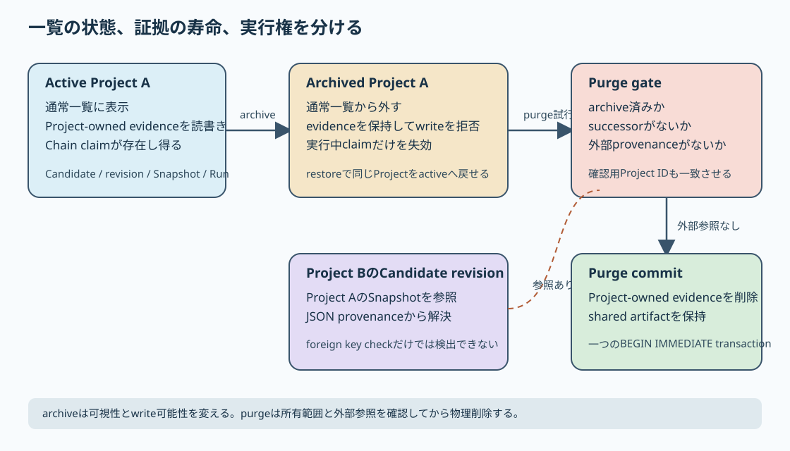

# 一覧から外すことと証拠を消すことを分ける {#sec-separate-archive-purge}

## 対象読者と到達点

Projectの保存schema、削除操作、provenance、または実行状態を変更する開発者が対象です。
SQL transaction、foreign key、JSON payloadの基本を読めることを前提にします。

読了後は、次の問いへ実装pathを挙げて答えられる状態を目指します。

- Project archiveで変わるrowと、残る判断証拠は何か
- archive時に実行中のChain claimだけを失効させる理由は何か
- restoreとWorkspace restoreは何が違うか
- purgeをarchive済みProjectへ限定する理由は何か
- 別Projectからのprovenance参照を、foreign keyだけでは守れない理由は何か
- APIの確認用ID、applicationの参照検査、SQLite triggerは何を分担するか
- 新しいProject-scoped tableを追加するとき、どのinventoryを更新するか
- 保持したChain evidenceをProject historyへ戻すとき、どのidentityを照合するか

## 扱わない範囲

この章は、Candidate単体のarchive規則、法令ごとの保持期間、複数利用者の認可、媒体の安全な廃棄を扱いません。
一つのlocal SQLite正本で、Projectを通常作業から外し、必要な場合だけ明示的に物理削除する経路へ絞ります。

現行UIはProjectのarchiveとrestoreを提供しますが、purge UIは提供しません。
purgeを通常利用者が画面から実行できる機能として説明しません。

## Project Aを片付けたい

Project Aには、Candidate、Candidate revision、Snapshot、実測値、Decision Activity、Chain実行結果があります。
Project BのCandidateは、Project AのSnapshotを派生元として参照しています。

Project Aが通常一覧を埋めるため、日常の作業対象から外したいとします。
この要求へ物理DELETEで応えると、Project Bが示す派生元の証拠まで失います。

反対に、すべてのrowを何も変えずに残すだけでは、Project Aへの新しい書き込みが続きます。
終了した検討と進行中の検討を同じ一覧と同じwrite経路で扱うためです。

この固定例では、三つの操作を分けます。

| 操作 | Project A | Project Aの証拠 | 実行権 | Project Bの参照 |
|---|---|---|---|---|
| archive | 通常一覧から外す | 保持する | 新しいwriteを拒否する | 解決できる |
| restore | 同じProjectをactiveへ戻す | そのまま使う | 新しい操作を受理できる | 解決できる |
| purge | Project rowを物理削除する | Project-owned evidenceを削除する | 残さない | 参照があれば拒否する |

archiveは、削除の弱い版ではありません。
可視性と書き込み可能性を変え、判断証拠の寿命は変えない状態遷移です。

purgeは、archiveの次に自動で起きるcleanupでもありません。
削除対象と外部参照を検査した後にだけ進める、別の不可逆操作です。

## 保持する集合を先に書く

`docs/decisions/sqlite-project-lifecycle-policy.md`は、archiveとpurgeで各artifactをどう扱うかを固定しています。

中心となる分類は次の三つです。

| 分類 | 例 | archive | purge |
|---|---|---|---|
| Project-owned evidence | Candidate、revision、Snapshot、実測、Run、lineage review | 保持 | 削除 |
| 実行中の権利 | Chain execution claim | 失効 | 削除 |
| shared artifact | Chain Definition、Chain Revision、Data Library、Project Series | 保持 | 保持または空ならarchive |

Project-owned evidenceは、そのProjectの判断を再現するために存在します。
archiveしても判断の来歴を読む必要があるため、rowを残します。

Chain execution claimは証拠ではありません。
遅れて到着したwriterが「まだ結果を書いてよい」と主張する短命な権利です。
Projectをarchiveした後まで権利を残すと、画面から外したProjectへ遅い計算結果が入る余地が残ります。

shared artifactは、一つのProjectだけが所有するとは限りません。
Projectをpurgeしても、別Projectが同じDataset、Model Package、Chain Definitionを使えるため、Projectと一緒に削除しません。

この分類はtable名から自動で決まりません。
どのrowが判断証拠で、どのrowが短命な実行権で、どのartifactが共有されるかを設計文書と利用経路から決めます。

{fig-alt="Project Aがactiveからarchiveへ進むと、通常一覧とwrite経路から外れるが証拠は残り、実行中claimだけが失効する。Project Bから派生参照があればpurgeを拒否する。外部参照がないProjectだけ、Project-owned evidenceを一つのtransactionで削除し、shared artifactを残す。" width="100%"}

## archiveは一つのtransactionで状態と実行権を変える

`DELETE /api/projects/{project_id}`というHTTP methodは、現行実装では物理削除を意味しません。
`api/projects.py`の`archive_project()`が`ProjectService.archive()`を経て、`Store.archive_project()`を呼びます。

repositoryは`BEGIN IMMEDIATE`を開始し、次を同じtransactionで行います。

1. `projects.archived_at`と`updated_at`を更新する。
2. Project IDで始まる`chain_execution_claims.scope_id`を削除する。
3. ProjectがProject Seriesに属し、同じSeriesにactive Projectが残らなければ、そのSeriesもarchiveする。

Candidate、Candidate revision、Snapshot、実測、保存済みRunは削除しません。
archive後のtable countがほとんど変わらないことは、操作が失敗した証拠ではなく保持policyの結果です。

Project Seriesへの所属は任意です。
ProjectがSeriesに属していなければ、archiveでProject Series rowは変わりません。

ただし、archiveを「何も変えない」とも説明できません。
Project row、所属している場合のProject Series、実行中claimは変わります。

`Store.archive_project()`は、すでにarchive済みなら新しい副作用を重ねません。
同じProjectへ操作を繰り返しても、`archived_at`を毎回更新し直さないidempotentな状態遷移です。

## 一覧から隠すだけでなくwriteを拒否する

通常のProject一覧は`archived_at IS NULL`のrowだけを返します。
frontendは`include_archived=true`でも一覧を取得し、active一覧と「アーカイブ済み」欄へ分けます。

UIの確認文は、Projectを一覧から外し、候補、予測履歴、実測データを保持して後から復元できることを示します。
この文言は、現行repositoryの保持policyと一致します。

一覧filterだけでは、API以外のwrite経路を止められません。
そこで`project_lifecycle_migration.py`は、archive済みProjectに属する主要tableへwrite guard triggerを設置します。

たとえば、archive済みProjectへCandidateを追加すると、triggerは`RAISE(ABORT, 'project_archived')`でstatementを拒否します。
Project-owned rowの通常DELETEも同じ理由で拒否します。

triggerは、applicationがarchive状態の確認を忘れた経路にも不変条件を掛けます。
一方、現行triggerがすべてのtableとoperationを自動発見するわけではありません。
対象tableは明示的なlistであり、新しいProject-scoped tableを追加した開発者がguardも更新します。

SQLite triggerはrowごとにINSERT、UPDATE、DELETEへ反応し、`RAISE()`で変更を中断できます [@sqlite-create-trigger]。
保持policyの全体はtriggerへ隠さず、ADR、repositoryのpurge plan、test inventoryにも見える形で残します。

## archiveは遅いwriterの権利を失効させる

Chain実行は、requestごとにgeneration付きclaimを取得します。
結果保存時には、そのclaimがまだcurrentかを確認します。

Project Aの計算中にarchive操作が入る場合を考えます。

```text
writer: claim generation 1を取得
user:   Project Aをarchive
store:  Project Aのclaimを削除
writer: generation 1で保存を試す
store:  current claimがないため保存しない
```

保存済み`chain_execution_state`は、過去の実行証拠として残ります。
次の結果を書く権利である`chain_execution_claims`だけを消します。

この区別により、archive前に何が起きたかは読めます。
同時に、archive後へ遅いresponseが滑り込む経路を閉じます。

archive後にrestoreしても、消したclaimは自動再開しません。
同じProjectをactiveへ戻すことと、中断した外部計算を再実行することは別の操作です。

## restoreは同じDB内の状態遷移である

`POST /api/projects/{project_id}/restore`は、同じProject rowの`archived_at`を`NULL`へ戻します。
ProjectがProject Seriesに属していれば、そのSeriesも必要に応じてactiveへ戻します。

Candidate、Snapshot、実測をbackupからcopyし直しません。
archive中も同じDBに残っていた証拠を、通常経路から再び利用できるようにします。

このProject restoreは、`.mdwb` bundleをstagingし、SQLite databaseと管理対象fileを切り替えるWorkspace restoreとは異なります。
Project restoreは一つのlifecycle flagを戻す操作であり、Workspace restoreは正本全体の置換です。

同じ「復元」という表示でも、変更する境界を識別子とpathから区別します。

## purgeの前に四つのgateを通る

現行purge endpointは、次の形です。

```text
DELETE /api/projects/{project_id}/purge
  ?confirm_project_id={project_id}
```

最初のgateは、pathのProject IDと確認用Project IDの完全一致です。
一致しなければ409 `project_purge_confirmation_mismatch`を返します。

この確認は、誤った対象へ操作を送る可能性を減らします。
利用者の認証、操作権限、多者承認、backupの代わりにはなりません。

repositoryは同じ`BEGIN IMMEDIATE` transaction内で、さらに次を検査します。

1. 予約Projectではない。
2. Projectがarchive済みである。
3. `predecessor_project_id`で参照する後続Projectがない。
4. 別ProjectのCandidate revisionが、このProjectのprovenanceを参照していない。

active Projectのpurgeを拒否することで、通常作業中の対象を一段の操作で物理削除できなくします。
後続Projectと派生Candidateの参照を拒否することで、別の判断記録から来歴をたどれなくなる削除を止めます。

## JSON内の参照はapplicationが解決する

Project BのCandidate revisionは、次のようなprovenanceをJSON payloadへ持ち得ます。

```json
{
  "provenance": {
    "source_kind": "snapshot",
    "source_ref": {
      "snapshot_id": "snapshot-from-project-a"
    }
  }
}
```

この`source_ref`は、Project Aへの通常のforeign key columnではありません。
SQLiteの`PRAGMA foreign_key_check`だけでは、JSON内のSnapshot IDがどのProjectへ属するかを検査できません。

`_candidate_provenance_references_project()`は、既知の`source_kind`ごとに参照を解決します。

| `source_kind` | Project Aへの到達方法 |
|---|---|
| `copy`、`blend_optimization` | `source_ref.project_id` |
| `screening` | `run_id`から`screening_runs.project_id` |
| `snapshot` | `snapshot_id`からCandidateとProject |
| `decision_activity` | `run_id`から`decision_activity_runs.project_id` |

purgeは、別Projectに属するすべてのCandidate revision payloadをparseします。
不正なJSONがあれば「参照なし」と推測せず、data integrity errorとして停止します。

このscanは、任意のprovenance graphを理解する仕組みではありません。
新しい`source_kind`を追加した場合は、参照解決、purge gate、testを同時に更新する必要があります。

foreign keyは、正規化した親子rowの存在関係を強制します。
application scanは、JSONに埋め込んだdomain参照の意味を解決します。
どちらか一方を「参照整合性」と呼んで全体の保証に広げません。

## purge authorizationは内部の通行証である

archive済みProjectへのDELETEは、write guardが通常は拒否します。
purge自身も同じguardに止められるため、repositoryはtransaction内で`project_purge_authorizations`へProject IDを一時的に入れます。

guardはこのrowがある間だけ、archive済みProject-owned rowのDELETEを許します。
repositoryは削除後にauthorization rowも消します。
途中で例外が起きれば、同じtransactionの削除とauthorizationをrollbackします。

このtableは利用者の認可記録ではありません。
誰が、なぜ、いつpurgeを承認したかを残すaudit logでもありません。
database triggerを、明示されたrepository経路だけが通過するための内部mechanismです。

通常tableである以上、raw SQLで不正なauthorization rowを残す攻撃まで単独で防ぐcapability systemではありません。
local applicationの正規write経路を守る層として読みます。

## 削除対象を明示順で消す

gateを通ったpurgeは、Project Aに属するCandidate IDを集め、次を一つのtransactionで削除します。

- Candidateに属する実測とSnapshot
- Chain analysis variant、distribution、snapshot
- Chain execution claimとstate
- Decision Activityとscreening run
- lineage reviewとobjective revision
- Candidate revisionとcurrent Candidate
- Project row

Project Seriesへの所属がある場合も、そのSeries rowは削除しません。
active Projectが残らなければarchiveします。

Data Library、Dataset revision、Model Package、Chain Definition、Chain Revisionも削除しません。
これらはProject-owned evidenceではなく、別Projectが参照し得るshared artifactだからです。

SQLiteの`ON DELETE CASCADE`は、親row削除時に子rowを自動削除できます [@sqlite-foreign-keys]。
便利なcleanupとして一律に付けるのではなく、親が子の寿命を本当に所有する関係へ限定します。
外部の判断証拠が参照するrowへCASCADEを置くと、削除範囲がschemaに固定されます。

現行実装は多くのProject-owned tableを明示SQLで削除します。
これにより保持対象と削除対象がrepositoryに見えますが、新しいtableをinventoryへ加え忘れる危険もあります。

## transactionが保証することを広げない

purge planは一つの`BEGIN IMMEDIATE` transactionで進みます。
途中のDELETEが失敗すれば、先に消したrowもrollbackされます。

transactionは、削除集合のatomicityを守ります。
削除対象の選び方がdomain上正しいことや、未知のJSON参照が存在しないことまでは保証しません。

commit後に`PRAGMA foreign_key_check`が空なら、宣言済みforeign keyの孤児がないことを確認できます。
foreign keyを持たない関係、JSON内参照、filesystem上のexportは検査対象外です。

SQLのDELETE成功を、媒体からdataを安全に消去したこととも同一視しません。
SQLiteは通常のDELETE後にcontentがfree pageへ残り得ることを説明し、`VACUUM`と`secure_delete`を別の機構として扱います [@sqlite-vacuum]。[^sanitization]

[^sanitization]: NIST SP 800-88 Rev.2は、sanitizationを対象dataへ所定の労力水準でアクセスできなくするprocessとして扱います [@nist-sp800-88r2]。
    Project purgeはapplicationのlogical recordを削除しますが、Workspace backup、export、filesystem snapshot、別媒体を横断するsanitization contractではありません。

## API、application、repository、databaseを分けて読む

現行経路の責務は次のように分かれています。

| 境界 | 現行の主な責務 |
|---|---|
| frontend | archiveの保持範囲を説明し、archive済みProjectをrestoreする |
| API router | endpoint、確認用ID、domain errorからHTTP 409への変換 |
| application service | Project存在を確認し、repository操作へ接続する |
| repository | archive状態、外部参照、削除順、transactionを実装する |
| SQLite trigger | archive済みProjectへの主要なwriteと通常DELETEを拒否する |
| foreign key | schemaへ宣言された親子参照の孤児を拒否する |

`ProjectService`は薄く、purge対象の組立てとprovenance scanは`Store`にあります。
この実装を、すべてのbusiness policyがapplication serviceへ置かれた模範的なlayer分離として一般化しません。

新しい操作を追加するときは、理想的なlayer名から逆算するより、どの不変条件をどのwrite経路でも守る必要があるかを先に書きます。

## 現mainで再確認する

リポジトリ直下で、archive、claim失効、purge、cross-Project provenanceを確認します。

```powershell
uv run python -m pytest `
  backend/tests/test_project_lifecycle.py `
  backend/tests/test_projects.py::test_project_with_cross_project_derived_candidate_cannot_be_deleted `
  backend/tests/test_data_library_api.py::test_project_with_successor_cannot_be_deleted
```

中心testの観察点は次です。

| test | 観察する境界 |
|---|---|
| `test_archive_preserves_chain_evidence_and_purge_removes_all` | archiveで証拠を保持し、purgeでProject-owned rowを削除する |
| `test_archive_invalidates_an_in_flight_chain_writer` | archive後に古いgenerationで書けない |
| `test_purge_rejects_non_copy_cross_project_provenance` | Snapshot由来の別Project Candidateがpurgeを止める |
|  | 三種類のChain evidenceと採用判断がProject historyへ戻り、再open後も固定参照が一致する |
| Project copy provenanceのpurge test | Candidate copyの来歴を保護する |
| successor Projectのpurge test | Project Seriesの継続関係を保護する |

backend testの成功は、画面のarchive操作をE2Eで自動検証したことを意味しません。
現行E2EにはProject archiveとrestoreを主題にした専用testがないため、UIまで保証すると書きません。

## 新しいProject-scoped tableを追加する

`proposal_runs(project_id, payload, created_at)`を追加する想定で考えます。

tableを作り、保存APIを実装しただけではlifecycle policyへ接続できません。
少なくとも次を決めます。

1. archive後も判断証拠として保持するか。
2. archive済みProjectへのINSERT、UPDATE、DELETEをguardするか。
3. purgeで削除するか、shared artifactとして残すか。
4. 別Projectから参照される場合、purge前にどの参照を検査するか。
5. Workspace backupとrestoreへ含まれるか。
6. focused testでarchive前後とpurge後のrow countをどう固定するか。

triggerの対象list、repositoryのpurge SQL、ADRの保持表、test inventoryは同じ変更の一部です。
一箇所だけへtable名を足すと、通常操作は動いてもarchive後のwriteまたはpurge時の残骸が漏れます。

## 症状から最初の証拠を選ぶ

| 症状 | 最初に見る証拠 | 次に読む場所 |
|---|---|---|
| archive済みProjectへ書ける | `archived_at`とtrigger一覧 | Project-scoped tableのguard coverage |
| archive後に遅い結果が入った | Chain claimのgeneration | claim削除と保存時CAS |
| purgeが409になる | error code | active、successor、派生provenance、確認用ID |
| purge後にrowが残る | ownership inventory | repositoryの明示DELETEとshared artifact分類 |
| foreign key checkは空だが来歴が切れる | Candidate revisionのJSON | `_candidate_provenance_references_project()` |
| restoreしても計算が再開しない | Projectのactive状態とclaim | restoreと再実行を別操作として扱う |

「削除できない」だけでは、保護が働いたのか実装が壊れたのかを区別できません。
HTTP error code、archive状態、参照元revision、transaction後のrowを順に確認します。

## 設計を振り返る

### archiveを通常操作にする

Projectは、候補比較、予測、実測、判断理由を束ねた証拠の単位です。
日常の片付けへ物理削除を割り当てると、表示上の都合が証拠の寿命を決めます。

通常操作をarchiveにすることで、active一覧の整理と判断証拠の保持を分けます。
必要なら同じProjectをrestoreできます。

### purgeを明示操作にする

purgeは、active状態の確認、外部参照、所有境界を検査する管理操作です。
確認用IDは一つの誤操作防止策ですが、参照検査とtransactionを置き換えません。

### retentionとdiscoverabilityを分ける

rowがDBに残ることと、通常UIから見つけられることは別です。
現行実装では、はChain Snapshot、実測conditioned variant、分布runをCandidateごとに読み、Project、Candidate revision、Chain revision、比較元Snapshotのidentityを照合します。^[この発見経路はPR #322で加わりました。変更履歴は教材drift reviewに残し、本文では現在の判断境界を先に説明します。]
は、照合を通った三種類の証拠を「候補と判断履歴」へ種類別に新しい順で表示します。

この経路により、activeまたはrestore済みのChain Projectでは、保持したrowへ通常UIから戻れます。
archive済みProjectは先にrestoreする必要があり、Workspace backupやexportにある別copyまで検索する経路ではありません。
保持したから利用者が到達できると推測せず、必要なevidenceには検索またはhistory経路を別に設計します。

## 現行実装の限界

purgeの外部参照検査は、既知のCandidate provenance `source_kind`だけを理解します。
未知のJSON schemaを自動でgraph探索しません。

write guardの対象tableとoperationはhard-codedです。
とくにChain execution stateとclaimは、database triggerだけで全write経路を覆うわけではなく、正規repositoryのclaim protocolにも依存します。

Project-owned tableの一部はforeign keyを持ちません。
`PRAGMA foreign_key_check`が空でも、宣言されていない関係の整合性は保証されません。

purgeは別ProjectのCandidate revisionを全件parseします。
現在の規模では明示性を優先していますが、revision数に比例するscan costを持ちます。

purgeはProject-scoped evidenceを削除しますが、Workspace backupやexportを削除しません。
情報廃棄の要件がある場合は、Project lifecycleとは別の保持とsanitization設計が必要です。

## 章末チェック

1. Project archiveで変わるrowは何か。
2. archive後に残すevidenceと、失効させるclaimは何が違うか。
3. restoreが中断したChain実行を自動再開しない理由は何か。
4. active Projectのpurgeを拒否する理由は何か。
5. `confirm_project_id`が保証しないものは何か。
6. Snapshot provenanceをforeign key checkだけで保護できない理由は何か。
7. `project_purge_authorizations`は何のためのtableか。
8. `ON DELETE CASCADE`をshared evidenceへ一律に付けない理由は何か。
9. transaction成功と削除対象の正しさは、どう違うか。
10. 新しいProject-scoped tableを追加するとき、同時に更新する四つのinventoryは何か。

[章末チェックの解答](../labs/trace-project-lifecycle.qmd#answer-project-lifecycle-chapter-check)を確認してから、同じページの変更演習へ進みます。

## Further Reading

- SQLiteの*CREATE TRIGGER* [@sqlite-create-trigger]：archive済みProjectへのwrite guardを読む基礎にします。新しいtableを自動発見する仕組みではありません。
- SQLiteの*Foreign Key Support* [@sqlite-foreign-keys]：row関係を宣言的に守れる範囲を確認します。未知のJSON参照は検査しません。
- SQLiteの*How VACUUM works* [@sqlite-vacuum]：logical deleteとdatabase file再構築を分けます。別のbackupやexportは対象外です。
- NIST SP 800-88 Rev. 2の*Sanitization Methods* [@nist-sp800-88r2]：application purgeとmedia sanitizationを分けます。本章の通常操作を規定する標準ではありません。
