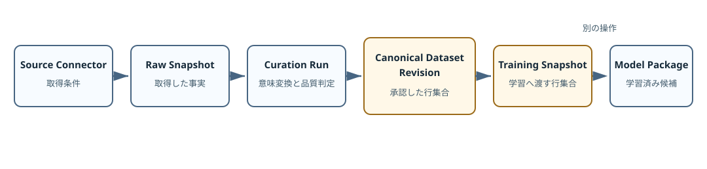

# ソース更新を学習から切り離す {#sec-source-evidence}

## 対象読者と到達点

共有先のJSONや表データを取り込み、品質確認を経てモデル開発へ渡す経路を変更する開発者が対象です。
Pythonでデータ構造を読めればよく、モデル学習やReactの経験は必要ありません。

読了後は、次の問いへ実装経路を挙げて答えられる状態を目指します。

- ソースの取得とデータセットの承認が別の操作である理由は何か
- 生スナップショット、Curation 実行記録、正規データセットリビジョン、学習用スナップショットは何を固定するか
- 行の品質状態と目的変数への利用可否を、なぜ別々に持つか
- 同じ内容の再取得と、内容が異なるリビジョンをどう区別するか
- 品質不良ではないholdoutを、なぜバージョン付きselection policyへ置くか
- 学習用スナップショットからパッケージへ進むタスク固有アダプタが、どのダイジェストを再検証するか
- どの操作もモデルパッケージの再学習や有効化を起こさないことを、どのテストが守るか

## 扱わない範囲

この章は、S3やAzureへの接続方法、認証情報 vault、外部schedulerの構築を扱いません。
現行の`object_storage_json_v1`は、別の取得処理が渡したJSONを解釈する境界です。

データセット入力プロファイルの作り方、特徴量パイプライン、モデルパッケージ生成は別の変更経路です。
四行の固定例は、承認済みの行集合を学習用スナップショットとして固定するところで止まります。

現行mainには、CALCE電池データをパッケージとプロジェクトへ接続するタスク固有の受入経路が一つあります。
汎用的な自動学習経路として扱わず、章の後半で境界だけを確認します。

## 取得しただけでは判断に使えない

共有objectの内容が更新されたとします。
新しい行が増え、既存の値も一つ変わっています。
取得APIが成功したなら、そのまま次回学習へ使ってよいようにも見えます。

しかし、取得の成功が証明するのは、objectを許可された形式で読めたことだけです。
列の意味、必須値、目的変数の有無、重複キー、承認者の判断はまだ確定していません。
取得と学習を一つの操作にすると、通信の成功が科学的な採否まで決めてしまいます。

現行実装は、同じ更新を五つの資産へ分けます。

{fig-alt="ソースコネクター、生スナップショット、キュレーション実行記録、正規データセットリビジョン、学習用スナップショットを順に作り、別操作でモデルパッケージ候補へ進む。" width="100%"}

画面にある`Source refresh ≠ retraining ≠ activation`は、この資産分割を短く表したものです。
更新を取得しても、既存プロジェクトが参照するデータセットとモデルパッケージは変わりません。

## 五つの資産が指すもの

似た名前を先に覚えると、`snapshot`と`revision`の違いだけが記憶に残りがちです。
各名称が指す具体物を先に固定します。

| 資産 | 具体的に固定するもの | 操作 | 次へ進む条件 |
|---|---|---|---|
| ソース Connector | locator、parser、選択フィールド、行キー、trigger policy | 登録 | 設定契約が妥当 |
| 生スナップショット | 取得時のJSON行、内容hash、設定ダイジェスト、前回との差分 | 取得 | JSONとして解釈可能 |
| Curation 実行記録 | Recipe適用後の全行、プロファイル参照、状態、理由、利用可否 | 品質判定 | 登録済みRecipeとプロファイルが一致 |
| 正規データセットリビジョン | 承認行、除外行、override、主体、理由 | 承認 | blocked 行がなく、overrideが妥当 |
| 学習用スナップショット | selection policy適用後の行和集合、目的変数別cohort、グループフィールド、フォールド数、グループ割当 | 明示作成 | 各targetに対象行と必要数のグループがある |

この表で異なるのは保存時刻だけではありません。
各資産は、事実の取得、意味の変換、人間の承認、学習用途の選択という別の役割を持ちます。

`backend/src/material_workbench/contracts/data_lifecycle_contracts.py`は、この区別を別々のPydantic モデルとして固定します。
`backend/src/material_workbench/domain/data_lifecycle.py`は、前の資産から次の資産を作る純粋な操作を持ちます。

## 四行の行方を予測する

焦点を絞ったテストの二回目のソースには、次の四行があります。

```json
[
  {"id": "A", "x": "2",  "target": "11"},
  {"id": "C", "x": "",   "target": "12"},
  {"id": "D", "x": "4"},
  {"id": "E", "x": "20", "target": "14"}
]
```

キュレーションレシピは、文字列をtrimし、`x`と`target`を数値へ変換し、`id`と`x`を必須とします。
`target`がなければ目的変数へ利用できないと判定し、`x > 10`には警告を付けます。

四行は生スナップショットにはすべて残ります。
標準承認後の正規データセットリビジョンには、A、D、Eが入り、Cは除外されます。
学習用スナップショットにはAとEだけが入ります。

Dが途中で消える理由は、行全体が壊れているからではありません。
`x`は有効なのでデータセットとしては承認できますが、`target`がないため今回の教師あり学習には使えないからです。

この一行が、品質状態と学習利用可否を別々に持つ理由を示します。

## Connectorは取得条件を固定する

`SourceConnectorCreateInput`は、次の取得条件を保存します。

- `connector_type`
- `source_locator`
- JSON arrayまたはJSONLという形式
- upstreamのprimary キー
- 取り込むフィールド
- manual-onlyまたはschedule可能というtrigger policy

`configuration_digest`は、この設定内容から計算します。
同じ名前を付けても、locatorや選択フィールドが違えば別の設定です。

一方、認証情報はConnectorへ保存しません。
FastAPI ルートは`X-Source-Credential`を一回のリクエスト headerとして受け取り、永続化するapplication 契約へ渡す前に破棄します。[^credential-boundary]

[^credential-boundary]: 現行local ファイルアダプタは認証情報引数を受け取っても使用せず破棄します。
    `source_locator`取得では元データをリクエスト bodyへ展開せず、将来の許可リスト済みremote アダプタも同じ一回限りの境界を使います。

`source_locator`にも認証情報を埋め込めません。
username、password、tokenや署名を示すquery キーをvalidatorが拒否します。

::: {.callout-warning title="CONFIRMED"}
`backend/tests/test_data_lifecycle.py`は、失敗attempt、API レスポンス、SQLite ファイルのいずれにもsecretが残らないことを確認します。
ログ全般や外部transportまでを、このテストだけで保証しているとは解釈しません。
:::

## 生スナップショットは取得した事実を残す

### Raw行を変更しない

`build_raw_snapshot()`はobject contentをJSON 記録へ変換し、選択フィールドだけを残します。
この段階では、`" 1 "`を数値`1.0`へ直しません。
trimや数値化はCurationの仕事だからです。

生スナップショットは次を保持します。

- Connectorの設定ダイジェスト
- selection ダイジェスト
- object バージョン
- manualまたはscheduledという取得trigger
- UTF-8 contentのSHA-256
- ソース byte count
- 取得した全行
- 前回スナップショット ID
- 行キーで比較した差分
- スナップショット全体の意味ダイジェスト

selectionで選んだソース側の表現を変換せずに残すことで、後から別のRecipeを適用できます。
Curation後の値だけを残すと、変換の誤りを調べるための入力が消えます。

`source_locator`取得では、がregular ファイルをchunk読込みし、16 MiB上限、UTF-8、読込前後のsize・更新時刻・ファイル同一性、SHA-256を検査します。
APIへ元データ全体を複製せず、任意の期待ダイジェストと期待行 countが一致したときだけ生スナップショットを公開します。
インライン JSONは小さなフィクスチャを検証する別経路であり、locator取得のfallbackではありません。

### 二種類のhashを混ぜない

`content_sha256`は、受け取った文字列をUTF-8へしたbyteのhashです。
`snapshot_digest`は、Connector、selection、object バージョン、trigger、内容hash、選択後の行をまとめた意味上の識別子です。

同じ内容であっても、Connectorまたはselectionが違えば同じスナップショットとは限りません。
逆にリポジトリの重複判定は、同じConnector、同じcontent SHA、同じselectionなら既存スナップショットを返します。
この条件ではobject バージョンやtriggerが違っても既存スナップショットを返し、Fetch Attemptへ新しい操作の情報と`reused_existing_snapshot=true`を残します。

### 行本体と要約を分ける

生スナップショットとCuration 実行記録の行本体は、SQLite ペイロードへ埋め込まず、が管理するcontent-addressed NDJSONへ保存します。
SQLiteは公開ダイジェスト、行 count、quality 要約、承認状態、CAS参照、page seek用indexを保持します。
このCAS ダイジェストは保存表現の完全性を検査する内部同一性であり、生スナップショットやCuration 実行記録の公開ダイジェストを置き換えません。

既存ワークスペースのインライン行は起動時にCASへ移し、公開同一性が変わらないことをが確認します。
欠損または改ざんされたペイロードは対象リソースへ限定した503として表面化し、別Connectorを巻き込んでapplication全体を停止しません。

### 差分には行キーが要る

前回との差分は、配列の位置ではなくprimary キーで行を対応付けます。
キーが一意なら、追加、変更、消失、未変更を数えます。

primary キーがない、欠損する、重複する場合、実装は配列順から対応を推測しません。
`comparable=false`と理由を返します。
比較不能を0件の変更と表示しないためです。

## Curationは意味変換と品質判定を記録する

### Recipeとプロファイルは別の参照である

Curation 実行記録は、生スナップショットへVersioned キュレーションレシピを適用し、データセットプロファイルリビジョンのIDとダイジェストを参照として固定します。

**Curation Recipe**は、trim、数値変換、必須判定、固定値filter、合計上限など、許可された操作の順序を固定します。
**データセットプロファイルリビジョン**は、ソースのフィールドがアプリ内で何を意味するかを固定します。

両者は似ていますが、同じ資産ではありません。
たとえば同じ数値変換規則を使う二つのデータセットでも、片方の`value`が温度で、もう片方が硬さならプロファイルの意味は異なります。

APIはワークスペース Catalogに登録済みのプロファイルリビジョンを探し、リクエストの`profile_digest`と一致する場合だけCurationへ進みます。
IDだけを受け入れないのは、同じ参照名で内容が食い違う状態を止めるためです。

### RawとCanonicalを並べて残す

`curate_snapshot()`はRaw 行をコピーしてからRecipeを順に適用し、`canonical_record`を作ります。
生スナップショットを書き換えません。

各`CuratedRow`は次を持ちます。

- `row_key`
- Raw配列内の位置
- 変換後の記録
- 品質状態
- 理由コード
- `target_eligible`

品質状態は`accepted`、`warning`、`quarantined`、`blocked`の四つです。
複数の理由がある場合は、blocked、quarantined、警告の順で強い状態を選びます。

`target_eligible`は別軸です。
目的変数欠損ならfalseになり、品質状態には警告が付きます。
一方、必須入力の欠損でquarantinedになっても、目的変数自体があれば`target_eligible`はtrueのままです。
承認と学習対象の選択を別々に行うため、この組合せは矛盾ではありません。

### 四行を二軸で読む

| 行 | 品質状態 | `target_eligible` | 標準承認 | 学習用スナップショット |
|---|---|---:|---:|---:|
| A | accepted | true | 含む | 含む |
| C | quarantined（必須`x`欠損） | true | 除外 | 除外 |
| D | 警告（`target`欠損） | false | 含む | 除外 |
| E | 警告（`x`が上限超過） | true | 含む | 含む |

Cは、承認者が理由付きoverrideを行えばCanonical データセットへ含められます。
その場合は`target_eligible=true`なので学習用スナップショットにも入ります。
この判断が妥当かどうかは、Recipeの必須フィールドと学習用途に依存します。

DをCanonical データセットから削る必要はありません。
将来targetが補われたかを追う、別の教師なし処理で使う、ソース品質の履歴として残すといった用途があるためです。

### 前回比は品質件数を比較する

同じRecipe リソースを同じConnectorの別生スナップショットへ適用したCuration 実行記録がある場合、保存順で直前に見つかった実行記録と現在の品質件数との差を計算します。
比較するのは個々の行の同一性ではなく、accepted、警告、quarantined、blocked、target-ineligibleの件数です。

生スナップショットの差分とCurationの品質差分は別の問いへ答えます。
前者はソースの行がどう変わったか、後者は同じ品質規則で判定した結果がどう変わったかを示します。

## 承認は行集合と判断者を固定する

`approve_curation_run()`は、acceptedと警告の行を標準で承認し、quarantinedとblockedを除外します。
quarantined 行は、対象行キー、空白ではない行ごとの理由、全体の承認理由をリクエストが伴う場合だけoverrideできます。
blocked 行はoverrideできません。

重複行キーを含む実行記録は、個々の行を区別できません。
そのため一部を選んで承認するのではなく、実行記録全体の承認を拒否します。
同じ行キーを一つの承認リクエストで複数回overrideする操作も、理由の対応が曖昧になるため拒否します。

APIが公開する`DatasetApprovalRequest`には`actor`がありません。
`GET /api/data-lifecycle`は`current_actor`として`local-workspace-user`を返し、承認ルートがそのIDをサービス用の`DatasetApprovalInput`へ加えます。
clientが別の`actor`をリクエストへ加えると、余分なフィールドとして422になります。

正規データセットリビジョンの`dataset_digest`には、次が入ります。

- Curation 実行記録ダイジェスト
- 承認行キー
- 除外行キー
- override
- 主体
- 承認理由

同じ行集合でも、APIが記録した主体または理由が違えば別の承認記録です。
ここでのダイジェストはデータ値だけのhashではなく、判断を含む記録の同一性です。

::: {.callout-note title="INTERPRETATION"}
正規データセットリビジョンは「きれいな表の保存名」ではありません。
どのCuration結果から、どの主体が、どの例外を認め、どの行集合を採ったかという承認済みの主張です。
:::

## 学習用スナップショットは学習用途を明示する

承認したデータセットを即座に学習へ使わない理由は、承認と用途選択が別の判断だからです。

`build_training_snapshot()`は、Canonical データセットで承認された行へバージョン付きselection policyを適用し、目的変数ごとに値が観測された行を選びます。
一つの目的変数が欠損しても、別の目的変数が観測されていれば、その行は後者のcohortへ残ります。
各targetに対象行がない場合、または指定フォールド数よりsplit グループが少ない場合は作成を拒否します。

学習用スナップショット v2は、行キーの和集合、目的変数別cohort、cohort ダイジェスト、グループフィールド、フォールド数、グループからフォールドへの完全な割当、主体、purpose、任意のselection policyを保存します。
公開リクエストの`TrainingSnapshotCreateRequest`はtarget フィールドとsplit定義も受け取り、local workspace 主体をAPIが加えます。
同じデータセットから、異なる学習目的のスナップショットを明示的に作れます。[^selection-policy-scope]

[^selection-policy-scope]: 現行selection policyは、フィールド値による除外条件を固定します。
    target cohortとsplitはスナップショット本体が固定し、特徴量定義はモデルパッケージが固定します。

### 目的変数ごとにcohortを作る

複数の目的変数を扱うとき、「全目的変数が揃った行」だけを共通の学習集合にすると、利用可能な観測まで失います。
入力として適格な行の集合を\(E\)、目的変数\(y_k\)が観測された行を\(O_k\)とすると、目的変数\(k\)のcohortは次です。

$$
I_k = E \cap O_k
$$

四つのheatを固定例にします。

| heat | 入力適格 | YS | UTS |
|---|---:|---:|---:|
| H1 | yes | 510 MPa | 680 MPa |
| H2 | yes | 495 MPa | missing |
| H3 | yes | missing | 705 MPa |
| H4 | no | 530 MPa | 700 MPa |

このとき\(I_{\mathrm{YS}}=\{\mathrm{H1},\mathrm{H2}\}\)、\(I_{\mathrm{UTS}}=\{\mathrm{H1},\mathrm{H3}\}\)です。
完全ケースだけを採るとH1だけになり、YSではH2、UTSではH3の観測を理由なく捨てます。
H4は目的変数があっても入力不適格なので、どちらのcohortにも入りません。

MCAR、MAR、MNARは欠損が生じる仕組みを考える語彙です。
現行アプリは欠損機構を自動判定しません。
`missing`という値だけから「無作為だから無視できる」と推定せず、測定計画、試験失敗、報告方針を来歴で調べます。

### split グループは行ではなく由来を分ける

同じmaterial、lot、heat、paper、weld runから得た反復観測をrandom 行 splitすると、近縁な観測がtrainとvalidationへまたがります。
split グループを\(g(i)\)とし、train側のグループ集合を\(G_{\mathrm{train}}\)、validation側を\(G_{\mathrm{validation}}\)とすると、最低条件は次です。

$$
G_{\mathrm{train}} \cap G_{\mathrm{validation}} = \varnothing
$$

どのフィールドをグループとするかは一般式から決まりません。
データセットプロファイルがentity roleとrelation cardinalityを固定し、タスク側が「同じ由来」とみなすgrainを選びます。
同じpaper内の異なる材料まで分けるか、同じheatの試験片だけを束ねるかで、評価が答える問いは変わります。

### スナップショットとパッケージの固定境界

目的変数別cohortとsplit assignmentは、モデルを選ぶ前に確定する学習データの証拠です。
そのため、学習用スナップショット v2のダイジェストへ含めます。
seedとアルゴリズムだけでは、実装変更やグループ順序の変更によって割当が変わり得るため、完全なグループ割当を保存します。

特徴量パイプラインは、Canonical 入力からモデル入力を作るパッケージ側の定義です。
同じcohortを異なる特徴量で比較できるように、学習用スナップショットへ特徴量定義を埋め込みません。
モデルパッケージが特徴量パイプラインのID、バージョン、入力経路、変換、特徴量順序、ダイジェストを固定し、来歴から学習用スナップショットダイジェストを参照します。

```{mermaid}
flowchart TB
  C["Canonical Dataset Revision"] --> T["Training Snapshot v2<br/>row和集合、target cohort、group割当"]
  T --> A["Task固有materialization adapter"]
  A --> P["Model Package"]
  F["Feature Pipeline定義<br/>入力path、変換、特徴量順序"] --> P
  T -.-> P
```

したがって、スナップショットダイジェストは行 inclusion、target cohort、split、selection policy、主体、purposeを対象にします。
パッケージダイジェストはマニフェスト、学習用スナップショット参照、特徴量パイプライン定義、学習済み成果物、品質reportを対象にします。
同じスナップショットから特徴量パイプラインだけを変えると、スナップショットダイジェストは変わらずパッケージダイジェストが変わります。

`approved-training-snapshot/v1`は、旧ペイロードと旧ダイジェスト規則のまま読み取ります。
不足するcohortやsplitを推測してv2へ見せかけると、当時固定していない証拠を後から作ることになるためです。
新しい学習実験はv2 スナップショットを作り、旧形式スナップショットは再解釈しない監査証拠として残します。

### 可変長系列はRaw、Canonical、Featureへ分ける

時間履歴、熱履歴、劣化曲線のような可変長系列を、最初から固定長vectorへ潰すと、単位変換、点順序、重複、補間の判断を後から検証できません。
三層を分けます。

| 層 | 固定するもの | ここでしないこと |
|---|---|---|
| Raw Series | 取得したpoint、元の順序、座標と値の単位、ソース locator | sort、平均、補間 |
| 正規系列 | 単位変換、elapsed origin、stable sort、重複判定、品質finding | タスク固有の特徴量選択 |
| Feature Representation | 面積、最大値、傾き、grid値などバージョン付き計算 | RawまたはCanonicalの上書き |

は、座標単位、値単位、elapsed origin、stable sort、同一点の扱いをバージョン付きrecipeへ置きます。
は同一内容の重複だけを決定的にまとめ、同じ座標で異なる値がある場合は自動平均せずblocked リビジョンを返します。
は正規系列からFeature 契約に従って表現を作り、Raw pointを変更しません。

補間、smoothing、resamplingは便利ですが、観測事実ではありません。
採用する場合は特徴量パイプライン側のバージョン付き変換として扱い、正規系列そのものへ焼き込みません。
材料組成のmass basis、amount basis、simplex制約は[材料・工程・測定の最小domain](materials-domain-primer.qmd)で別に扱います。

学習用スナップショットを作っても、次の処理は起きません。

- モデル学習
- モデルパッケージの生成
- パッケージ verify
- 有効なパッケージの切替
- 既存プロジェクトの参照更新

`backend/tests/test_data_lifecycle.py`は、学習用スナップショット作成後も`/api/project-creation-options`のモデルパッケージ一覧が変わらないことを確認します。
E2Eも、再学習、モデル検証、有効化が別の操作だと画面へ表示されるところまでを守ります。

### タスク固有アダプタは境界を残したまま接続する

`backend/src/material_workbench/application/training_snapshot_adapter.py`は、`battery-degradation-v1`の学習用スナップショットを決定的なCSVへmaterializeします。
アダプタはスナップショット IDから親のCanonical データセット、Curation 実行記録、生スナップショットまでを再読込し、保存済みダイジェストと行集合を再検証します。

固定例では、CALCE由来の3,131行をCanonical データセットへ残し、正常なholdoutである`CS2_35`の829行をselection policyで除外します。
学習用スナップショットは残る2,302行を固定します。
品質に問題がない行をquarantineへ偽装せず、学習用途の選択として別の証拠へ残すためです。

`backend/scripts/reference_data_loop_acceptance.py`は、このスナップショットからデータ-only パッケージ、固定参照を持つプロジェクト、予測スナップショット、Actualまでを一つの受入経路として実行します。
同じcommandを再実行した場合は、ダイジェストが一致する不変資産を再利用し、別内容を同じmaterialized CSVまたはパッケージディレクトリへ上書きしません。

::: {.callout-note title="CONFIRMED"}
この受入経路は、データライブラリ画面で学習用スナップショットを作るたびに自動実行される処理ではありません。
タスク固有スクリプトが各境界を明示的に呼び、`data/source/`、リポジトリ管理下のパッケージ、有効なパッケージ設定を変更せずに証拠の接続を検証します。
:::

### データライブラリのデータセットリビジョンとは別である

データライフサイクルの`CanonicalDatasetRevision`は、`canonical_dataset_approvals`へ保存する承認記録です。
データライブラリの`DatasetRevision`は、データ資産、データセットプロファイルリビジョン、正規化契約を組み合わせた登録資産です。

名前は近いものの、現行v1は前者を作っただけで後者へ自動登録しません。
したがって、正規データセットリビジョンを承認しても、プロジェクト作成画面で選べるデータセットが増えるとは限りません。

二つを接続する場合は、どのタスクのどのデータ資産として登録するかを明示するアダプタが必要です。
この未接続を「承認済みだからデータライブラリでも利用可能」と読み替えないことが、現行契約を正確に扱う条件です。

## アプリケーションサービスが操作の順序を守る

`DataLifecycleService`は、ドメイン関数とリポジトリを接続します。
各methodは一つの資産を作り、次の資産を暗黙に作りません。

| method | 読む資産 | 作る資産 |
|---|---|---|
| `fetch()` | Connector、前回生スナップショット | 生スナップショット、Fetch Attempt |
| `curate()` | 生スナップショット、Recipe、前回Curation 実行記録 | Curation 実行記録 |
| `approve()` | Curation 実行記録 | 正規データセットリビジョン |
| `create_training_snapshot()` | 正規データセットリビジョン、Curation 実行記録 | 学習用スナップショット |

`fetch()`が失敗した場合も、失敗Fetch Attemptを保存します。
一方、生スナップショットは作りません。
再試行リクエストは`retry_of`で失敗attemptへ結び付きます。

この分離により、「取得を試みた」「取得できた」「同じ内容だった」「品質判定した」「承認した」を別々に監査できます。

`detail()`は行を含まない要約だけを返します。
Raw／Curation 行は親リソース ID、固定ダイジェスト、総件数、安定順を持つbounded pageとして別取得し、初期画面表示のために全行をdecodeしません。
は、要約から行とTraining split assignmentが除かれ、pageが親同一性を保つことを確認します。

## リポジトリが参照ダイジェストを再検証する

Pydantic モデルのself-validatorは、ペイロード内部の件数やダイジェストを検証します。
それだけでは、保存先にある参照資産と本当に一致するかは分かりません。

`DataLifecycleRepository`は保存時に、次の参照を引き直します。

- 生スナップショットのConnector設定ダイジェストとselection ダイジェスト
- Curation 実行記録の生スナップショットダイジェストとRecipe ダイジェスト
- 正規データセットリビジョンのCuration、Raw、Recipe、プロファイルダイジェスト
- 学習用スナップショットのデータセットダイジェスト

不一致なら保存しません。
これは「子ペイロードが自己申告したダイジェスト」と「リポジトリが保持する親資産」のすり替えを防ぐ境界です。

同じ意味ダイジェストの資産を再作成した場合、リポジトリは既存ペイロードを返します。
ただし、同じRecipe IDとバージョンへ異なる定義を登録する操作はconflictとして拒否します。
意味が変わったRecipeには新しいバージョンが必要です。

## APIと画面は停止点を見せる

FastAPIは五つの資産を一括作成するendpointを持ちません。
Connector登録、取得、Recipe登録、Curation、承認、学習用スナップショット作成が別々のPOSTです。

`DataLibraryPage.tsx`は初期状態を「閲覧」tabとし、更新操作を「データ更新」tabへ分けます。
接続先の名前、データの場所、行識別キーには見本値を入れず、利用者が入力するまで登録buttonを無効にします。

`SourceLifecycleSection.tsx`は、取得スナップショット、品質判定、承認、学習用スナップショットの順序を四段のstage railとして表示します。
JSONを直接入力する経路は閉じた「検証モード」に置き、元データの版、JSON、一時認証情報を空の状態から入力します。
local ファイル Connectorでは、登録済みlocatorから取得する通常経路を別buttonで示し、期待SHA-256と期待行 countを任意で照合できます。
品質理由はcodeのまま見せず、「必須項目がありません」などの表示へ変換します。

override対象はquarantined 行から選びます。
隔離行と理由付き行は状態／reason indexから遅延取得するため、先頭page外のblocked 行も監査表示から消えません。
画面は選んだ各行の根拠と全体の承認理由が揃うまで、承認buttonを無効にします。
主体は入力欄にせず、APIが返した「このローカルワークスペースの利用者」を記録される主体として表示します。

各操作後のnoticeは、まだ起きていない処理を明示します。

| 操作 | 画面が示す停止点 |
|---|---|
| Connector登録 | 取得はまだ実行していない |
| 取得スナップショット | 承認や学習はまだ行っていない |
| 品質判定 | 承認前なので学習には使われない |
| 承認 | 再学習と有効化は行っていない |
| 学習用スナップショット | モデルパッケージは変更していない |

これは説明文の重複ではありません。
利用者が押したbuttonより先の副作用を想像しやすいため、現在の停止点を操作結果の近くで確認できるようにしています。

## 一回の更新を端から追う

四行のV2 ソースを標準承認する場合、値と責務は次の順で移ります。

1. ConnectorがJSON arrayと`id`をprimary キーとして固定する。
2. `fetch()`が四行を生スナップショットへ保存し、前回からの追加、変更、消失を計算する。
3. Curationが`x`と`target`を数値化し、Cをquarantined、DとEを警告にする。
4. APIが登録済みプロファイルリビジョンのダイジェストを照合する。
5. 承認がA、D、Eを採り、Cを除外する。
6. 学習用スナップショットが目的変数を持つAとEだけを固定する。
7. プロジェクト作成候補と有効モデルパッケージは変わらない。

Rawの4件、承認の3件、Trainingの2件は、処理の途中で行を黙って捨てた結果ではありません。
各段階が異なる条件で集合を選び、除外理由と判断記録を残した結果です。

## テストが守る境界

### ドメインとpersistence

`backend/tests/test_data_lifecycle.py`は、次の破損を原因に近い層で検出します。

- 複数生スナップショットを上書きする
- 同じ内容の再取得でスナップショットを増やす
- primary キーによる差分を誤る
- 失敗attemptやDBへ認証情報を保存する
- scheduled取得をmanual-only Connectorで許可する
- quarantine理由と品質差分を失う
- 承認と学習用スナップショットを一操作にまとめる
- blocked 行をoverrideする
- clientが承認主体を指定する
- overrideの全体理由、行ごとの理由、行キーの一意性を検証しない
- 未承認データをプロジェクト作成候補へ露出する
- 学習用スナップショット作成でモデルパッケージ一覧を変える

### OpenAPI

データライフサイクル契約もFastAPIのOpenAPIへ公開され、TypeScript型へ生成されます。
Pydantic モデルやendpointを変更した場合、`backend/tests/test_openapi_contract.py`と`npm run api:check`で生成driftを確認します。

### E2E

`e2e/source-lifecycle.spec.ts`は、利用者の操作として次を確認します。

1. 初期状態では「閲覧」tabが選ばれ、「データ更新」tabを選ぶまで更新UIが見えない
2. Connectorと検証用JSONの入力欄に見本値が入っていない
3. 品質判定後に日本語の隔離理由が見える
4. 未承認の間はプロジェクトデータセットが変わらない
5. overrideする行ごとの根拠と全体の承認理由が揃うまで承認できない
6. 承認主体が`local-workspace-user`として保存される
7. 承認だけでは学習用スナップショットが作られない
8. 学習用スナップショットを明示作成できる
9. モデルパッケージと有効状態が変わらない
10. 先頭100行より後ろの理由付きblocked 行を遅延取得して表示できる

E2Eは外部object storageへ接続しません。
UI、loopback API、SQLite メタデータ、content-addressed 行ペイロードを通る操作分離を確認するテストです。

## 症状から戻って調べる

### 再取得のたびにリビジョンが増える

まずFetch Attemptの`reused_existing_snapshot`と生スナップショットの`content_sha256`を確認します。
同じ見た目でも空白や改行を含むbyteが違えばcontent SHAは変わります。

内容hashが同じなら、Connector IDとselection ダイジェストを確認します。
リポジトリの重複条件は、この三つの組合せです。

### 差分がすべて0に見える

`diff.comparable`を先に確認します。
primary キーがない場合、0件という比較結果ではなく比較不能です。

画面が理由を表示していないなら、ドメインの差分計算ではなくpresentationの欠落かもしれません。
API レスポンスに`reason`があるかを確認してからUIへ戻ります。

### 警告行が学習用スナップショットに入らない

警告という状態だけでは除外理由になりません。
その行の`target_eligible`を確認します。

目的変数欠損なら、Canonical データセットには承認されても学習用スナップショットから除外されます。
`sum_limit_exceeded`だけなら、標準承認と学習用スナップショットの両方へ入ります。

### 承認済みなのにプロジェクトから選べない

現行データライフサイクルの正規データセットリビジョンは、承認後にプロジェクト作成候補へ自動登録される契約ではありません。
さらに学習用スナップショット作成もモデルパッケージや有効データセットを切り替えません。

この状態をUI fallbackで埋めません。
特定タスクのbuilderまたはデータセット登録へ接続する明示的なアダプタが必要かを、別の機能変更として判断します。

## 設計を振り返る

### 一つの状態にまとめない理由

品質状態と学習利用可否を一つの列へまとめると、「品質上は保持できるが目的変数がない行」を表せません。
Dのような行をデータセットから削るか、学習に誤って含めるかの二択になります。

二軸なら、データセットとしての採否と、特定の教師あり学習への適格性を別々に決められます。

### 自動昇格を採らない理由

Raw取得後に自動Curation、自動承認、自動学習まで進めれば、操作回数は減ります。
しかし、ソースの更新頻度、品質規則の変更、承認責任、学習目的が一つのtriggerへ結合します。

現行実装は、各資産を明示操作で作ります。
自動化する場合も、この境界を消すのではなく、どの条件で次の操作を呼ぶかを外側のpolicyとして設計する必要があります。

### 現在の限界

現行実装には次の限界があります。

- object storageのSDK接続と認証情報管理は実装していない
- schedulerは実装せず、scheduled リクエストの契約だけを持つ
- 承認主体はlocal workspace userに固定され、複数利用者の認証と識別は実装していない
- Recipeは許可リストされた単純操作だけで、任意joinや任意Pythonを実行しない
- プロファイルの意味変換は参照ダイジェストを固定するが、このドメイン関数自体はプロファイル内容を解釈しない
- 学習用スナップショットからパッケージ builderへ渡すアダプタは`battery-degradation-v1`に限定され、汎用アダプタはない
- 正規データセットリビジョンからデータライブラリのデータセットリビジョンへ登録するアダプタは未実装
- 旧形式学習用スナップショット v1はtarget cohortとsplitを持たず、新しいパッケージ入力へ自動昇格しない
- 特徴量パイプライン定義はモデルパッケージの責務であり、学習用スナップショット単体ではモデル入力を再現しない

これらの不足を、汎用ETLや自動再学習で一度に埋めると、承認境界が見えなくなります。
必要なタスクの縦スライスごとに、次の明示操作を追加するのが現行設計に沿います。

## 現mainで再確認する

リポジトリ直下で焦点を絞ったテストを実行します。

```powershell
uv run python -m pytest `
  backend/tests/test_data_lifecycle.py `
  backend/tests/test_reference_data_loop_acceptance.py `
  backend/tests/test_openapi_contract.py

npm run api:check
```

UIまで変更した場合は、毎回隔離DBを作る既定設定でE2Eを実行します。

```powershell
npx playwright test e2e/source-lifecycle.spec.ts
```

成功した場合、契約、ドメイン、persistence、API、生成型、代表的な画面操作が現mainで接続していると確認できます。
`test_reference_data_loop_acceptance.py`は、固定したCALCE派生データについてパッケージ生成、プロジェクト、予測、Actualまでの証拠接続と再実行時の再利用を確認します。
外部object storage SDK、有効なパッケージの自動切替、任意タスクの汎用学習まで成功したとは解釈しません。

## 章末チェック

次の問いに、資産名、経路、テストを挙げて答えてください。

1. 生スナップショットで文字列`" 1 "`を数値へ直さない理由は何か。
2. `content_sha256`と`snapshot_digest`は何が違うか。
3. primary キーが重複する場合、Raw差分と承認はそれぞれどうなるか。
4. Cの`target_eligible`がtrueでも標準承認で除外される理由は何か。
5. DがCanonical データセットへ入り、学習用スナップショットから外れる理由は何か。
6. quarantined 行をoverrideするリクエストに必要な記録と、APIが加える主体は何か。
7. 同じRecipe IDとバージョンへ異なる定義を登録できない理由は何か。
8. 学習用スナップショット作成がモデルパッケージを変えないことを、どのテストが確認するか。
9. リポジトリが親資産のダイジェストを引き直す理由は何か。
10. 正常なholdoutをquarantineではなくselection policyへ置く理由は何か。
11. 現行E2Eとタスク固有acceptance テストが、それぞれ証明しない範囲は何か。
12. スナップショットダイジェストとパッケージダイジェストは、target cohort、split、特徴量パイプラインのどれを固定するか。

[章末チェックの解答](../labs/trace-source-evidence.qmd#answer-source-chapter-check)を確認してから、同じページの変更演習へ進みます。

## Further Reading

- *The Turing Way*の*Guide for Reproducible Research* [@turing-way]：再現性をcode、データ、environment、collaborationへ広げます。同じ結果が科学的に正しいことまでは保証しません。
- *Research Software Engineering with Python*の*Research Data Management* [@rse-python]：研究データと変更履歴を共有可能にする基礎作業を補います。本章固有のasset 契約の代替にはしません。
- *Designing Data-Intensive Applications*の*Data Models and Query Languages*と*Encoding and Evolution* [@kleppmann-ddia2]：正本、派生物、スキーマ evolutionを一般化します。分散systemの構成をlocal SQLiteへ持ち込みません。
