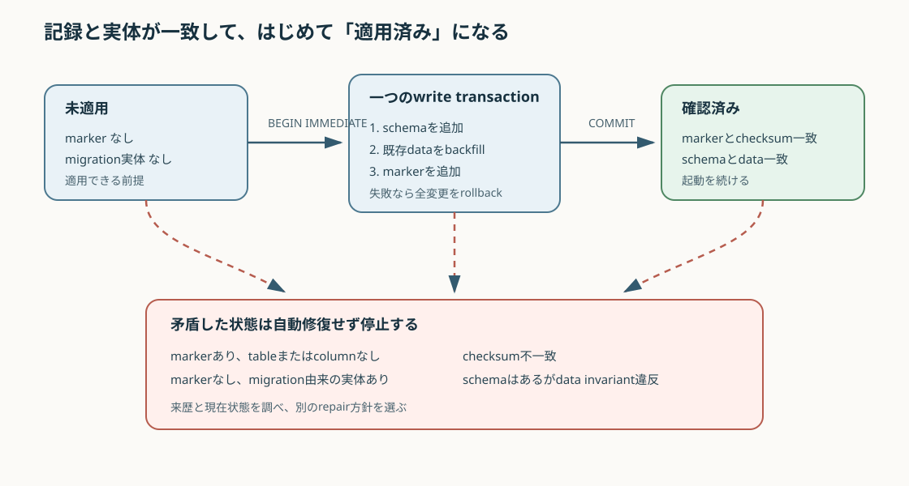

# 過去のDBを現在の契約で信用する {#sec-trust-migrated-database}

## 対象読者と到達点

SQLite schema、起動処理、保存済みevidenceを変更する開発者が対象です。
SQL transactionとprimary keyの基本を読めることを前提にします。

読了後は、次の問いへ実装pathを挙げて答えられる状態を目指します。

- migration markerは何を主張し、何を証明しないか
- checksumが一致してもtableとdataを検証する理由は何か
- `BEGIN IMMEDIATE`とrollbackは部分適用をどう防ぐか
- markerだけが残ったDBを、なぜ「適用済み」と扱わないか
- foreign keyで表現できる不変条件と、application検証が必要な不変条件は何か
- 既存dataの意味を復元できないとき、なぜ値を発明せず停止またはprovenance付きで移行するか

## 扱わない範囲

この章は、一般的なmigration frameworkの比較、分散databaseのonline migration、zero-downtime deployを扱いません。
現行アプリが一つのlocal SQLite正本を起動時に更新する経路へ絞ります。

SQLiteのDDL一覧を覚える章でもありません。
schema変更の文法ではなく、変更前後で何を真に保つかを読みます。

## markerがあるのにtableがない

Candidateの過去版を残すため、あるreleaseが`candidate_revisions` tableを追加したとします。
起動後の`schema_migrations`には、次の一行があります。

```text
id = candidate-revision-history-v1
checksum = immutable-candidate-revisions-v1
```

ところが、databaseを調べると`candidate_revisions` tableがありません。

markerだけを見る実装は「適用済み」と判断して起動を続けます。
その後にCandidateを更新すると、過去revisionを保存できないか、参照時に初めて失敗します。

問題はtableがないことだけではありません。
markerと実体が食い違う状態を正常と見なしたため、どこまで変更されたDBか分からなくなっています。

この例では、少なくとも四つの証拠を分けて読みます。

| 証拠 | 答える問い | 単独では答えられないこと |
|---|---|---|
| migration ID | どの変更を適用したと記録したか | 実体が完全か |
| checksum | そのIDに期待する定義が同じか | tableとdataが正しいか |
| table、column、index | schemaの形があるか | 既存rowの意味が正しいか |
| data invariant | 現在のcontractでrowを解釈できるか | 適用手順の来歴 |

markerは作業記録です。
現在のschemaとdataを無条件に証明する証明書ではありません。

## migration前後の不変条件を先に書く

`candidate_revision_migration.py`が守る中心条件は、現在の各Candidateに対応するrevision historyが存在することです。

述語にすると、次の形になります。

Candidatesの集合を$C$、Candidate revision historyの集合を$H$とします。

$$
\begin{aligned}
\forall c \in C,\quad \exists h \in H:\quad
&h.candidate\_id=c.id \\
&\land h.revision=c.revision
\end{aligned}
$$

migration前には`candidate_revisions`自体がありません。
migration後にはtableを作るだけでなく、既存のcurrent Candidateを履歴へseedし、この述語を真にします。

実装は次の順で変更します。

1. write transactionを開始する。
2. markerとchecksumを調べる。
3. 未適用ならtableとindexを作る。
4. `candidates`のcurrent rowを履歴へcopyする。
5. migration markerを記録する。
6. すべてをcommitする。

{fig-alt="markerなし実体なしの未適用状態から、同じtransaction内でschema、backfill、markerを作り、確認済み状態へ進む。markerと実体の不一致、checksum不一致、data invariant違反は矛盾状態として起動を停止する。" width="100%"}

順序だけで安全になるわけではありません。
schema、backfill、markerを同じtransactionへ置くことで、途中の失敗を外から見える中間状態として残さないことが重要です。

## transactionは「全部か無か」を作る

SQLiteでは、databaseへのreadとwriteはtransaction内で行われます。
明示したtransactionは`COMMIT`または`ROLLBACK`まで続き、同時に成立するwrite transactionは一つです [@sqlite-transactions]。

中心例のCandidate revision migrationとWorkspace catalog migrationは`BEGIN IMMEDIATE`を使います。
これは最初のschema変更まで待たず、開始時点でwrite transactionを取りに行きます。
別writerがすでにいれば、その時点で`SQLITE_BUSY`になり得ます。[^begin-immediate]

`migrate_candidate_revisions()`は、例外を受けると`rollback()`を呼びます。
table作成後、backfill後、marker追加前のどこで失敗しても、同じtransactionに入った変更を戻します。

transactionが守るのはatomicityです。
誤ったbackfill規則を正しい意味へ直したり、欠けた意味情報を推測したりはしません。

たとえば、旧rowに単位がなく、新contractが単位を必須にした場合を考えます。
transactionは全rowへ同じ仮定単位を書き込む操作をatomicにはできますが、その仮定が科学的に正しいとは保証しません。

::: {.callout-warning title="atomicな誤変換もあり得る"}
transaction成功は、migrationの意味が正しいことを示しません。
schema変更、data変換、marker追加が一まとまりになったことだけを示します。
:::

[^begin-immediate]: `BEGIN`のdefaultは`DEFERRED`です。
    `IMMEDIATE`はwrite transactionを直ちに開始するため、read後のwrite昇格より早い位置でwriter競合を観測できます [@sqlite-transactions]。
    `BEGIN...COMMIT`は入れ子にできず、入れ子の境界にはsavepointが必要です。

## marker、checksum、実体を三方向から照合する

起動時の`migrate_candidate_revisions()`は、markerがある場合も何もせず帰りません。
checksum、column、current revisionの履歴を確認します。

### markerとchecksum

同じmigration IDへ、applicationが期待するchecksumと異なる値が記録されていれば停止します。
同じIDの定義をrelease間で書き換えたか、DBの記録が変わった可能性があるためです。

checksumはmigration fileのbyte hashではありません。
現行実装では、developerが定めた定数文字列を契約識別子として保存します。
したがって、コード変更を自動検出する仕組みではなく、定義を変えたときに新しいIDとchecksumを選ぶ運用に依存します。

### markerとschema

markerがあるのに期待columnが欠けていれば停止します。
「markerがあるから不足columnを追加する」と自動修復しません。

反対に、Candidate revision tableまたはWorkspace catalog tableがあるのに対応markerがなければ停止します。
同名tableを別の手順が作ったのか、migrationがtransaction外で中断したのかを区別できないためです。

### schemaとdata

tableとcolumnが揃っていても、current Candidateに対応する履歴rowが欠けていれば停止します。
shapeだけが現在で、data invariantが過去のままというpartial stateを拒否します。

この三方向を照合する二つの中心例では、起動時の状態を次へ分けます。

| marker | 実体 | 判定 |
|---|---|---|
| なし | なし | transaction内で適用する |
| あり、checksum一致 | schemaとdataが一致 | 適用済みとして進む |
| あり、checksum不一致 | 任意 | 定義の食い違いとして停止する |
| あり | schemaまたはdataが不完全 | partial migrationとして停止する |
| なし | 中心例のmigration由来実体あり | 来歴不明として停止する |

停止は不親切な挙動ではありません。
どちらが正本か判断できない状態で変更を重ねず、修復手順を選ぶための情報を残します。

## idempotentは「何度でも直してよい」ではない

migrationを二回呼んだとき、二回目が同じschemaとdataを重ねて作らない性質をidempotencyと呼びます。
現行実装では、marker、checksum、実体が一致した場合に検証してreturnします。

この設計は、壊れた状態へ何度でもDDLを当てることとは異なります。
矛盾を見つけた二回目は修復せず、例外で停止します。

$$
M(M(s))=M(s)
$$

この式の$s$は、migrationが受理する前提を満たした状態です。
任意の壊れたDBへ同じ結果を返すという意味ではありません。

`test_candidate_revision_migration_backfills_the_current_candidate()`は、fresh DBの起動後にmarker、履歴row、payloadを確認します。
`test_catalog_migration_preserves_workspace_and_is_idempotent()`は、Workspace catalog migrationを再実行してrecordが重複しないことを確認します。

## additive migrationにも二種類ある

このrepositoryでは、既存tableへcolumnを加えるmigrationと、新しいtableを加えるmigrationが共存します。

`project_design_space_migration.py`は、`projects`へ三つのcolumnを追加します。
既存Projectに過去のDesign Spaceを発明できないため、provenanceを`unbound_legacy`として残します。

`candidate_revision_migration.py`は、新しい履歴tableを作り、既存current Candidateをrevision 1以上の既知recordとしてcopyします。
既存rowにすでにある情報だけで履歴をseedできるためです。

どちらもadditiveですが、dataの扱いは同じではありません。

| 既存dataから言えること | 選ぶ処理 |
|---|---|
| 新fieldの値を一意に再構成できる | backfillする |
| 値は不明だが、未bound状態を表現できる | 明示的なlegacy provenanceを入れる |
| 複数の解釈があり、誤ると意味が変わる | migrationを停止する |
| 旧contract自体を安全に解釈できない | 自動変換せず、別の修復または再作成を求める |

`candidate_migration.py`は、retired input contractを持つ古いCandidateを現在の科学入力へ推測変換しません。
曖昧なlegacy dataを見つけると、DBを変更せずmigrationを拒否します。

Workspace catalogでは、schema migration直後の既存Projectも`unbound_legacy`です。
別のbootstrap処理がupgrade時点で確認できた参照を固定した場合だけ、`assumed_current_at_upgrade`へ進みます。
このbootstrapが固定するのは、Dataset View、Task contract、Model Packageの参照です。
Project Seriesへの所属は判断のまとまりを表す任意情報なので、legacy Projectの名前からSeriesを発明せず、`project_series_id`を未所属のままにします。
起動時auditも、`project_series_id`が保存されているProjectだけ、その参照先のSeriesが存在するかを検査します。
新規Projectが作成時に明示したbindingの`explicit`とは区別されます。

::: {.callout-note title="DECISION"}
このrepositoryは、schemaを現在形に見せることより、保存済み科学dataの意味を発明しないことを優先します。
`unbound_legacy`のようなprovenanceは、欠損を隠すdefault値ではなく、何が分からないかを残す値です。
:::

## SQLiteのALTER TABLEだけでは設計は決まらない

SQLiteが直接支援する`ALTER TABLE`は、table名変更、column名変更、column追加、column削除に限られます。
より広いschema変更では、新tableを作り、dataをcopyし、indexやtriggerを再構築し、foreign keyを検査する手順が公式に示されています [@sqlite-alter-table]。

単純なcolumn追加でも、既存rowへ何を入れるかはdomainの問いです。
`TEXT NOT NULL DEFAULT 'unbound_legacy'`が妥当かどうかをSQLiteは判断しません。

制約なしのcolumn追加はschema textの変更だけで済み、tableのdata量にほぼ依存しません。
一方、既存rowへ適用するCHECK制約や一部のcolumn削除はdata走査または書き換えを伴います [@sqlite-alter-table]。
「ALTER TABLEは常に軽い」とも「常に全table copy」とも一般化せず、採用する操作とruntime versionを確認します。

## foreign keyとapplication invariantを分ける

foreign keyは、子rowの参照先が親tableに存在するという関係をDBで強制できます。
ただしSQLiteでは、foreign key enforcementをconnectionごとに有効化する必要があります [@sqlite-foreign-keys]。

`connect_sqlite()`は各connectionで次を設定し、読戻して確認します。

```sql
PRAGMA foreign_keys = ON;
PRAGMA busy_timeout = 5000;
PRAGMA synchronous = FULL;
```

さらに全migration後、`Store._init()`は`PRAGMA foreign_key_check`を実行します。
既存DBに孤児があれば自動削除せず、起動を停止します。

それでも、すべての不変条件をforeign keyへ書けるわけではありません。

| 不変条件 | 主な検証境界 | 理由 |
|---|---|---|
| `dataset_revisions.data_asset_id`の親が存在する | foreign key | table間の存在関係 |
| current Candidateに同じrevisionの履歴がある | migrationのSQL検証 | active rowと履歴rowの複合条件 |
| JSON内のCandidate revisionが実在する | applicationまたはrepository | 参照がJSON payload内にある |
| legacy bindingの意味が確認済みか | provenanceとapplication | 存在ではなく知識の状態 |
| Model Packageがallow-listされたruntimeで読めるか | application bootstrap | DB schema外のcapability |

foreign keyは重要ですが、domain invariantの代替ではありません。
逆に、table間の単純な存在関係までapplicationの手作業checkだけへ任せると、別のwrite経路から孤児を作る余地が増えます。

## 接続policyはmigrationより外側にある

`Store`の初期化は、migrationより先にSQLite接続policyを固定します。
現行policyはrollback journalの`delete` mode、`synchronous=FULL`、5秒のbusy timeoutです。
WALは採用していません。

その後、依存順に複数migrationを実行し、archive用write guardを設置し、最後にforeign key全体を検査します。

```text
initialize SQLite policy
  -> remove old write guards
  -> run ordered migrations
  -> install current write guards
  -> validate all foreign keys
  -> accept requests
```

各migration関数は個別のconnectionとtransaction境界で進みます。
全migration列を一つの巨大transactionにはしていません。
途中のmigrationが失敗した場合、それ以前にcommit済みのmigrationは残り、失敗した一件はrollbackされます。

これはpartially applied schemaをすべて同じ意味にしないための重要な境界です。

- 一件のmigration内部が半端に残る状態はrollbackで防ぐ。
- release内のmigration列が途中まで進んだ状態は、次回起動で各moduleが実装している深さまで適用済み状態を確認して続ける。
- 中心例のようにmarkerと実体の矛盾を検査するmigrationは、自動継続せず停止する。

古いmigrationを含む全moduleが、同じschemaとdata invariantを再検査するわけではありません。
再試行可能性は共通runnerの保証ではなく、各moduleのidempotencyと検証内容を読んで判断します。

`runtime_diagnostics.py`は、migration ID、foreign key違反、busy timeout、journal modeを診断結果へ含めます。
これは起動契約の観測面であり、診断を実行しただけでschemaを修復しません。

## rollback、retry、forward repairを分ける

失敗がcommit前なら、migration関数は同じtransactionをrollbackします。
前提が直れば、同じmigrationを再実行できます。

commit後に、実装の意味上の欠陥が見つかった場合は状況が違います。
適用済みIDの中身を書き換えて再実行すると、同じIDがreleaseごとに違う意味になります。

この場合は、新しいmigration IDでforward repairを定義し、旧状態から新状態への変換と検証を明示します。
元へ戻す必要があるときは、事前backupまたはWorkspace restoreの経路を使います。

`candidate_migration.py`の大きなtable再構築は、変更前にdatabase backupを作ります。
一方、すべての小さなadditive migrationが個別backupを作るわけではありません。
transaction rollbackと災害復旧用backupを同じ安全網として数えないことが必要です。

## 現mainで再確認する

リポジトリ直下で、migrationの適用、再実行、rollback、checksum、foreign key policyを確認します。

```powershell
uv run python -m pytest `
  backend/tests/test_candidate_safety.py `
  backend/tests/test_candidate_migration.py `
  backend/tests/test_workspace_catalog_migration.py `
  backend/tests/test_sqlite_connection.py
```

test fileごとの観察点は次です。

| test | 観察する境界 |
|---|---|
| `test_candidate_safety.py` | current Candidateのrevision history backfill |
| `test_candidate_migration.py` | table再構築、故障注入、rollback、legacy data拒否 |
| `test_workspace_catalog_migration.py` | additive schema、idempotency、checksum mismatch |
| `test_sqlite_connection.py` | connection policy、foreign key enforcement、既存孤児の検出 |

test成功は、将来の全migrationが安全であることを保証しません。
現行migrationが固定したfailure pointとinvariantを満たすことを確認します。

## 症状から最初の証拠を選ぶ

| 症状 | 最初に見る証拠 | 次に読む場所 |
|---|---|---|
| checksum mismatchで起動しない | migration IDと記録checksum | 対応moduleの定数とrelease差分 |
| markerがあるがcolumnがない | `schema_migrations`と`PRAGMA table_info` | partial migrationの発生経路 |
| tableがあるがmarkerがない | `sqlite_master`とbackup | 手動DDLまたは中断履歴 |
| foreign key orphanで起動しない | `PRAGMA foreign_key_check`のrow | 親子tableとwrite経路 |
| legacy data変換を拒否した | 元payloadと旧contract version | 明示的なrepair方針 |
| `database is locked`になる | active writerとbusy timeout | transactionの長さと起動重複 |

「migrationに失敗した」だけでは、再実行してよいか判断できません。
transaction前提の競合、schemaの矛盾、data意味の曖昧さを先に分けます。

## 設計を振り返る

### markerをschema versionの代わりにしない

一つの整数schema versionだけなら、途中のどの変更まで適用されたかを表しにくくなります。
IDごとのledgerは、独立した変更と適用時刻を列挙できます。

ただし、ledgerが真実なのは実体との照合がある場合です。
記録だけを見て適用済みと扱うと、partial stateを隠します。

### 自動修復より停止を選ぶ

不足columnを機械的に追加できても、欠けたdataを何で埋めるかは別問題です。
来歴を確定できない状態では、起動停止の方が保存済みevidenceを静かに書き換えるより安全です。

### DB制約とapplication検証を重ねる

foreign keyはtable間の存在関係を全write経路で守ります。
application検証はJSON内部、provenance、capabilityのようなDB外の意味を守ります。

同じ条件を重複して書くことが目的ではありません。
各条件を最初に完全な情報が揃う境界へ置きます。

### 一件のatomicityとrelease全体の進捗を分ける

各migrationを個別transactionにすると、一件の途中状態は残りません。
一方、migration列の途中までcommitされた状態は存在し得ます。

次回起動が安全に続けられるのは、各migrationがidempotentであり、適用済み状態を実体まで検証する場合です。

## 現行実装の限界

migration moduleごとにmarker、checksum、schema検証のpatternが繰り返されています。
共通runnerが一括して依存関係、checksum、故障注入を管理する構成ではありません。

checksumは手動定数であり、migration SQLまたはPython変換処理から自動計算しません。
定数を更新せず実装だけ変更しても、ledgerはそのdriftを検出しません。

すべてのmigrationが同じ深さでdata invariantを検証するわけではありません。
table存在だけを確認するもの、column集合まで確認するもの、row内容まで確認するものがあります。

`Store._init()`はmigrationを順番に呼びますが、依存関係を宣言的なgraphとして検証しません。
新しいmigrationを追加するときは、前提tableと後続consumerを読んで配置します。

markerと実体の不一致を拒否する深さも統一されていません。
Workspace catalogとCandidate revisionは不足tableやcolumnを拒否しますが、Project Design Spaceはmarkerなしで既存columnが揃う状態を受理してmarkerを追加します。
Source data lifecycleなど、期待tableの存在を中心に確認し、全column集合までは再検査しないmigrationもあります。
したがって、この章の状態表は全migration runnerの共通保証ではなく、新しいmigrationをreviewするときの基準と中心例の挙動です。

rollback journalの`delete` modeは現行local運用の明示的policyです。
WALへ変える場合は、並行性だけでなくbackup、sidecar停止、file集合、checkpointを再設計する必要があります。

## 章末チェック

1. migration markerは何を記録するか。
2. checksum一致だけで起動を続けられない理由は何か。
3. `BEGIN IMMEDIATE`はmigration開始時に何を試みるか。
4. transactionが保証しない意味上の正しさは何か。
5. markerなしでmigration由来tableがあるとき、なぜ自動採用しないか。
6. idempotencyが成立する入力状態にはどんな前提があるか。
7. backfill、legacy provenance、停止をどう選び分けるか。
8. foreign keyで表現しやすい条件は何か。
9. JSON内部のprovenanceをapplicationで検証する理由は何か。
10. 一件のmigration失敗と、migration列の途中停止はどう違うか。

[章末チェックの解答](../labs/break-and-repair-migration.qmd#answer-migration-chapter-check)を確認してから、同じページの変更演習へ進みます。

## Further Reading

- SQLiteの*Deferred, Immediate, and Exclusive Transactions* [@sqlite-transactions]：migration開始時のwriter境界を確認します。migration列全体が一transactionだとは読み替えません。
- SQLiteの*Making Other Kinds Of Table Schema Changes* [@sqlite-alter-table]：table再構築が必要なschema変更を読みます。markerとchecksumの運用は別に設計します。
- SQLiteの*Enabling Foreign Key Support* [@sqlite-foreign-keys]：connectionごとの有効化と検査範囲を確認します。JSON内provenanceは対象外です。
