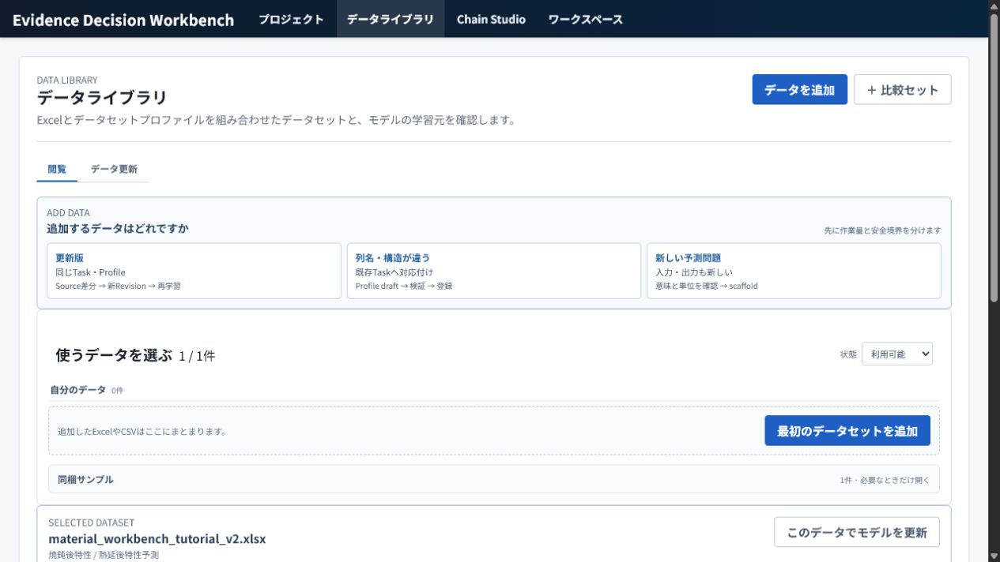
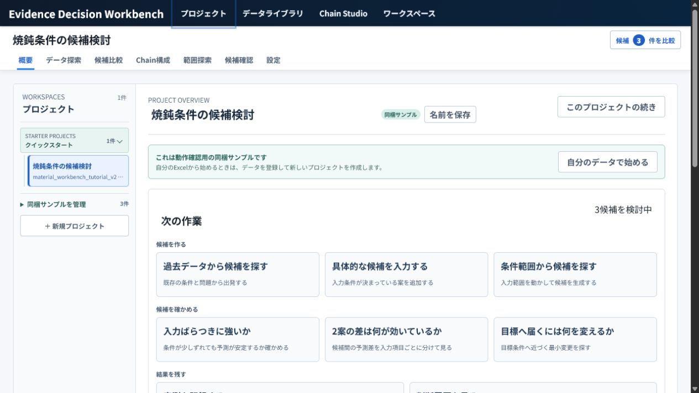
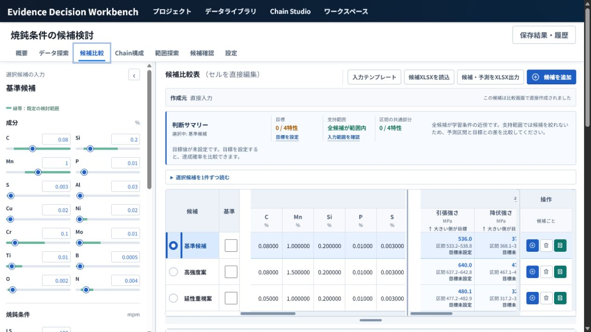
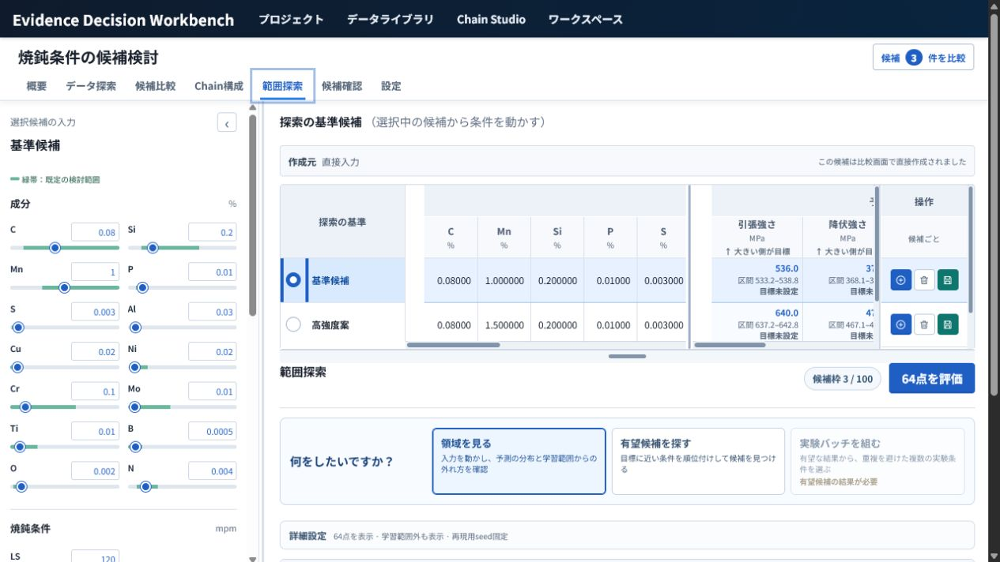
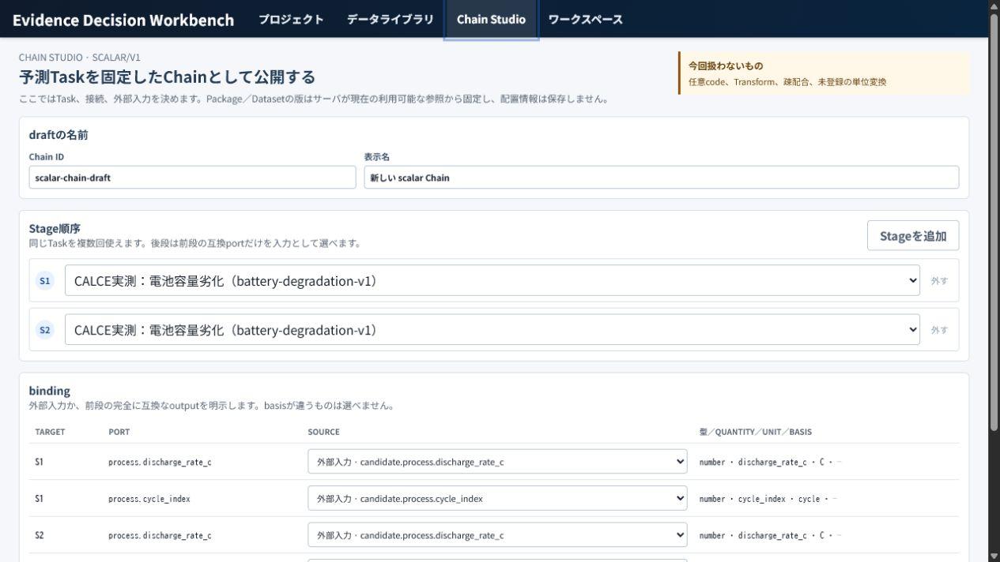
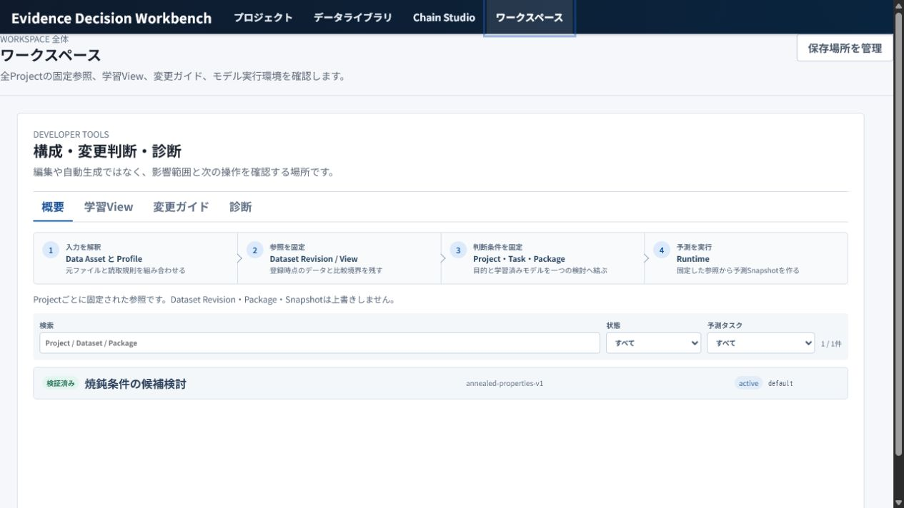
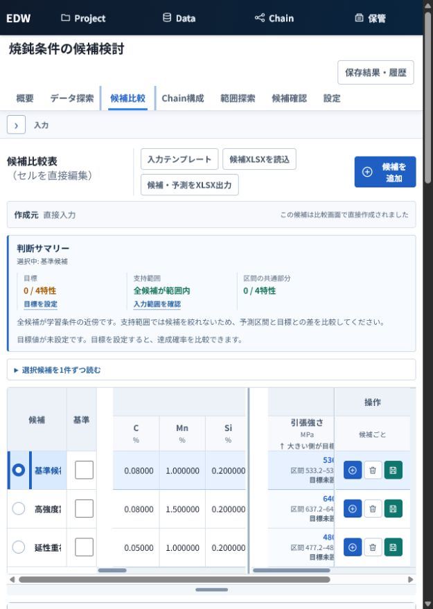

# App-wide UI / UX audit — 2026-08-02

## Scope and evidence

This audit covers the current `main` baseline at `f24839b5` and the primary
Evidence Decision Workbench journeys requested in the app-wide audit brief.

Evidence sources:

- fresh interaction in the running Web application on 2026-08-02;
- current frontend owners, API contracts, product decisions, unit tests, and E2E;
- the completed UI-first Concrete Slump Actor journey and its open findings;
- recent UX, navigation, Data Library, Proposal, and Prediction Graph issues/PRs.

The screenshot pass used the bundled tutorial Project. It did not mutate source
data or the main Workspace. Screenshots prove visible structure and state only;
keyboard, history, error, and persistence findings are tied to direct interaction,
tests, or code evidence separately.

## 1. Current strengths

1. **Scientific distinctions are visible.** Candidate comparison separates point
   prediction, interval, model support, actual measurement, missingness-related
   provisional results, and immutable Snapshot evidence.
2. **Project identity is unusually strong.** Project, Candidate, Screening Run,
   Activity Run, Snapshot, Source Lifecycle stage, and several management tabs
   already participate in `NavigationIntent`.
3. **Data Library has a good partial-failure model.** Dataset, Package, and
   Project-creation resources retain stale data independently and expose scoped
   retry.
4. **The first-run split is understandable.** Bundled samples and user data are
   explicitly separated, and onboarding chooses among update, mapping, and new
   prediction problem by meaning rather than file type alone.
5. **Project Overview starts from user questions.** It groups next work into
   creating candidates, checking candidates, and preserving results.
6. **Degraded Chain state is read-only rather than silently rebound.** Existing
   evidence remains inspectable without falling back to another Package or Task.
7. **Decision Activity and saved Proposal Runs have immutable identities.**
   Reloading a known Run does not relabel old evidence as current.
8. **Responsive navigation has a deliberate compact mode.** At 640 px the global
   and Project navigation remain reachable, and the large input rail collapses.

## 2. Fresh visual evidence

### Step 1 — Data Library entry: healthy



The three onboarding paths are visible before the resource catalog, and the
sample/user-data distinction is preserved. The page is information-dense but the
primary question is still clear: “What kind of data am I adding or using?”

### Step 2 — Project Overview: healthy with density risk



“Next work” is a strong question-first structure. The same owner also contains
Project selection, creation, naming, sample guidance, Objective editing, Candidate
history, archival, and several failure sources; failures currently converge on a
single page-level error state.

### Step 3 — Candidate comparison: usable but cognitively overloaded



The judgment summary is valuable, but editable input, heat pattern, comparison
table, prediction/actual, response surfaces, and historical evidence compete in
one continuous workspace. On a desktop viewport, the input rail consumes the
entire left third even when the current task is reading evidence rather than
editing.

### Step 4 — Screening / Proposal: primary task appears after repeated context



The primary question “What do you want to do?” and the execution action are
understandable once reached. Before them, the user traverses the full Candidate
editor and a wide Candidate prediction table. The structure asks the user to
re-read fixed context before deciding how to explore.

### Step 5 — Chain Studio: clear boundary, weak resume



The scope boundary and validate-before-publish sequence are clear. However, the
entire draft (name, Stage order, binding) is component-local. Reload, browser
back, or next-day return loses a long multi-step configuration.

### Step 6 — Workspace: healthy



The page makes the Data Asset → Dataset → Project → Runtime chain legible and
keeps developer diagnostics out of the primary Project journey.

### Step 7 — Candidate comparison at 640 px: degraded but operable



The input rail collapses and navigation remains reachable. The comparison table
requires nested horizontal scrolling, so row labels, input values, predictions,
and actions cannot be held in view together. This is acceptable as desktop-first
degradation, but not a suitable primary mobile workflow.

## 3. Confirmed friction — top 10

Priority is based on decision error/data loss, journey blockage, state
misrecognition, recovery/resume, then repeated cognitive load.

| Rank | Priority | Confirmed friction | User impact | Evidence |
|---:|---|---|---|---|
| 1 | P0 | Normal Candidate edits scheduled within 250 ms are discarded when Project context changes. | A value the user just changed can disappear without a retained draft or warning. | `useCandidateEditor.ts:155-169,197-203`; `useWorkbenchSession.ts:116-180,666-675` |
| 2 | P0 | Chain Candidate edits inside the 450 ms debounce window are cleared on unmount without flush or recovery. | Stage input can be lost when leaving the screen. | `ChainWorkbenchPage.tsx:358-364,505-552` |
| 3 | P0 | Actual Measurement draft identity includes Candidate revision, so Candidate autosave can reset an open Actual form. | Experiment ID, values, and note can disappear during the same working session. | `ActualMeasurementPanel.tsx:54-95` |
| 4 | P1 | Screening execution failure collapses validation, API, and runtime failure into one generic warning and clears result context. | The UI-first journey cannot identify the invalid field, retained state, failed Run, or retry scope. Concrete Slump V2 stopped here. | Issue #703; `ScreeningPage.tsx:488-624,1576` |
| 5 | P1 | Screening and Response Curve surfaces hard-code “90% interval” although Package coverage/method can differ or is absent from the curve contract. | The UI can make a scientifically incorrect confidence statement. | `prediction_catalog_contracts.py:150-177`; `ScreeningPage.tsx:1731-1740`; `evidence_contracts.py:94-103`; `ResponseCurvePanels.tsx:251-261` |
| 6 | P1 | Lineage index/review request failures are swallowed and become indefinite loading or apparent empty state. | “No evidence” is indistinguishable from “evidence could not be loaded,” with no retry. | `LineagePage.tsx:177-201,456-493` |
| 7 | P1 | Chain Studio draft is entirely local and has no reload/back/next-day resume. | A long Stage/binding draft is lost, making interruption expensive. | `ChainStudioPage.tsx:85-189` |
| 8 | P1 | Response Curve / contour / prediction space / input space selection is not in navigation identity and resets to response curve. | Shared link, reload, back/forward, and next-day resume return to the wrong analysis question. | `WorkbenchPage.tsx:228`; `navigation.ts:26-52` |
| 9 | P1 | Chain Graph conflates no Candidate, execution API failure, and unresolved Revision; selected Stage/edge and Workbench Snapshot are local-only. | The user cannot tell cause/impact/recovery and loses the exact inspection position. | `ChainGraphViewer.tsx:72-140`; `ChainWorkbenchPage.tsx:86-99,230-234` |
| 10 | P1 | Data Quality and Project/Source owners use weaker, aggregated error models than Data Library. | Stale evidence is discarded or unrelated failures share one banner, so the affected resource and retry scope are unclear. | `QualityPages.tsx:74-148`; `ProjectHub.tsx:217,1300-1522`; `SourceLifecycleWorkspace.tsx:55-119,543` |

Related confirmed friction that should reuse an existing issue:

- #702: historical row and experiment-batch → Candidate handoff loses provenance.
- #699/#700: Prediction Graph Studio and Model Library IA; do not duplicate while
  #698 / PR #708 is still the runtime dependency.

## 4. Theoretical opportunities

These are not implementation commitments until a real journey confirms their
value:

- Persist every Lineage filter or Data Library disclosure in the URL.
- Split `ProjectHub.tsx` solely because it is large. The relevant goal is scoped
  state ownership and recovery, not file count.
- Put pane widths and table heights into URLs. Existing local persistence is
  probably the better ownership model.
- Replace all wide tables with cards. Exact cross-candidate alignment remains
  valuable on desktop.
- Hide technical identity completely. Digests and immutable IDs must remain
  reachable through disclosure for auditability.

## 5. App-wide UX map

| Journey | User / purpose | Start | Primary decisions and required information | Current travel / interruption | Ideal flow |
|---|---|---|---|---|---|
| First use | Researcher connects a safe data source and creates a prediction-ready Project. | Data Library or sample guidance | sample vs user data; update vs mapping vs new Task; units, grain, relations, input/output; Dataset/Task/Package binding | Data Library → onboarding → Profile Workbench/new Task → Project creation. Partial resource failures are strong; same-view Profile URL ownership is split. | One meaning decision at a time; prepared binding carried forward; visible progress and resumable draft; no repeat selection. |
| Daily candidate decision | Researcher decides whether a Candidate is worth testing. | Project Overview or Candidate deep link | Objective, current revision, prediction+interval, support, similar actuals, actual measurement | Overview → comparison → evidence surfaces → Activity → Snapshot/history. Large editor/table context repeats before the active question. | Compact pinned Candidate context → judgment summary → evidence surface; editor opens only when changing inputs; exact surface resumes. |
| Proposal / experiment planning | Researcher chooses where to explore or what to test next. | Overview “conditions range” or saved Screening Run | purpose, Objective revision, Design Space, variables, support policy, strategy, seed, proposal/batch identity | Full Candidate editor/table precede the mode and variable form. Failure can erase the visible Run context and provides no field recovery. | Purpose first → fixed context summary → variables/strategy → execution state → result/batch → explicit Candidate promotion. |
| Actual / decision preservation | Researcher links experiment outcome to frozen prediction evidence. | Candidate Actual or history | Candidate revision, fixed Snapshot, actual values, experiment identity, note | Actual draft can reset on Candidate revision; history itself has good loading/error/retry. | Draft bound to Project+Candidate, explicit fixed-revision change handling, save receipt, immutable history resume. |
| Chain work | Researcher defines and evaluates a multi-Stage dependency. | Chain Studio / Chain Project | Stage order, typed binding, external input, stage freshness, Snapshot, partial availability | Studio draft cannot resume; Graph error states and inspection selection are ambiguous/local. | Resumable draft → validate → immutable publish → Stage/edge deep link → partial execution/recovery → fixed Snapshot. |
| Data lifecycle / quality | Data steward determines whether data can be used and promoted. | Data Library “update,” Quality, Lineage | raw/curated/approved/training identity, quality issue, provenance path, affected resource | Source and Project errors aggregate; Lineage can show failure as empty; Quality drops stale evidence. | Resource-local state contract everywhere: loading / ready / stale / empty / unavailable / error, with retained evidence and scoped retry. |
| Workspace administration | Maintainer verifies storage, fixed references, and runtime health. | Workspace | Workspace location, backup/restore receipt, Project reference health, model/runtime diagnostics | Clear separation from daily work; internal IDs remain secondary. | Preserve current structure; add resource-local failures only where observed. |

## 6. Screen inventory

| Screen family | Responsibility / primary question | Primary action | Details to defer | State and resume assessment | Recommendation |
|---|---|---|---|---|---|
| Global shell/startup | Where am I, and can I continue safely? | Navigate or retry API | startup diagnostics | Good URL/history owner and offline notice. | Preserve. |
| Project Overview | What is the Project’s current state and next useful decision? | Choose one next task | fixed digests, global management | Good question-first entry; error scope is too broad. | Structural state-owner split, not visual redesign. |
| Project settings/history | What Objective/Design Space/evidence is fixed? | Save setting or open Snapshot | technical identity | Good loading/error/empty/retry and deep links. | Preserve as reference pattern. |
| Data Library/onboarding | Which data path and binding can I use? | Add/select data, then create Project | Package technical metadata | Strong partial/stale/retry states. | Local polish only unless new evidence appears. |
| Profile Workbench | Can this workbook be mapped safely? | inspect → validate → register | parser detail | Broad validation states; direct URL reading weakens same-view resume. | Move all location parsing to NavigationIntent owner. |
| Candidate comparison | Which Candidate best fits the objective and evidence? | Compare/save detailed prediction | editor and technical evidence when not needed | Strong scientific semantics; repeated simultaneous decisions. | Use decision-first composition with optional editor. |
| Actual measurement | How did frozen prediction compare with measurement? | Register actual | technical Snapshot identity | Correct prediction/actual split; local draft can reset. | Protect draft before further visual work. |
| Evidence surfaces | How does output change and where is support? | Select evidence surface | feature internals | Stale/loading separation exists; selected surface is not resumable. | Add exact surface to NavigationIntent. |
| Candidate review/Activity | What does robustness/difference/counterfactual evidence change? | Run or open Activity Run | full provenance | Activity/Run deep links are good; Activity appears after repeated Candidate context. | Put Activity question before editable context. |
| Screening/Proposal | Where should we explore or test next? | execute selected purpose | seed/strategy/digests | Draft-vs-last-Run is visible; error recovery is not. | #703 first, then decision-first composition. |
| Quality/Lineage | Is this data/evidence usable and connected? | inspect issue/entity | raw keys | Deep-link identity is good; empty/error/stale is inconsistent. | Adopt Data Library resource-state contract. |
| Chain Studio/Graph/Workbench | Can this dependency be fixed, executed, and inspected honestly? | validate/publish or run/fix Snapshot | graph layout and digest | Degraded read-only is good; draft and inspection resume are weak. | Resumable draft and Stage/edge/Snapshot identity. |
| Workspace/developer | Is the local Workspace and runtime healthy? | manage storage or diagnose | internal IDs | Clear separation and information hierarchy. | Preserve. |

## 7. Structural alternatives

### Candidate / Screening / Activity family

| Model | Directness | Working memory / travel | Resume and states | Contract impact | Accessibility / cost |
|---|---|---|---|---|---|
| A. Current persistent editor + all evidence | Editing is immediate, but the current question starts below fixed context. | High simultaneous load; minimal page travel; long scroll and wide nested panes. | Existing Project/Candidate identity remains; surface selection is incomplete. | Low. | Tables are semantically rich but keyboard/zoom burden is high. |
| B. **Question-first: decision → evidence → optional edit** | Highest. The screen opens on judgment summary, purpose, or Activity; Candidate context is compact and the editor is disclosed only when changing inputs. | Lower working-memory load; evidence stays in the same screen; less repeated scroll. | URL owns question/surface/Run; server owns immutable evidence; local owner holds unsaved draft. | Low-to-medium; no scientific API change required for layout. | Clearer heading/focus order and smaller keyboard path. Recommended. |
| C. Object-first Candidate record with separate work modes | Candidate identity is strongest, but Proposal and Activity become subtools of an object rather than user questions. | More mode travel and context switches; strong resume if every mode is URL-owned. | Requires wider navigation model and migration of several existing views. | Medium-to-high. | Potentially clean, but risks turning work into generic record management. |

Choice: **B**. It preserves current scientific contracts and exact comparison
tables while reducing simultaneous decisions. It should be introduced one screen
family at a time, not as an app-wide rewrite.

### Failure-state model

| Model | Effect |
|---|---|
| One page-level string | Simple implementation, but collapses validation, transport, unavailable identity, and backend failure; no scoped retry or retained evidence contract. |
| **Resource-local typed state** | Each affected resource declares loading / ready / stale / empty / unavailable / validation error / execution error and owns retry scope. Existing evidence remains visible when safe. |

Choice: **resource-local typed state**, using Data Library and Project Evidence
History as existing patterns. Raw backend detail belongs in a disclosure, not the
primary recovery message.

## 8. Contracts and interactions to preserve

- `App.tsx` remains the only `pushState` / `replaceState` / `popstate` owner.
- Unresolved Project, Candidate, Run, Snapshot, Task, or Package never silently
  falls back to another resource.
- Saved Run and Snapshot payloads remain immutable and are not relabeled after
  Objective, Design Space, Dataset, or Package changes.
- Prediction, actual, point estimate, interval, model uncertainty, input
  variability, missingness, support, hard feasibility, and `p(x)` remain distinct.
- Proposal and Activity outputs require explicit Candidate promotion.
- Data Library prepared bindings are not reselected during Project creation.
- Degraded Tasks remain inspectable read-only; no legacy or alternate-Package
  fallback is added.
- Wide comparison tables remain available on desktop even if a compact reading
  mode is added.

## 9. Recommended implementation order

1. Screening failure diagnosis and recovery — existing #703.
2. Candidate/Chain/Actual unsaved-draft safety, split into independently provable
   screen-family issues.
3. Interval semantics from Package/curve contract to all labels.
4. Lineage and Quality resource-local loading/empty/error/stale/retry.
5. Workbench evidence-surface NavigationIntent.
6. Chain Studio draft persistence, then Graph Stage/edge and Snapshot resume.
7. Candidate / Screening / Activity question-first composition.
8. Existing #702 provenance-preserving Candidate handoff.
9. Existing #699/#700 after #698 direct verification is green.

## 10. First implementation slice and verification budget

```yaml
change_class: structural
authority: Screening validation and execution failure state
affected_journey:
  - open Project range exploration
  - execute the current Objective and variable draft
  - correct a validation failure or retry an execution failure
expected_scope:
  - typed client error mapping for Screening
  - resource-local inline recovery state
  - focused frontend/API regression evidence
verification_budget:
  - nearest frontend unit test for validation/error presentation
  - targeted backend pytest only if the API error contract changes
  - focused fresh Playwright for the failed execution journey
  - typecheck through Level 1 verification
not_planned:
  - full local pytest
  - default Playwright suite
  - unrelated Candidate or Graph redesign
  - release acceptance
review: focused-peer
escalation_triggers:
  - persistence or failed-Run schema change
  - Objective, Design Space, Snapshot, or Package identity change
  - inability to distinguish validation from runtime failure at the API boundary
stop_condition:
  - the changed failure journey passes once on the current commit
  - Objective revision, variable draft, strategy, and safe previous result remain visible
  - the affected field or retry scope is explicit
```

## 11. Delivery tracking

The app-wide program is tracked by
[Epic #709](https://github.com/mryk814/re-process-dashboard/issues/709).
Confirmed findings were separated by state owner and independently provable
journey:

- [#703](https://github.com/mryk814/re-process-dashboard/issues/703) —
  Screening failure diagnosis and recovery; selected for this first slice.
- [#710](https://github.com/mryk814/re-process-dashboard/issues/710) —
  flush normal Candidate pending saves before Project navigation.
- [#711](https://github.com/mryk814/re-process-dashboard/issues/711) —
  retain Chain Candidate edits during debounce and screen exit.
- [#712](https://github.com/mryk814/re-process-dashboard/issues/712) —
  protect Actual Measurement drafts from Candidate revision refresh.
- [#713](https://github.com/mryk814/re-process-dashboard/issues/713) —
  propagate real interval semantics to Screening and Response Curve.
- [#714](https://github.com/mryk814/re-process-dashboard/issues/714) —
  separate Lineage and Quality loading, empty, error, stale, and retry.
- [#715](https://github.com/mryk814/re-process-dashboard/issues/715) —
  resume evidence surfaces and Chain inspection through NavigationIntent.
- [#716](https://github.com/mryk814/re-process-dashboard/issues/716) —
  resume Chain Studio drafts before validation and publication.
- [#717](https://github.com/mryk814/re-process-dashboard/issues/717) —
  recompose Candidate, Screening, and Activity around the active question.
- [#718](https://github.com/mryk814/re-process-dashboard/issues/718) —
  scope Project Overview and Source Lifecycle failures by resource.

Existing [#702](https://github.com/mryk814/re-process-dashboard/issues/702),
[#699](https://github.com/mryk814/re-process-dashboard/issues/699), and
[#700](https://github.com/mryk814/re-process-dashboard/issues/700) remain the
owners for provenance handoff and Prediction Graph follow-up; no duplicate was
created.

## Evidence limits

- The fresh browser pass used the existing sample Project and normal success
  states. It did not intentionally corrupt source data, Package files, or the
  Workspace to synthesize every backend failure.
- Screen-reader behavior was not manually tested. Existing accessibility E2E and
  DOM semantics support keyboard/table/chart observations, but assistive
  technology usability remains separate evidence.
- The 640 px pass proves compact navigation and access to the comparison table,
  not comfortable mobile use. The product remains desktop-first.
- Prediction Graph runtime work is in progress in #698 / PR #708, so Graph Studio
  conclusions must be rechecked after that dependency lands.
